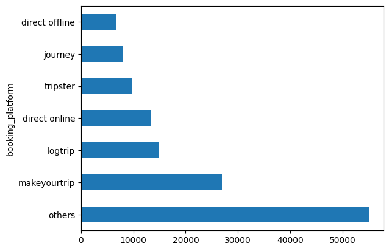
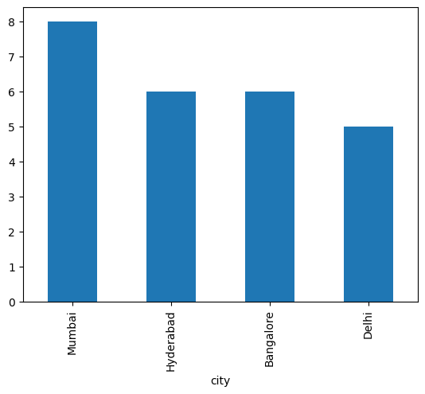
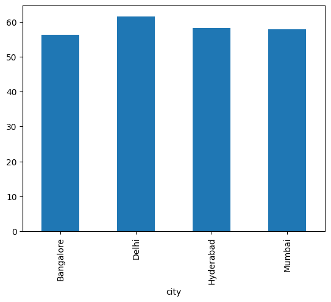
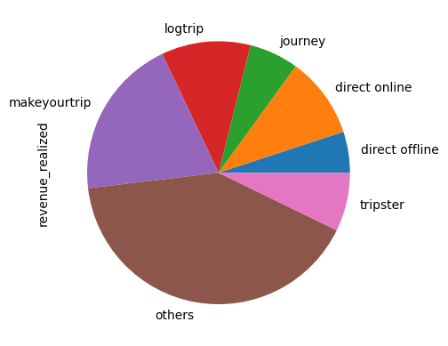

```python
import pandas as pd
```


```python
df_bookings = pd.read_csv('/content/drive/MyDrive/fact_bookings.csv')
df_bookings
```

  <div id="df-479a7f46-197f-4f52-a6b7-3654f2260f07" class="colab-df-container">
    <div>
<table border="1" class="dataframe">
  <thead>
    <tr style="text-align: right;">
      <th></th>
      <th>booking_id</th>
      <th>property_id</th>
      <th>booking_date</th>
      <th>check_in_date</th>
      <th>checkout_date</th>
      <th>no_guests</th>
      <th>room_category</th>
      <th>booking_platform</th>
      <th>ratings_given</th>
      <th>booking_status</th>
      <th>revenue_generated</th>
      <th>revenue_realized</th>
    </tr>
  </thead>
  <tbody>
    <tr>
      <th>0</th>
      <td>May012216558RT11</td>
      <td>16558</td>
      <td>27-04-22</td>
      <td>1/5/2022</td>
      <td>2/5/2022</td>
      <td>-3.0</td>
      <td>RT1</td>
      <td>direct online</td>
      <td>1.0</td>
      <td>Checked Out</td>
      <td>10010</td>
      <td>10010</td>
    </tr>
    <tr>
      <th>1</th>
      <td>May012216558RT12</td>
      <td>16558</td>
      <td>30-04-22</td>
      <td>1/5/2022</td>
      <td>2/5/2022</td>
      <td>2.0</td>
      <td>RT1</td>
      <td>others</td>
      <td>NaN</td>
      <td>Cancelled</td>
      <td>9100</td>
      <td>3640</td>
    </tr>
    <tr>
      <th>2</th>
      <td>May012216558RT13</td>
      <td>16558</td>
      <td>28-04-22</td>
      <td>1/5/2022</td>
      <td>4/5/2022</td>
      <td>2.0</td>
      <td>RT1</td>
      <td>logtrip</td>
      <td>5.0</td>
      <td>Checked Out</td>
      <td>9100000</td>
      <td>9100</td>
    </tr>
    <tr>
      <th>3</th>
      <td>May012216558RT14</td>
      <td>16558</td>
      <td>28-04-22</td>
      <td>1/5/2022</td>
      <td>2/5/2022</td>
      <td>-2.0</td>
      <td>RT1</td>
      <td>others</td>
      <td>NaN</td>
      <td>Cancelled</td>
      <td>9100</td>
      <td>3640</td>
    </tr>
    <tr>
      <th>4</th>
      <td>May012216558RT15</td>
      <td>16558</td>
      <td>27-04-22</td>
      <td>1/5/2022</td>
      <td>2/5/2022</td>
      <td>4.0</td>
      <td>RT1</td>
      <td>direct online</td>
      <td>5.0</td>
      <td>Checked Out</td>
      <td>10920</td>
      <td>10920</td>
    </tr>
    <tr>
      <th>...</th>
      <td>...</td>
      <td>...</td>
      <td>...</td>
      <td>...</td>
      <td>...</td>
      <td>...</td>
      <td>...</td>
      <td>...</td>
      <td>...</td>
      <td>...</td>
      <td>...</td>
      <td>...</td>
    </tr>
    <tr>
      <th>134585</th>
      <td>Jul312217564RT46</td>
      <td>17564</td>
      <td>29-07-22</td>
      <td>31-07-22</td>
      <td>3/8/2022</td>
      <td>1.0</td>
      <td>RT4</td>
      <td>makeyourtrip</td>
      <td>2.0</td>
      <td>Checked Out</td>
      <td>32300</td>
      <td>32300</td>
    </tr>
    <tr>
      <th>134586</th>
      <td>Jul312217564RT47</td>
      <td>17564</td>
      <td>30-07-22</td>
      <td>31-07-22</td>
      <td>1/8/2022</td>
      <td>-4.0</td>
      <td>RT4</td>
      <td>logtrip</td>
      <td>2.0</td>
      <td>Checked Out</td>
      <td>38760</td>
      <td>38760</td>
    </tr>
    <tr>
      <th>134587</th>
      <td>Jul312217564RT48</td>
      <td>17564</td>
      <td>30-07-22</td>
      <td>31-07-22</td>
      <td>2/8/2022</td>
      <td>1.0</td>
      <td>RT4</td>
      <td>tripster</td>
      <td>NaN</td>
      <td>Cancelled</td>
      <td>32300</td>
      <td>12920</td>
    </tr>
    <tr>
      <th>134588</th>
      <td>Jul312217564RT49</td>
      <td>17564</td>
      <td>29-07-22</td>
      <td>31-07-22</td>
      <td>1/8/2022</td>
      <td>2.0</td>
      <td>RT4</td>
      <td>logtrip</td>
      <td>2.0</td>
      <td>Checked Out</td>
      <td>32300</td>
      <td>32300</td>
    </tr>
    <tr>
      <th>134589</th>
      <td>Jul312217564RT410</td>
      <td>17564</td>
      <td>31-07-22</td>
      <td>31-07-22</td>
      <td>1/8/2022</td>
      <td>2.0</td>
      <td>RT4</td>
      <td>makeyourtrip</td>
      <td>NaN</td>
      <td>Cancelled</td>
      <td>32300</td>
      <td>12920</td>
    </tr>
  </tbody>
</table>
<p>134590 rows × 12 columns</p>
  </div>


```python
df_bookings.shape
```


    (134590, 12)


```python
df_bookings.room_category.unique()
```


    array(['RT1', 'RT2', 'RT3', 'RT4'], dtype=object)


```python
df_bookings.booking_platform.unique()
```


    array(['direct online', 'others', 'logtrip', 'tripster', 'makeyourtrip',
           'journey', 'direct offline'], dtype=object)


```python
df_bookings.booking_platform.value_counts()
```


    booking_platform
    others            55066
    makeyourtrip      26898
    logtrip           14756
    direct online     13379
    tripster           9630
    journey            8106
    direct offline     6755
    Name: count, dtype: int64


```python
df_bookings.booking_platform.value_counts().plot(kind='barh')
```


    <Axes: ylabel='booking_platform'>


    

    


```python
df_bookings.describe()
```


  <div id="df-9675fc6d-dc37-4938-adb6-a05494794bab" class="colab-df-container">
    <div>
<table border="1" class="dataframe">
  <thead>
    <tr style="text-align: right;">
      <th></th>
      <th>property_id</th>
      <th>no_guests</th>
      <th>ratings_given</th>
      <th>revenue_generated</th>
      <th>revenue_realized</th>
    </tr>
  </thead>
  <tbody>
    <tr>
      <th>count</th>
      <td>134590.000000</td>
      <td>134587.000000</td>
      <td>56683.000000</td>
      <td>1.345900e+05</td>
      <td>134590.000000</td>
    </tr>
    <tr>
      <th>mean</th>
      <td>18061.113493</td>
      <td>2.036170</td>
      <td>3.619004</td>
      <td>1.537805e+04</td>
      <td>12696.123256</td>
    </tr>
    <tr>
      <th>std</th>
      <td>1093.055847</td>
      <td>1.034885</td>
      <td>1.235009</td>
      <td>9.303604e+04</td>
      <td>6928.108124</td>
    </tr>
    <tr>
      <th>min</th>
      <td>16558.000000</td>
      <td>-17.000000</td>
      <td>1.000000</td>
      <td>6.500000e+03</td>
      <td>2600.000000</td>
    </tr>
    <tr>
      <th>25%</th>
      <td>17558.000000</td>
      <td>1.000000</td>
      <td>3.000000</td>
      <td>9.900000e+03</td>
      <td>7600.000000</td>
    </tr>
    <tr>
      <th>50%</th>
      <td>17564.000000</td>
      <td>2.000000</td>
      <td>4.000000</td>
      <td>1.350000e+04</td>
      <td>11700.000000</td>
    </tr>
    <tr>
      <th>75%</th>
      <td>18563.000000</td>
      <td>2.000000</td>
      <td>5.000000</td>
      <td>1.800000e+04</td>
      <td>15300.000000</td>
    </tr>
    <tr>
      <th>max</th>
      <td>19563.000000</td>
      <td>6.000000</td>
      <td>5.000000</td>
      <td>2.856000e+07</td>
      <td>45220.000000</td>
    </tr>
  </tbody>
</table>


```python
df_bookings.revenue_generated.min(), df_bookings.revenue_generated.max()
```


    (6500, 28560000)


```python
df_date = pd.read_csv('/content/drive/MyDrive/dim_date.csv')
df_hotels = pd.read_csv('/content/drive/MyDrive/dim_hotels.csv')
df_rooms = pd.read_csv('/content/drive/MyDrive/dim_rooms.csv')
df_agg_bookings = pd.read_csv('/content/drive/MyDrive/fact_aggregated_bookings.csv')
```


```python
df_hotels.shape
```


    (25, 4)


```python
df_hotels.head()
```


  <div id="df-0724bc61-e638-4737-9958-ec14c9473eaf" class="colab-df-container">
    <div>

<table border="1" class="dataframe">
  <thead>
    <tr style="text-align: right;">
      <th></th>
      <th>property_id</th>
      <th>property_name</th>
      <th>category</th>
      <th>city</th>
    </tr>
  </thead>
  <tbody>
    <tr>
      <th>0</th>
      <td>16558</td>
      <td>Atliq Grands</td>
      <td>Luxury</td>
      <td>Delhi</td>
    </tr>
    <tr>
      <th>1</th>
      <td>16559</td>
      <td>Atliq Exotica</td>
      <td>Luxury</td>
      <td>Mumbai</td>
    </tr>
    <tr>
      <th>2</th>
      <td>16560</td>
      <td>Atliq City</td>
      <td>Business</td>
      <td>Delhi</td>
    </tr>
    <tr>
      <th>3</th>
      <td>16561</td>
      <td>Atliq Blu</td>
      <td>Luxury</td>
      <td>Delhi</td>
    </tr>
    <tr>
      <th>4</th>
      <td>16562</td>
      <td>Atliq Bay</td>
      <td>Luxury</td>
      <td>Delhi</td>
    </tr>
  </tbody>
</table>
</div>
    <div class="colab-df-buttons">

  <div class="colab-df-container">
    <button class="colab-df-convert" onclick="convertToInteractive('df-0724bc61-e638-4737-9958-ec14c9473eaf')"
            title="Convert this dataframe to an interactive table."
            style="display:none;">

  <svg xmlns="http://www.w3.org/2000/svg" height="24px" viewBox="0 -960 960 960">
    <path d="M120-120v-720h720v720H120Zm60-500h600v-160H180v160Zm220 220h160v-160H400v160Zm0 220h160v-160H400v160ZM180-400h160v-160H180v160Zm440 0h160v-160H620v160ZM180-180h160v-160H180v160Zm440 0h160v-160H620v160Z"/>
  </svg>
    </button>

  <style>
    .colab-df-container {
      display:flex;
      gap: 12px;
    }

    .colab-df-convert {
      background-color: #E8F0FE;
      border: none;
      border-radius: 50%;
      cursor: pointer;
      display: none;
      fill: #1967D2;
      height: 32px;
      padding: 0 0 0 0;
      width: 32px;
    }

    .colab-df-convert:hover {
      background-color: #E2EBFA;
      box-shadow: 0px 1px 2px rgba(60, 64, 67, 0.3), 0px 1px 3px 1px rgba(60, 64, 67, 0.15);
      fill: #174EA6;
    }

    .colab-df-buttons div {
      margin-bottom: 4px;
    }

    [theme=dark] .colab-df-convert {
      background-color: #3B4455;
      fill: #D2E3FC;
    }

    [theme=dark] .colab-df-convert:hover {
      background-color: #434B5C;
      box-shadow: 0px 1px 3px 1px rgba(0, 0, 0, 0.15);
      filter: drop-shadow(0px 1px 2px rgba(0, 0, 0, 0.3));
      fill: #FFFFFF;
    }
  </style>

  </div>


<div id="df-419f6a67-5543-485a-a355-a875e75067f6">
  <button class="colab-df-quickchart" onclick="quickchart('df-419f6a67-5543-485a-a355-a875e75067f6')"
            title="Suggest charts"
            style="display:none;">

<svg xmlns="http://www.w3.org/2000/svg" height="24px"viewBox="0 0 24 24"
     width="24px">
    <g>
        <path d="M19 3H5c-1.1 0-2 .9-2 2v14c0 1.1.9 2 2 2h14c1.1 0 2-.9 2-2V5c0-1.1-.9-2-2-2zM9 17H7v-7h2v7zm4 0h-2V7h2v10zm4 0h-2v-4h2v4z"/>
    </g>
</svg>
  </button>

<style>
  .colab-df-quickchart {
      --bg-color: #E8F0FE;
      --fill-color: #1967D2;
      --hover-bg-color: #E2EBFA;
      --hover-fill-color: #174EA6;
      --disabled-fill-color: #AAA;
      --disabled-bg-color: #DDD;
  }

  [theme=dark] .colab-df-quickchart {
      --bg-color: #3B4455;
      --fill-color: #D2E3FC;
      --hover-bg-color: #434B5C;
      --hover-fill-color: #FFFFFF;
      --disabled-bg-color: #3B4455;
      --disabled-fill-color: #666;
  }

  .colab-df-quickchart {
    background-color: var(--bg-color);
    border: none;
    border-radius: 50%;
    cursor: pointer;
    display: none;
    fill: var(--fill-color);
    height: 32px;
    padding: 0;
    width: 32px;
  }

  .colab-df-quickchart:hover {
    background-color: var(--hover-bg-color);
    box-shadow: 0 1px 2px rgba(60, 64, 67, 0.3), 0 1px 3px 1px rgba(60, 64, 67, 0.15);
    fill: var(--button-hover-fill-color);
  }

  .colab-df-quickchart-complete:disabled,
  .colab-df-quickchart-complete:disabled:hover {
    background-color: var(--disabled-bg-color);
    fill: var(--disabled-fill-color);
    box-shadow: none;
  }

  .colab-df-spinner {
    border: 2px solid var(--fill-color);
    border-color: transparent;
    border-bottom-color: var(--fill-color);
    animation:
      spin 1s steps(1) infinite;
  }

  @keyframes spin {
    0% {
      border-color: transparent;
      border-bottom-color: var(--fill-color);
      border-left-color: var(--fill-color);
    }
    20% {
      border-color: transparent;
      border-left-color: var(--fill-color);
      border-top-color: var(--fill-color);
    }
    30% {
      border-color: transparent;
      border-left-color: var(--fill-color);
      border-top-color: var(--fill-color);
      border-right-color: var(--fill-color);
    }
    40% {
      border-color: transparent;
      border-right-color: var(--fill-color);
      border-top-color: var(--fill-color);
    }
    60% {
      border-color: transparent;
      border-right-color: var(--fill-color);
    }
    80% {
      border-color: transparent;
      border-right-color: var(--fill-color);
      border-bottom-color: var(--fill-color);
    }
    90% {
      border-color: transparent;
      border-bottom-color: var(--fill-color);
    }
  }
</style>

  <script>
    async function quickchart(key) {
      const quickchartButtonEl =
        document.querySelector('#' + key + ' button');
      quickchartButtonEl.disabled = true;  // To prevent multiple clicks.
      quickchartButtonEl.classList.add('colab-df-spinner');
      try {
        const charts = await google.colab.kernel.invokeFunction(
            'suggestCharts', [key], {});
      } catch (error) {
        console.error('Error during call to suggestCharts:', error);
      }
      quickchartButtonEl.classList.remove('colab-df-spinner');
      quickchartButtonEl.classList.add('colab-df-quickchart-complete');
    }
    (() => {
      let quickchartButtonEl =
        document.querySelector('#df-419f6a67-5543-485a-a355-a875e75067f6 button');
      quickchartButtonEl.style.display =
        google.colab.kernel.accessAllowed ? 'block' : 'none';
    })();
  </script>
</div>

    </div>
  </div>


```python
df_hotels.category.value_counts()
```


    category
    Luxury      16
    Business     9
    Name: count, dtype: int64


```python
df_hotels.city.value_counts()
```


    city
    Mumbai       8
    Hyderabad    6
    Bangalore    6
    Delhi        5
    Name: count, dtype: int64


```python
df_hotels.city.value_counts().plot(kind='bar')
```


    <Axes: xlabel='city'>


    

    


```python
df_bookings.head(5)
```


  <div id="df-27b47818-f19d-4b51-817a-b6a4ab45d0bf" class="colab-df-container">
    <div>

<table border="1" class="dataframe">
  <thead>
    <tr style="text-align: right;">
      <th></th>
      <th>booking_id</th>
      <th>property_id</th>
      <th>booking_date</th>
      <th>check_in_date</th>
      <th>checkout_date</th>
      <th>no_guests</th>
      <th>room_category</th>
      <th>booking_platform</th>
      <th>ratings_given</th>
      <th>booking_status</th>
      <th>revenue_generated</th>
      <th>revenue_realized</th>
    </tr>
  </thead>
  <tbody>
    <tr>
      <th>0</th>
      <td>May012216558RT11</td>
      <td>16558</td>
      <td>27-04-22</td>
      <td>1/5/2022</td>
      <td>2/5/2022</td>
      <td>-3.0</td>
      <td>RT1</td>
      <td>direct online</td>
      <td>1.0</td>
      <td>Checked Out</td>
      <td>10010</td>
      <td>10010</td>
    </tr>
    <tr>
      <th>1</th>
      <td>May012216558RT12</td>
      <td>16558</td>
      <td>30-04-22</td>
      <td>1/5/2022</td>
      <td>2/5/2022</td>
      <td>2.0</td>
      <td>RT1</td>
      <td>others</td>
      <td>NaN</td>
      <td>Cancelled</td>
      <td>9100</td>
      <td>3640</td>
    </tr>
    <tr>
      <th>2</th>
      <td>May012216558RT13</td>
      <td>16558</td>
      <td>28-04-22</td>
      <td>1/5/2022</td>
      <td>4/5/2022</td>
      <td>2.0</td>
      <td>RT1</td>
      <td>logtrip</td>
      <td>5.0</td>
      <td>Checked Out</td>
      <td>9100000</td>
      <td>9100</td>
    </tr>
    <tr>
      <th>3</th>
      <td>May012216558RT14</td>
      <td>16558</td>
      <td>28-04-22</td>
      <td>1/5/2022</td>
      <td>2/5/2022</td>
      <td>-2.0</td>
      <td>RT1</td>
      <td>others</td>
      <td>NaN</td>
      <td>Cancelled</td>
      <td>9100</td>
      <td>3640</td>
    </tr>
    <tr>
      <th>4</th>
      <td>May012216558RT15</td>
      <td>16558</td>
      <td>27-04-22</td>
      <td>1/5/2022</td>
      <td>2/5/2022</td>
      <td>4.0</td>
      <td>RT1</td>
      <td>direct online</td>
      <td>5.0</td>
      <td>Checked Out</td>
      <td>10920</td>
      <td>10920</td>
    </tr>
  </tbody>
</table>
</div>
    <div class="colab-df-buttons">

  <div class="colab-df-container">
    <button class="colab-df-convert" onclick="convertToInteractive('df-27b47818-f19d-4b51-817a-b6a4ab45d0bf')"
            title="Convert this dataframe to an interactive table."
            style="display:none;">

  <svg xmlns="http://www.w3.org/2000/svg" height="24px" viewBox="0 -960 960 960">
    <path d="M120-120v-720h720v720H120Zm60-500h600v-160H180v160Zm220 220h160v-160H400v160Zm0 220h160v-160H400v160ZM180-400h160v-160H180v160Zm440 0h160v-160H620v160ZM180-180h160v-160H180v160Zm440 0h160v-160H620v160Z"/>
  </svg>
    </button>

  <style>
    .colab-df-container {
      display:flex;
      gap: 12px;
    }

    .colab-df-convert {
      background-color: #E8F0FE;
      border: none;
      border-radius: 50%;
      cursor: pointer;
      display: none;
      fill: #1967D2;
      height: 32px;
      padding: 0 0 0 0;
      width: 32px;
    }

    .colab-df-convert:hover {
      background-color: #E2EBFA;
      box-shadow: 0px 1px 2px rgba(60, 64, 67, 0.3), 0px 1px 3px 1px rgba(60, 64, 67, 0.15);
      fill: #174EA6;
    }

    .colab-df-buttons div {
      margin-bottom: 4px;
    }

    [theme=dark] .colab-df-convert {
      background-color: #3B4455;
      fill: #D2E3FC;
    }

    [theme=dark] .colab-df-convert:hover {
      background-color: #434B5C;
      box-shadow: 0px 1px 3px 1px rgba(0, 0, 0, 0.15);
      filter: drop-shadow(0px 1px 2px rgba(0, 0, 0, 0.3));
      fill: #FFFFFF;
    }
  </style>

   
  </div>


<div id="df-0da6ccf9-ef04-450e-aaf4-52ce48aa9c9c">
  <button class="colab-df-quickchart" onclick="quickchart('df-0da6ccf9-ef04-450e-aaf4-52ce48aa9c9c')"
            title="Suggest charts"
            style="display:none;">

<svg xmlns="http://www.w3.org/2000/svg" height="24px"viewBox="0 0 24 24"
     width="24px">
    <g>
        <path d="M19 3H5c-1.1 0-2 .9-2 2v14c0 1.1.9 2 2 2h14c1.1 0 2-.9 2-2V5c0-1.1-.9-2-2-2zM9 17H7v-7h2v7zm4 0h-2V7h2v10zm4 0h-2v-4h2v4z"/>
    </g>
</svg>
  </button>

<style>
  .colab-df-quickchart {
      --bg-color: #E8F0FE;
      --fill-color: #1967D2;
      --hover-bg-color: #E2EBFA;
      --hover-fill-color: #174EA6;
      --disabled-fill-color: #AAA;
      --disabled-bg-color: #DDD;
  }

  [theme=dark] .colab-df-quickchart {
      --bg-color: #3B4455;
      --fill-color: #D2E3FC;
      --hover-bg-color: #434B5C;
      --hover-fill-color: #FFFFFF;
      --disabled-bg-color: #3B4455;
      --disabled-fill-color: #666;
  }

  .colab-df-quickchart {
    background-color: var(--bg-color);
    border: none;
    border-radius: 50%;
    cursor: pointer;
    display: none;
    fill: var(--fill-color);
    height: 32px;
    padding: 0;
    width: 32px;
  }

  .colab-df-quickchart:hover {
    background-color: var(--hover-bg-color);
    box-shadow: 0 1px 2px rgba(60, 64, 67, 0.3), 0 1px 3px 1px rgba(60, 64, 67, 0.15);
    fill: var(--button-hover-fill-color);
  }

  .colab-df-quickchart-complete:disabled,
  .colab-df-quickchart-complete:disabled:hover {
    background-color: var(--disabled-bg-color);
    fill: var(--disabled-fill-color);
    box-shadow: none;
  }

  .colab-df-spinner {
    border: 2px solid var(--fill-color);
    border-color: transparent;
    border-bottom-color: var(--fill-color);
    animation:
      spin 1s steps(1) infinite;
  }

  @keyframes spin {
    0% {
      border-color: transparent;
      border-bottom-color: var(--fill-color);
      border-left-color: var(--fill-color);
    }
    20% {
      border-color: transparent;
      border-left-color: var(--fill-color);
      border-top-color: var(--fill-color);
    }
    30% {
      border-color: transparent;
      border-left-color: var(--fill-color);
      border-top-color: var(--fill-color);
      border-right-color: var(--fill-color);
    }
    40% {
      border-color: transparent;
      border-right-color: var(--fill-color);
      border-top-color: var(--fill-color);
    }
    60% {
      border-color: transparent;
      border-right-color: var(--fill-color);
    }
    80% {
      border-color: transparent;
      border-right-color: var(--fill-color);
      border-bottom-color: var(--fill-color);
    }
    90% {
      border-color: transparent;
      border-bottom-color: var(--fill-color);
    }
  }
</style>

  <script>
    async function quickchart(key) {
      const quickchartButtonEl =
        document.querySelector('#' + key + ' button');
      quickchartButtonEl.disabled = true;  // To prevent multiple clicks.
      quickchartButtonEl.classList.add('colab-df-spinner');
      try {
        const charts = await google.colab.kernel.invokeFunction(
            'suggestCharts', [key], {});
      } catch (error) {
        console.error('Error during call to suggestCharts:', error);
      }
      quickchartButtonEl.classList.remove('colab-df-spinner');
      quickchartButtonEl.classList.add('colab-df-quickchart-complete');
    }
    (() => {
      let quickchartButtonEl =
        document.querySelector('#df-0da6ccf9-ef04-450e-aaf4-52ce48aa9c9c button');
      quickchartButtonEl.style.display =
        google.colab.kernel.accessAllowed ? 'block' : 'none';
    })();
  </script>
</div>

    </div>
  </div>


```python
df_agg_bookings.head(5)
```


  <div id="df-6aa52941-452e-413b-8157-ecf138804a91" class="colab-df-container">
    <div>

<table border="1" class="dataframe">
  <thead>
    <tr style="text-align: right;">
      <th></th>
      <th>property_id</th>
      <th>check_in_date</th>
      <th>room_category</th>
      <th>successful_bookings</th>
      <th>capacity</th>
    </tr>
  </thead>
  <tbody>
    <tr>
      <th>0</th>
      <td>16559</td>
      <td>1-May-22</td>
      <td>RT1</td>
      <td>25</td>
      <td>30.0</td>
    </tr>
    <tr>
      <th>1</th>
      <td>19562</td>
      <td>1-May-22</td>
      <td>RT1</td>
      <td>28</td>
      <td>30.0</td>
    </tr>
    <tr>
      <th>2</th>
      <td>19563</td>
      <td>1-May-22</td>
      <td>RT1</td>
      <td>23</td>
      <td>30.0</td>
    </tr>
    <tr>
      <th>3</th>
      <td>17558</td>
      <td>1-May-22</td>
      <td>RT1</td>
      <td>30</td>
      <td>19.0</td>
    </tr>
    <tr>
      <th>4</th>
      <td>16558</td>
      <td>1-May-22</td>
      <td>RT1</td>
      <td>18</td>
      <td>19.0</td>
    </tr>
  </tbody>
</table>
</div>
    <div class="colab-df-buttons">

  <div class="colab-df-container">
    <button class="colab-df-convert" onclick="convertToInteractive('df-6aa52941-452e-413b-8157-ecf138804a91')"
            title="Convert this dataframe to an interactive table."
            style="display:none;">

  <svg xmlns="http://www.w3.org/2000/svg" height="24px" viewBox="0 -960 960 960">
    <path d="M120-120v-720h720v720H120Zm60-500h600v-160H180v160Zm220 220h160v-160H400v160Zm0 220h160v-160H400v160ZM180-400h160v-160H180v160Zm440 0h160v-160H620v160ZM180-180h160v-160H180v160Zm440 0h160v-160H620v160Z"/>
  </svg>
    </button>

  <style>
    .colab-df-container {
      display:flex;
      gap: 12px;
    }

    .colab-df-convert {
      background-color: #E8F0FE;
      border: none;
      border-radius: 50%;
      cursor: pointer;
      display: none;
      fill: #1967D2;
      height: 32px;
      padding: 0 0 0 0;
      width: 32px;
    }

    .colab-df-convert:hover {
      background-color: #E2EBFA;
      box-shadow: 0px 1px 2px rgba(60, 64, 67, 0.3), 0px 1px 3px 1px rgba(60, 64, 67, 0.15);
      fill: #174EA6;
    }

    .colab-df-buttons div {
      margin-bottom: 4px;
    }

    [theme=dark] .colab-df-convert {
      background-color: #3B4455;
      fill: #D2E3FC;
    }

    [theme=dark] .colab-df-convert:hover {
      background-color: #434B5C;
      box-shadow: 0px 1px 3px 1px rgba(0, 0, 0, 0.15);
      filter: drop-shadow(0px 1px 2px rgba(0, 0, 0, 0.3));
      fill: #FFFFFF;
    }
  </style>

  </div>


<div id="df-1ad3b679-58be-4445-83b5-f898b8ed2f9d">
  <button class="colab-df-quickchart" onclick="quickchart('df-1ad3b679-58be-4445-83b5-f898b8ed2f9d')"
            title="Suggest charts"
            style="display:none;">

<svg xmlns="http://www.w3.org/2000/svg" height="24px"viewBox="0 0 24 24"
     width="24px">
    <g>
        <path d="M19 3H5c-1.1 0-2 .9-2 2v14c0 1.1.9 2 2 2h14c1.1 0 2-.9 2-2V5c0-1.1-.9-2-2-2zM9 17H7v-7h2v7zm4 0h-2V7h2v10zm4 0h-2v-4h2v4z"/>
    </g>
</svg>
  </button>

<style>
  .colab-df-quickchart {
      --bg-color: #E8F0FE;
      --fill-color: #1967D2;
      --hover-bg-color: #E2EBFA;
      --hover-fill-color: #174EA6;
      --disabled-fill-color: #AAA;
      --disabled-bg-color: #DDD;
  }

  [theme=dark] .colab-df-quickchart {
      --bg-color: #3B4455;
      --fill-color: #D2E3FC;
      --hover-bg-color: #434B5C;
      --hover-fill-color: #FFFFFF;
      --disabled-bg-color: #3B4455;
      --disabled-fill-color: #666;
  }

  .colab-df-quickchart {
    background-color: var(--bg-color);
    border: none;
    border-radius: 50%;
    cursor: pointer;
    display: none;
    fill: var(--fill-color);
    height: 32px;
    padding: 0;
    width: 32px;
  }

  .colab-df-quickchart:hover {
    background-color: var(--hover-bg-color);
    box-shadow: 0 1px 2px rgba(60, 64, 67, 0.3), 0 1px 3px 1px rgba(60, 64, 67, 0.15);
    fill: var(--button-hover-fill-color);
  }

  .colab-df-quickchart-complete:disabled,
  .colab-df-quickchart-complete:disabled:hover {
    background-color: var(--disabled-bg-color);
    fill: var(--disabled-fill-color);
    box-shadow: none;
  }

  .colab-df-spinner {
    border: 2px solid var(--fill-color);
    border-color: transparent;
    border-bottom-color: var(--fill-color);
    animation:
      spin 1s steps(1) infinite;
  }

  @keyframes spin {
    0% {
      border-color: transparent;
      border-bottom-color: var(--fill-color);
      border-left-color: var(--fill-color);
    }
    20% {
      border-color: transparent;
      border-left-color: var(--fill-color);
      border-top-color: var(--fill-color);
    }
    30% {
      border-color: transparent;
      border-left-color: var(--fill-color);
      border-top-color: var(--fill-color);
      border-right-color: var(--fill-color);
    }
    40% {
      border-color: transparent;
      border-right-color: var(--fill-color);
      border-top-color: var(--fill-color);
    }
    60% {
      border-color: transparent;
      border-right-color: var(--fill-color);
    }
    80% {
      border-color: transparent;
      border-right-color: var(--fill-color);
      border-bottom-color: var(--fill-color);
    }
    90% {
      border-color: transparent;
      border-bottom-color: var(--fill-color);
    }
  }
</style>

  <script>
    async function quickchart(key) {
      const quickchartButtonEl =
        document.querySelector('#' + key + ' button');
      quickchartButtonEl.disabled = true;  // To prevent multiple clicks.
      quickchartButtonEl.classList.add('colab-df-spinner');
      try {
        const charts = await google.colab.kernel.invokeFunction(
            'suggestCharts', [key], {});
      } catch (error) {
        console.error('Error during call to suggestCharts:', error);
      }
      quickchartButtonEl.classList.remove('colab-df-spinner');
      quickchartButtonEl.classList.add('colab-df-quickchart-complete');
    }
    (() => {
      let quickchartButtonEl =
        document.querySelector('#df-1ad3b679-58be-4445-83b5-f898b8ed2f9d button');
      quickchartButtonEl.style.display =
        google.colab.kernel.accessAllowed ? 'block' : 'none';
    })();
  </script>
</div>

    </div>
  </div>


```python
df_agg_bookings.property_id.unique()
```


    array([16559, 19562, 19563, 17558, 16558, 17560, 19558, 19560, 17561,
           16560, 16561, 16562, 16563, 17559, 17562, 17563, 18558, 18559,
           18561, 18562, 18563, 19559, 19561, 17564, 18560])


```python
df_agg_bookings.groupby ('property_id')['successful_bookings'].sum()
```


    property_id
    16558    3153
    16559    7338
    16560    4693
    16561    4418
    16562    4820
    16563    7211
    17558    5053
    17559    6142
    17560    6013
    17561    5183
    17562    3424
    17563    6337
    17564    3982
    18558    4475
    18559    5256
    18560    6638
    18561    6458
    18562    7333
    18563    4737
    19558    4400
    19559    4729
    19560    6079
    19561    5736
    19562    5812
    19563    5413
    Name: successful_bookings, dtype: int64


```python
df_agg_bookings
```


  <div id="df-55f9251f-2a59-4b9b-87f1-7b7672695b16" class="colab-df-container">
    <div>

<table border="1" class="dataframe">
  <thead>
    <tr style="text-align: right;">
      <th></th>
      <th>property_id</th>
      <th>check_in_date</th>
      <th>room_category</th>
      <th>successful_bookings</th>
      <th>capacity</th>
    </tr>
  </thead>
  <tbody>
    <tr>
      <th>0</th>
      <td>16559</td>
      <td>1-May-22</td>
      <td>RT1</td>
      <td>25</td>
      <td>30.0</td>
    </tr>
    <tr>
      <th>1</th>
      <td>19562</td>
      <td>1-May-22</td>
      <td>RT1</td>
      <td>28</td>
      <td>30.0</td>
    </tr>
    <tr>
      <th>2</th>
      <td>19563</td>
      <td>1-May-22</td>
      <td>RT1</td>
      <td>23</td>
      <td>30.0</td>
    </tr>
    <tr>
      <th>3</th>
      <td>17558</td>
      <td>1-May-22</td>
      <td>RT1</td>
      <td>30</td>
      <td>19.0</td>
    </tr>
    <tr>
      <th>4</th>
      <td>16558</td>
      <td>1-May-22</td>
      <td>RT1</td>
      <td>18</td>
      <td>19.0</td>
    </tr>
    <tr>
      <th>...</th>
      <td>...</td>
      <td>...</td>
      <td>...</td>
      <td>...</td>
      <td>...</td>
    </tr>
    <tr>
      <th>9195</th>
      <td>16563</td>
      <td>31-Jul-22</td>
      <td>RT4</td>
      <td>13</td>
      <td>18.0</td>
    </tr>
    <tr>
      <th>9196</th>
      <td>16559</td>
      <td>31-Jul-22</td>
      <td>RT4</td>
      <td>13</td>
      <td>18.0</td>
    </tr>
    <tr>
      <th>9197</th>
      <td>17558</td>
      <td>31-Jul-22</td>
      <td>RT4</td>
      <td>3</td>
      <td>6.0</td>
    </tr>
    <tr>
      <th>9198</th>
      <td>19563</td>
      <td>31-Jul-22</td>
      <td>RT4</td>
      <td>3</td>
      <td>6.0</td>
    </tr>
    <tr>
      <th>9199</th>
      <td>17561</td>
      <td>31-Jul-22</td>
      <td>RT4</td>
      <td>3</td>
      <td>4.0</td>
    </tr>
  </tbody>
</table>
<p>9200 rows × 5 columns</p>
</div>
    <div class="colab-df-buttons">

  <div class="colab-df-container">
    <button class="colab-df-convert" onclick="convertToInteractive('df-55f9251f-2a59-4b9b-87f1-7b7672695b16')"
            title="Convert this dataframe to an interactive table."
            style="display:none;">

  <svg xmlns="http://www.w3.org/2000/svg" height="24px" viewBox="0 -960 960 960">
    <path d="M120-120v-720h720v720H120Zm60-500h600v-160H180v160Zm220 220h160v-160H400v160Zm0 220h160v-160H400v160ZM180-400h160v-160H180v160Zm440 0h160v-160H620v160ZM180-180h160v-160H180v160Zm440 0h160v-160H620v160Z"/>
  </svg>
    </button>

  <style>
    .colab-df-container {
      display:flex;
      gap: 12px;
    }

    .colab-df-convert {
      background-color: #E8F0FE;
      border: none;
      border-radius: 50%;
      cursor: pointer;
      display: none;
      fill: #1967D2;
      height: 32px;
      padding: 0 0 0 0;
      width: 32px;
    }

    .colab-df-convert:hover {
      background-color: #E2EBFA;
      box-shadow: 0px 1px 2px rgba(60, 64, 67, 0.3), 0px 1px 3px 1px rgba(60, 64, 67, 0.15);
      fill: #174EA6;
    }

    .colab-df-buttons div {
      margin-bottom: 4px;
    }

    [theme=dark] .colab-df-convert {
      background-color: #3B4455;
      fill: #D2E3FC;
    }

    [theme=dark] .colab-df-convert:hover {
      background-color: #434B5C;
      box-shadow: 0px 1px 3px 1px rgba(0, 0, 0, 0.15);
      filter: drop-shadow(0px 1px 2px rgba(0, 0, 0, 0.3));
      fill: #FFFFFF;
    }
  </style>

   
  </div>


<div id="df-0b25e83e-2a83-43fa-90d0-090d583dfdeb">
  <button class="colab-df-quickchart" onclick="quickchart('df-0b25e83e-2a83-43fa-90d0-090d583dfdeb')"
            title="Suggest charts"
            style="display:none;">

<svg xmlns="http://www.w3.org/2000/svg" height="24px"viewBox="0 0 24 24"
     width="24px">
    <g>
        <path d="M19 3H5c-1.1 0-2 .9-2 2v14c0 1.1.9 2 2 2h14c1.1 0 2-.9 2-2V5c0-1.1-.9-2-2-2zM9 17H7v-7h2v7zm4 0h-2V7h2v10zm4 0h-2v-4h2v4z"/>
    </g>
</svg>
  </button>

<style>
  .colab-df-quickchart {
      --bg-color: #E8F0FE;
      --fill-color: #1967D2;
      --hover-bg-color: #E2EBFA;
      --hover-fill-color: #174EA6;
      --disabled-fill-color: #AAA;
      --disabled-bg-color: #DDD;
  }

  [theme=dark] .colab-df-quickchart {
      --bg-color: #3B4455;
      --fill-color: #D2E3FC;
      --hover-bg-color: #434B5C;
      --hover-fill-color: #FFFFFF;
      --disabled-bg-color: #3B4455;
      --disabled-fill-color: #666;
  }

  .colab-df-quickchart {
    background-color: var(--bg-color);
    border: none;
    border-radius: 50%;
    cursor: pointer;
    display: none;
    fill: var(--fill-color);
    height: 32px;
    padding: 0;
    width: 32px;
  }

  .colab-df-quickchart:hover {
    background-color: var(--hover-bg-color);
    box-shadow: 0 1px 2px rgba(60, 64, 67, 0.3), 0 1px 3px 1px rgba(60, 64, 67, 0.15);
    fill: var(--button-hover-fill-color);
  }

  .colab-df-quickchart-complete:disabled,
  .colab-df-quickchart-complete:disabled:hover {
    background-color: var(--disabled-bg-color);
    fill: var(--disabled-fill-color);
    box-shadow: none;
  }

  .colab-df-spinner {
    border: 2px solid var(--fill-color);
    border-color: transparent;
    border-bottom-color: var(--fill-color);
    animation:
      spin 1s steps(1) infinite;
  }

  @keyframes spin {
    0% {
      border-color: transparent;
      border-bottom-color: var(--fill-color);
      border-left-color: var(--fill-color);
    }
    20% {
      border-color: transparent;
      border-left-color: var(--fill-color);
      border-top-color: var(--fill-color);
    }
    30% {
      border-color: transparent;
      border-left-color: var(--fill-color);
      border-top-color: var(--fill-color);
      border-right-color: var(--fill-color);
    }
    40% {
      border-color: transparent;
      border-right-color: var(--fill-color);
      border-top-color: var(--fill-color);
    }
    60% {
      border-color: transparent;
      border-right-color: var(--fill-color);
    }
    80% {
      border-color: transparent;
      border-right-color: var(--fill-color);
      border-bottom-color: var(--fill-color);
    }
    90% {
      border-color: transparent;
      border-bottom-color: var(--fill-color);
    }
  }
</style>

  <script>
    async function quickchart(key) {
      const quickchartButtonEl =
        document.querySelector('#' + key + ' button');
      quickchartButtonEl.disabled = true;  // To prevent multiple clicks.
      quickchartButtonEl.classList.add('colab-df-spinner');
      try {
        const charts = await google.colab.kernel.invokeFunction(
            'suggestCharts', [key], {});
      } catch (error) {
        console.error('Error during call to suggestCharts:', error);
      }
      quickchartButtonEl.classList.remove('colab-df-spinner');
      quickchartButtonEl.classList.add('colab-df-quickchart-complete');
    }
    (() => {
      let quickchartButtonEl =
        document.querySelector('#df-0b25e83e-2a83-43fa-90d0-090d583dfdeb button');
      quickchartButtonEl.style.display =
        google.colab.kernel.accessAllowed ? 'block' : 'none';
    })();
  </script>
</div>

  <div id="id_d6e797ea-d917-4e79-af05-9a04bed12f17">
    <style>
      .colab-df-generate {
        background-color: #E8F0FE;
        border: none;
        border-radius: 50%;
        cursor: pointer;
        display: none;
        fill: #1967D2;
        height: 32px;
        padding: 0 0 0 0;
        width: 32px;
      }

      

  <svg xmlns="http://www.w3.org/2000/svg" height="24px"viewBox="0 0 24 24"
       width="24px">
    <path d="M7,19H8.4L18.45,9,17,7.55,7,17.6ZM5,21V16.75L18.45,3.32a2,2,0,0,1,2.83,0l1.4,1.43a1.91,1.91,0,0,1,.58,1.4,1.91,1.91,0,0,1-.58,1.4L9.25,21ZM18.45,9,17,7.55Zm-12,3A5.31,5.31,0,0,0,4.9,8.1,5.31,5.31,0,0,0,1,6.5,5.31,5.31,0,0,0,4.9,4.9,5.31,5.31,0,0,0,6.5,1,5.31,5.31,0,0,0,8.1,4.9,5.31,5.31,0,0,0,12,6.5,5.46,5.46,0,0,0,6.5,12Z"/>
  </svg>
    </button>
    <script>
      (() => {
      const buttonEl =
        document.querySelector('#id_d6e797ea-d917-4e79-af05-9a04bed12f17 button.colab-df-generate');
      buttonEl.style.display =
        google.colab.kernel.accessAllowed ? 'block' : 'none';

      buttonEl.onclick = () => {
        google.colab.notebook.generateWithVariable('df_agg_bookings');
      }
      })();
    </script>
  </div>

    </div>
  </div>


```python
df_agg_bookings[df_agg_bookings.successful_bookings > df_agg_bookings.capacity]
```


  <div id="df-5aebf4a0-10a8-4ce0-ae43-3004aea38563" class="colab-df-container">
    <div>

<table border="1" class="dataframe">
  <thead>
    <tr style="text-align: right;">
      <th></th>
      <th>property_id</th>
      <th>check_in_date</th>
      <th>room_category</th>
      <th>successful_bookings</th>
      <th>capacity</th>
    </tr>
  </thead>
  <tbody>
    <tr>
      <th>3</th>
      <td>17558</td>
      <td>1-May-22</td>
      <td>RT1</td>
      <td>30</td>
      <td>19.0</td>
    </tr>
    <tr>
      <th>12</th>
      <td>16563</td>
      <td>1-May-22</td>
      <td>RT1</td>
      <td>100</td>
      <td>41.0</td>
    </tr>
    <tr>
      <th>4136</th>
      <td>19558</td>
      <td>11-Jun-22</td>
      <td>RT2</td>
      <td>50</td>
      <td>39.0</td>
    </tr>
    <tr>
      <th>6209</th>
      <td>19560</td>
      <td>2-Jul-22</td>
      <td>RT1</td>
      <td>123</td>
      <td>26.0</td>
    </tr>
    <tr>
      <th>8522</th>
      <td>19559</td>
      <td>25-Jul-22</td>
      <td>RT1</td>
      <td>35</td>
      <td>24.0</td>
    </tr>
    <tr>
      <th>9194</th>
      <td>18563</td>
      <td>31-Jul-22</td>
      <td>RT4</td>
      <td>20</td>
      <td>18.0</td>
    </tr>
  </tbody>
</table>
</div>
    <div class="colab-df-buttons">

  <div class="colab-df-container">
    <button class="colab-df-convert" onclick="convertToInteractive('df-5aebf4a0-10a8-4ce0-ae43-3004aea38563')"
            title="Convert this dataframe to an interactive table."
            style="display:none;">

  <svg xmlns="http://www.w3.org/2000/svg" height="24px" viewBox="0 -960 960 960">
    <path d="M120-120v-720h720v720H120Zm60-500h600v-160H180v160Zm220 220h160v-160H400v160Zm0 220h160v-160H400v160ZM180-400h160v-160H180v160Zm440 0h160v-160H620v160ZM180-180h160v-160H180v160Zm440 0h160v-160H620v160Z"/>
  </svg>
    </button>

  <style>
    .colab-df-container {
      display:flex;
      gap: 12px;
    }

    .colab-df-convert {
      background-color: #E8F0FE;
      border: none;
      border-radius: 50%;
      cursor: pointer;
      display: none;
      fill: #1967D2;
      height: 32px;
      padding: 0 0 0 0;
      width: 32px;
    }

    .colab-df-convert:hover {
      background-color: #E2EBFA;
      box-shadow: 0px 1px 2px rgba(60, 64, 67, 0.3), 0px 1px 3px 1px rgba(60, 64, 67, 0.15);
      fill: #174EA6;
    }

    .colab-df-buttons div {
      margin-bottom: 4px;
    }

    [theme=dark] .colab-df-convert {
      background-color: #3B4455;
      fill: #D2E3FC;
    }

    [theme=dark] .colab-df-convert:hover {
      background-color: #434B5C;
      box-shadow: 0px 1px 3px 1px rgba(0, 0, 0, 0.15);
      filter: drop-shadow(0px 1px 2px rgba(0, 0, 0, 0.3));
      fill: #FFFFFF;
    }
  </style>

 
  </div>


<div id="df-001cf447-c388-4354-af55-0a633faa0a59">
  <button class="colab-df-quickchart" onclick="quickchart('df-001cf447-c388-4354-af55-0a633faa0a59')"
            title="Suggest charts"
            style="display:none;">

<svg xmlns="http://www.w3.org/2000/svg" height="24px"viewBox="0 0 24 24"
     width="24px">
    <g>
        <path d="M19 3H5c-1.1 0-2 .9-2 2v14c0 1.1.9 2 2 2h14c1.1 0 2-.9 2-2V5c0-1.1-.9-2-2-2zM9 17H7v-7h2v7zm4 0h-2V7h2v10zm4 0h-2v-4h2v4z"/>
    </g>
</svg>
  </button>

<style>
  .colab-df-quickchart {
      --bg-color: #E8F0FE;
      --fill-color: #1967D2;
      --hover-bg-color: #E2EBFA;
      --hover-fill-color: #174EA6;
      --disabled-fill-color: #AAA;
      --disabled-bg-color: #DDD;
  }

  [theme=dark] .colab-df-quickchart {
      --bg-color: #3B4455;
      --fill-color: #D2E3FC;
      --hover-bg-color: #434B5C;
      --hover-fill-color: #FFFFFF;
      --disabled-bg-color: #3B4455;
      --disabled-fill-color: #666;
  }

  .colab-df-quickchart {
    background-color: var(--bg-color);
    border: none;
    border-radius: 50%;
    cursor: pointer;
    display: none;
    fill: var(--fill-color);
    height: 32px;
    padding: 0;
    width: 32px;
  }

  .colab-df-quickchart:hover {
    background-color: var(--hover-bg-color);
    box-shadow: 0 1px 2px rgba(60, 64, 67, 0.3), 0 1px 3px 1px rgba(60, 64, 67, 0.15);
    fill: var(--button-hover-fill-color);
  }

  .colab-df-quickchart-complete:disabled,
  .colab-df-quickchart-complete:disabled:hover {
    background-color: var(--disabled-bg-color);
    fill: var(--disabled-fill-color);
    box-shadow: none;
  }

  .colab-df-spinner {
    border: 2px solid var(--fill-color);
    border-color: transparent;
    border-bottom-color: var(--fill-color);
    animation:
      spin 1s steps(1) infinite;
  }

  @keyframes spin {
    0% {
      border-color: transparent;
      border-bottom-color: var(--fill-color);
      border-left-color: var(--fill-color);
    }
    20% {
      border-color: transparent;
      border-left-color: var(--fill-color);
      border-top-color: var(--fill-color);
    }
    30% {
      border-color: transparent;
      border-left-color: var(--fill-color);
      border-top-color: var(--fill-color);
      border-right-color: var(--fill-color);
    }
    40% {
      border-color: transparent;
      border-right-color: var(--fill-color);
      border-top-color: var(--fill-color);
    }
    60% {
      border-color: transparent;
      border-right-color: var(--fill-color);
    }
    80% {
      border-color: transparent;
      border-right-color: var(--fill-color);
      border-bottom-color: var(--fill-color);
    }
    90% {
      border-color: transparent;
      border-bottom-color: var(--fill-color);
    }
  }
</style>

  <script>
    async function quickchart(key) {
      const quickchartButtonEl =
        document.querySelector('#' + key + ' button');
      quickchartButtonEl.disabled = true;  // To prevent multiple clicks.
      quickchartButtonEl.classList.add('colab-df-spinner');
      try {
        const charts = await google.colab.kernel.invokeFunction(
            'suggestCharts', [key], {});
      } catch (error) {
        console.error('Error during call to suggestCharts:', error);
      }
      quickchartButtonEl.classList.remove('colab-df-spinner');
      quickchartButtonEl.classList.add('colab-df-quickchart-complete');
    }
    (() => {
      let quickchartButtonEl =
        document.querySelector('#df-001cf447-c388-4354-af55-0a633faa0a59 button');
      quickchartButtonEl.style.display =
        google.colab.kernel.accessAllowed ? 'block' : 'none';
    })();
  </script>
</div>

    </div>
  </div>


```python
df_agg_bookings.capacity.max()
```


    50.0


```python
df_agg_bookings[df_agg_bookings.capacity == df_agg_bookings.capacity.max()]
```


  <div id="df-4176270f-6c98-4a25-8274-4d5cc500aadb" class="colab-df-container">
    <div>

<table border="1" class="dataframe">
  <thead>
    <tr style="text-align: right;">
      <th></th>
      <th>property_id</th>
      <th>check_in_date</th>
      <th>room_category</th>
      <th>successful_bookings</th>
      <th>capacity</th>
    </tr>
  </thead>
  <tbody>
    <tr>
      <th>27</th>
      <td>17558</td>
      <td>1-May-22</td>
      <td>RT2</td>
      <td>38</td>
      <td>50.0</td>
    </tr>
    <tr>
      <th>128</th>
      <td>17558</td>
      <td>2-May-22</td>
      <td>RT2</td>
      <td>27</td>
      <td>50.0</td>
    </tr>
    <tr>
      <th>229</th>
      <td>17558</td>
      <td>3-May-22</td>
      <td>RT2</td>
      <td>26</td>
      <td>50.0</td>
    </tr>
    <tr>
      <th>328</th>
      <td>17558</td>
      <td>4-May-22</td>
      <td>RT2</td>
      <td>27</td>
      <td>50.0</td>
    </tr>
    <tr>
      <th>428</th>
      <td>17558</td>
      <td>5-May-22</td>
      <td>RT2</td>
      <td>29</td>
      <td>50.0</td>
    </tr>
    <tr>
      <th>...</th>
      <td>...</td>
      <td>...</td>
      <td>...</td>
      <td>...</td>
      <td>...</td>
    </tr>
    <tr>
      <th>8728</th>
      <td>17558</td>
      <td>27-Jul-22</td>
      <td>RT2</td>
      <td>22</td>
      <td>50.0</td>
    </tr>
    <tr>
      <th>8828</th>
      <td>17558</td>
      <td>28-Jul-22</td>
      <td>RT2</td>
      <td>21</td>
      <td>50.0</td>
    </tr>
    <tr>
      <th>8928</th>
      <td>17558</td>
      <td>29-Jul-22</td>
      <td>RT2</td>
      <td>23</td>
      <td>50.0</td>
    </tr>
    <tr>
      <th>9028</th>
      <td>17558</td>
      <td>30-Jul-22</td>
      <td>RT2</td>
      <td>32</td>
      <td>50.0</td>
    </tr>
    <tr>
      <th>9128</th>
      <td>17558</td>
      <td>31-Jul-22</td>
      <td>RT2</td>
      <td>30</td>
      <td>50.0</td>
    </tr>
  </tbody>
</table>
<p>92 rows × 5 columns</p>
</div>
    <div class="colab-df-buttons">

  <div class="colab-df-container">
    <button class="colab-df-convert" onclick="convertToInteractive('df-4176270f-6c98-4a25-8274-4d5cc500aadb')"
            title="Convert this dataframe to an interactive table."
            style="display:none;">

  <svg xmlns="http://www.w3.org/2000/svg" height="24px" viewBox="0 -960 960 960">
    <path d="M120-120v-720h720v720H120Zm60-500h600v-160H180v160Zm220 220h160v-160H400v160Zm0 220h160v-160H400v160ZM180-400h160v-160H180v160Zm440 0h160v-160H620v160ZM180-180h160v-160H180v160Zm440 0h160v-160H620v160Z"/>
  </svg>
    </button>

  <style>
    .colab-df-container {
      display:flex;
      gap: 12px;
    }

    .colab-df-convert {
      background-color: #E8F0FE;
      border: none;
      border-radius: 50%;
      cursor: pointer;
      display: none;
      fill: #1967D2;
      height: 32px;
      padding: 0 0 0 0;
      width: 32px;
    }

    .colab-df-convert:hover {
      background-color: #E2EBFA;
      box-shadow: 0px 1px 2px rgba(60, 64, 67, 0.3), 0px 1px 3px 1px rgba(60, 64, 67, 0.15);
      fill: #174EA6;
    }

    .colab-df-buttons div {
      margin-bottom: 4px;
    }

    [theme=dark] .colab-df-convert {
      background-color: #3B4455;
      fill: #D2E3FC;
    }

    [theme=dark] .colab-df-convert:hover {
      background-color: #434B5C;
      box-shadow: 0px 1px 3px 1px rgba(0, 0, 0, 0.15);
      filter: drop-shadow(0px 1px 2px rgba(0, 0, 0, 0.3));
      fill: #FFFFFF;
    }
  </style>
  </div>


<div id="df-c535b064-c2e7-47cb-b824-fcc062af2e52">
  <button class="colab-df-quickchart" onclick="quickchart('df-c535b064-c2e7-47cb-b824-fcc062af2e52')"
            title="Suggest charts"
            style="display:none;">

<svg xmlns="http://www.w3.org/2000/svg" height="24px"viewBox="0 0 24 24"
     width="24px">
    <g>
        <path d="M19 3H5c-1.1 0-2 .9-2 2v14c0 1.1.9 2 2 2h14c1.1 0 2-.9 2-2V5c0-1.1-.9-2-2-2zM9 17H7v-7h2v7zm4 0h-2V7h2v10zm4 0h-2v-4h2v4z"/>
    </g>
</svg>
  </button>

<style>
  .colab-df-quickchart {
      --bg-color: #E8F0FE;
      --fill-color: #1967D2;
      --hover-bg-color: #E2EBFA;
      --hover-fill-color: #174EA6;
      --disabled-fill-color: #AAA;
      --disabled-bg-color: #DDD;
  }

  [theme=dark] .colab-df-quickchart {
      --bg-color: #3B4455;
      --fill-color: #D2E3FC;
      --hover-bg-color: #434B5C;
      --hover-fill-color: #FFFFFF;
      --disabled-bg-color: #3B4455;
      --disabled-fill-color: #666;
  }

  .colab-df-quickchart {
    background-color: var(--bg-color);
    border: none;
    border-radius: 50%;
    cursor: pointer;
    display: none;
    fill: var(--fill-color);
    height: 32px;
    padding: 0;
    width: 32px;
  }

  .colab-df-quickchart:hover {
    background-color: var(--hover-bg-color);
    box-shadow: 0 1px 2px rgba(60, 64, 67, 0.3), 0 1px 3px 1px rgba(60, 64, 67, 0.15);
    fill: var(--button-hover-fill-color);
  }

  .colab-df-quickchart-complete:disabled,
  .colab-df-quickchart-complete:disabled:hover {
    background-color: var(--disabled-bg-color);
    fill: var(--disabled-fill-color);
    box-shadow: none;
  }

  .colab-df-spinner {
    border: 2px solid var(--fill-color);
    border-color: transparent;
    border-bottom-color: var(--fill-color);
    animation:
      spin 1s steps(1) infinite;
  }

  @keyframes spin {
    0% {
      border-color: transparent;
      border-bottom-color: var(--fill-color);
      border-left-color: var(--fill-color);
    }
    20% {
      border-color: transparent;
      border-left-color: var(--fill-color);
      border-top-color: var(--fill-color);
    }
    30% {
      border-color: transparent;
      border-left-color: var(--fill-color);
      border-top-color: var(--fill-color);
      border-right-color: var(--fill-color);
    }
    40% {
      border-color: transparent;
      border-right-color: var(--fill-color);
      border-top-color: var(--fill-color);
    }
    60% {
      border-color: transparent;
      border-right-color: var(--fill-color);
    }
    80% {
      border-color: transparent;
      border-right-color: var(--fill-color);
      border-bottom-color: var(--fill-color);
    }
    90% {
      border-color: transparent;
      border-bottom-color: var(--fill-color);
    }
  }
</style>

  <script>
    async function quickchart(key) {
      const quickchartButtonEl =
        document.querySelector('#' + key + ' button');
      quickchartButtonEl.disabled = true;  // To prevent multiple clicks.
      quickchartButtonEl.classList.add('colab-df-spinner');
      try {
        const charts = await google.colab.kernel.invokeFunction(
            'suggestCharts', [key], {});
      } catch (error) {
        console.error('Error during call to suggestCharts:', error);
      }
      quickchartButtonEl.classList.remove('colab-df-spinner');
      quickchartButtonEl.classList.add('colab-df-quickchart-complete');
    }
    (() => {
      let quickchartButtonEl =
        document.querySelector('#df-c535b064-c2e7-47cb-b824-fcc062af2e52 button');
      quickchartButtonEl.style.display =
        google.colab.kernel.accessAllowed ? 'block' : 'none';
    })();
  </script>
</div>

    </div>
  </div>


```python
df_bookings.describe()
```


  <div id="df-e4938d5b-4c04-4d25-b8a7-f023fa4431d7" class="colab-df-container">
    <div>

<table border="1" class="dataframe">
  <thead>
    <tr style="text-align: right;">
      <th></th>
      <th>property_id</th>
      <th>no_guests</th>
      <th>ratings_given</th>
      <th>revenue_generated</th>
      <th>revenue_realized</th>
    </tr>
  </thead>
  <tbody>
    <tr>
      <th>count</th>
      <td>134590.000000</td>
      <td>134587.000000</td>
      <td>56683.000000</td>
      <td>1.345900e+05</td>
      <td>134590.000000</td>
    </tr>
    <tr>
      <th>mean</th>
      <td>18061.113493</td>
      <td>2.036170</td>
      <td>3.619004</td>
      <td>1.537805e+04</td>
      <td>12696.123256</td>
    </tr>
    <tr>
      <th>std</th>
      <td>1093.055847</td>
      <td>1.034885</td>
      <td>1.235009</td>
      <td>9.303604e+04</td>
      <td>6928.108124</td>
    </tr>
    <tr>
      <th>min</th>
      <td>16558.000000</td>
      <td>-17.000000</td>
      <td>1.000000</td>
      <td>6.500000e+03</td>
      <td>2600.000000</td>
    </tr>
    <tr>
      <th>25%</th>
      <td>17558.000000</td>
      <td>1.000000</td>
      <td>3.000000</td>
      <td>9.900000e+03</td>
      <td>7600.000000</td>
    </tr>
    <tr>
      <th>50%</th>
      <td>17564.000000</td>
      <td>2.000000</td>
      <td>4.000000</td>
      <td>1.350000e+04</td>
      <td>11700.000000</td>
    </tr>
    <tr>
      <th>75%</th>
      <td>18563.000000</td>
      <td>2.000000</td>
      <td>5.000000</td>
      <td>1.800000e+04</td>
      <td>15300.000000</td>
    </tr>
    <tr>
      <th>max</th>
      <td>19563.000000</td>
      <td>6.000000</td>
      <td>5.000000</td>
      <td>2.856000e+07</td>
      <td>45220.000000</td>
    </tr>
  </tbody>
</table>
</div>
    <div class="colab-df-buttons">

  <div class="colab-df-container">
    <button class="colab-df-convert" onclick="convertToInteractive('df-e4938d5b-4c04-4d25-b8a7-f023fa4431d7')"
            title="Convert this dataframe to an interactive table."
            style="display:none;">

  <svg xmlns="http://www.w3.org/2000/svg" height="24px" viewBox="0 -960 960 960">
    <path d="M120-120v-720h720v720H120Zm60-500h600v-160H180v160Zm220 220h160v-160H400v160Zm0 220h160v-160H400v160ZM180-400h160v-160H180v160Zm440 0h160v-160H620v160ZM180-180h160v-160H180v160Zm440 0h160v-160H620v160Z"/>
  </svg>
    </button>

  <style>
    .colab-df-container {
      display:flex;
      gap: 12px;
    }

    .colab-df-convert {
      background-color: #E8F0FE;
      border: none;
      border-radius: 50%;
      cursor: pointer;
      display: none;
      fill: #1967D2;
      height: 32px;
      padding: 0 0 0 0;
      width: 32px;
    }

    .colab-df-convert:hover {
      background-color: #E2EBFA;
      box-shadow: 0px 1px 2px rgba(60, 64, 67, 0.3), 0px 1px 3px 1px rgba(60, 64, 67, 0.15);
      fill: #174EA6;
    }

    .colab-df-buttons div {
      margin-bottom: 4px;
    }

    [theme=dark] .colab-df-convert {
      background-color: #3B4455;
      fill: #D2E3FC;
    }

    [theme=dark] .colab-df-convert:hover {
      background-color: #434B5C;
      box-shadow: 0px 1px 3px 1px rgba(0, 0, 0, 0.15);
      filter: drop-shadow(0px 1px 2px rgba(0, 0, 0, 0.3));
      fill: #FFFFFF;
    }
  </style>


  </div>


<div id="df-559c213e-dc35-46b8-943d-c808fb8d7e62">
  <button class="colab-df-quickchart" onclick="quickchart('df-559c213e-dc35-46b8-943d-c808fb8d7e62')"
            title="Suggest charts"
            style="display:none;">

<svg xmlns="http://www.w3.org/2000/svg" height="24px"viewBox="0 0 24 24"
     width="24px">
    <g>
        <path d="M19 3H5c-1.1 0-2 .9-2 2v14c0 1.1.9 2 2 2h14c1.1 0 2-.9 2-2V5c0-1.1-.9-2-2-2zM9 17H7v-7h2v7zm4 0h-2V7h2v10zm4 0h-2v-4h2v4z"/>
    </g>
</svg>
  </button>

<style>
  .colab-df-quickchart {
      --bg-color: #E8F0FE;
      --fill-color: #1967D2;
      --hover-bg-color: #E2EBFA;
      --hover-fill-color: #174EA6;
      --disabled-fill-color: #AAA;
      --disabled-bg-color: #DDD;
  }

  [theme=dark] .colab-df-quickchart {
      --bg-color: #3B4455;
      --fill-color: #D2E3FC;
      --hover-bg-color: #434B5C;
      --hover-fill-color: #FFFFFF;
      --disabled-bg-color: #3B4455;
      --disabled-fill-color: #666;
  }

  .colab-df-quickchart {
    background-color: var(--bg-color);
    border: none;
    border-radius: 50%;
    cursor: pointer;
    display: none;
    fill: var(--fill-color);
    height: 32px;
    padding: 0;
    width: 32px;
  }

  .colab-df-quickchart:hover {
    background-color: var(--hover-bg-color);
    box-shadow: 0 1px 2px rgba(60, 64, 67, 0.3), 0 1px 3px 1px rgba(60, 64, 67, 0.15);
    fill: var(--button-hover-fill-color);
  }

  .colab-df-quickchart-complete:disabled,
  .colab-df-quickchart-complete:disabled:hover {
    background-color: var(--disabled-bg-color);
    fill: var(--disabled-fill-color);
    box-shadow: none;
  }

  .colab-df-spinner {
    border: 2px solid var(--fill-color);
    border-color: transparent;
    border-bottom-color: var(--fill-color);
    animation:
      spin 1s steps(1) infinite;
  }

  @keyframes spin {
    0% {
      border-color: transparent;
      border-bottom-color: var(--fill-color);
      border-left-color: var(--fill-color);
    }
    20% {
      border-color: transparent;
      border-left-color: var(--fill-color);
      border-top-color: var(--fill-color);
    }
    30% {
      border-color: transparent;
      border-left-color: var(--fill-color);
      border-top-color: var(--fill-color);
      border-right-color: var(--fill-color);
    }
    40% {
      border-color: transparent;
      border-right-color: var(--fill-color);
      border-top-color: var(--fill-color);
    }
    60% {
      border-color: transparent;
      border-right-color: var(--fill-color);
    }
    80% {
      border-color: transparent;
      border-right-color: var(--fill-color);
      border-bottom-color: var(--fill-color);
    }
    90% {
      border-color: transparent;
      border-bottom-color: var(--fill-color);
    }
  }
</style>

  <script>
    async function quickchart(key) {
      const quickchartButtonEl =
        document.querySelector('#' + key + ' button');
      quickchartButtonEl.disabled = true;  // To prevent multiple clicks.
      quickchartButtonEl.classList.add('colab-df-spinner');
      try {
        const charts = await google.colab.kernel.invokeFunction(
            'suggestCharts', [key], {});
      } catch (error) {
        console.error('Error during call to suggestCharts:', error);
      }
      quickchartButtonEl.classList.remove('colab-df-spinner');
      quickchartButtonEl.classList.add('colab-df-quickchart-complete');
    }
    (() => {
      let quickchartButtonEl =
        document.querySelector('#df-559c213e-dc35-46b8-943d-c808fb8d7e62 button');
      quickchartButtonEl.style.display =
        google.colab.kernel.accessAllowed ? 'block' : 'none';
    })();
  </script>
</div>

    </div>
  </div>


```python
df_bookings[df_bookings.no_guests <= 0]
```


  <div id="df-c8c09bb3-1eeb-4d18-8adc-82c1181c7378" class="colab-df-container">
    <div>

<table border="1" class="dataframe">
  <thead>
    <tr style="text-align: right;">
      <th></th>
      <th>booking_id</th>
      <th>property_id</th>
      <th>booking_date</th>
      <th>check_in_date</th>
      <th>checkout_date</th>
      <th>no_guests</th>
      <th>room_category</th>
      <th>booking_platform</th>
      <th>ratings_given</th>
      <th>booking_status</th>
      <th>revenue_generated</th>
      <th>revenue_realized</th>
    </tr>
  </thead>
  <tbody>
    <tr>
      <th>0</th>
      <td>May012216558RT11</td>
      <td>16558</td>
      <td>27-04-22</td>
      <td>1/5/2022</td>
      <td>2/5/2022</td>
      <td>-3.0</td>
      <td>RT1</td>
      <td>direct online</td>
      <td>1.0</td>
      <td>Checked Out</td>
      <td>10010</td>
      <td>10010</td>
    </tr>
    <tr>
      <th>3</th>
      <td>May012216558RT14</td>
      <td>16558</td>
      <td>28-04-22</td>
      <td>1/5/2022</td>
      <td>2/5/2022</td>
      <td>-2.0</td>
      <td>RT1</td>
      <td>others</td>
      <td>NaN</td>
      <td>Cancelled</td>
      <td>9100</td>
      <td>3640</td>
    </tr>
    <tr>
      <th>17924</th>
      <td>May122218559RT44</td>
      <td>18559</td>
      <td>12/5/2022</td>
      <td>12/5/2022</td>
      <td>14-05-22</td>
      <td>-10.0</td>
      <td>RT4</td>
      <td>direct online</td>
      <td>NaN</td>
      <td>No Show</td>
      <td>20900</td>
      <td>20900</td>
    </tr>
    <tr>
      <th>18020</th>
      <td>May122218561RT22</td>
      <td>18561</td>
      <td>8/5/2022</td>
      <td>12/5/2022</td>
      <td>14-05-22</td>
      <td>-12.0</td>
      <td>RT2</td>
      <td>makeyourtrip</td>
      <td>NaN</td>
      <td>Cancelled</td>
      <td>9000</td>
      <td>3600</td>
    </tr>
    <tr>
      <th>18119</th>
      <td>May122218562RT311</td>
      <td>18562</td>
      <td>5/5/2022</td>
      <td>12/5/2022</td>
      <td>17-05-22</td>
      <td>-6.0</td>
      <td>RT3</td>
      <td>direct offline</td>
      <td>5.0</td>
      <td>Checked Out</td>
      <td>16800</td>
      <td>16800</td>
    </tr>
    <tr>
      <th>18121</th>
      <td>May122218562RT313</td>
      <td>18562</td>
      <td>10/5/2022</td>
      <td>12/5/2022</td>
      <td>17-05-22</td>
      <td>-4.0</td>
      <td>RT3</td>
      <td>direct online</td>
      <td>NaN</td>
      <td>Cancelled</td>
      <td>14400</td>
      <td>5760</td>
    </tr>
    <tr>
      <th>56715</th>
      <td>Jun082218562RT12</td>
      <td>18562</td>
      <td>5/6/2022</td>
      <td>8/6/2022</td>
      <td>13-06-22</td>
      <td>-17.0</td>
      <td>RT1</td>
      <td>others</td>
      <td>NaN</td>
      <td>Checked Out</td>
      <td>6500</td>
      <td>6500</td>
    </tr>
    <tr>
      <th>119765</th>
      <td>Jul202219560RT220</td>
      <td>19560</td>
      <td>19-07-22</td>
      <td>20-07-22</td>
      <td>22-07-22</td>
      <td>-1.0</td>
      <td>RT2</td>
      <td>others</td>
      <td>NaN</td>
      <td>Checked Out</td>
      <td>13500</td>
      <td>13500</td>
    </tr>
    <tr>
      <th>134586</th>
      <td>Jul312217564RT47</td>
      <td>17564</td>
      <td>30-07-22</td>
      <td>31-07-22</td>
      <td>1/8/2022</td>
      <td>-4.0</td>
      <td>RT4</td>
      <td>logtrip</td>
      <td>2.0</td>
      <td>Checked Out</td>
      <td>38760</td>
      <td>38760</td>
    </tr>
  </tbody>
</table>
</div>
    <div class="colab-df-buttons">

  <div class="colab-df-container">
    <button class="colab-df-convert" onclick="convertToInteractive('df-c8c09bb3-1eeb-4d18-8adc-82c1181c7378')"
            title="Convert this dataframe to an interactive table."
            style="display:none;">

  <svg xmlns="http://www.w3.org/2000/svg" height="24px" viewBox="0 -960 960 960">
    <path d="M120-120v-720h720v720H120Zm60-500h600v-160H180v160Zm220 220h160v-160H400v160Zm0 220h160v-160H400v160ZM180-400h160v-160H180v160Zm440 0h160v-160H620v160ZM180-180h160v-160H180v160Zm440 0h160v-160H620v160Z"/>
  </svg>
    </button>

  <style>
    .colab-df-container {
      display:flex;
      gap: 12px;
    }

    .colab-df-convert {
      background-color: #E8F0FE;
      border: none;
      border-radius: 50%;
      cursor: pointer;
      display: none;
      fill: #1967D2;
      height: 32px;
      padding: 0 0 0 0;
      width: 32px;
    }

    .colab-df-convert:hover {
      background-color: #E2EBFA;
      box-shadow: 0px 1px 2px rgba(60, 64, 67, 0.3), 0px 1px 3px 1px rgba(60, 64, 67, 0.15);
      fill: #174EA6;
    }

    .colab-df-buttons div {
      margin-bottom: 4px;
    }

    [theme=dark] .colab-df-convert {
      background-color: #3B4455;
      fill: #D2E3FC;
    }

    [theme=dark] .colab-df-convert:hover {
      background-color: #434B5C;
      box-shadow: 0px 1px 3px 1px rgba(0, 0, 0, 0.15);
      filter: drop-shadow(0px 1px 2px rgba(0, 0, 0, 0.3));
      fill: #FFFFFF;
    }
  </style>

  </div>


<div id="df-6d55e44e-af89-4d20-a2f1-404d9f91a13e">
  <button class="colab-df-quickchart" onclick="quickchart('df-6d55e44e-af89-4d20-a2f1-404d9f91a13e')"
            title="Suggest charts"
            style="display:none;">

<svg xmlns="http://www.w3.org/2000/svg" height="24px"viewBox="0 0 24 24"
     width="24px">
    <g>
        <path d="M19 3H5c-1.1 0-2 .9-2 2v14c0 1.1.9 2 2 2h14c1.1 0 2-.9 2-2V5c0-1.1-.9-2-2-2zM9 17H7v-7h2v7zm4 0h-2V7h2v10zm4 0h-2v-4h2v4z"/>
    </g>
</svg>
  </button>

<style>
  .colab-df-quickchart {
      --bg-color: #E8F0FE;
      --fill-color: #1967D2;
      --hover-bg-color: #E2EBFA;
      --hover-fill-color: #174EA6;
      --disabled-fill-color: #AAA;
      --disabled-bg-color: #DDD;
  }

  [theme=dark] .colab-df-quickchart {
      --bg-color: #3B4455;
      --fill-color: #D2E3FC;
      --hover-bg-color: #434B5C;
      --hover-fill-color: #FFFFFF;
      --disabled-bg-color: #3B4455;
      --disabled-fill-color: #666;
  }

  .colab-df-quickchart {
    background-color: var(--bg-color);
    border: none;
    border-radius: 50%;
    cursor: pointer;
    display: none;
    fill: var(--fill-color);
    height: 32px;
    padding: 0;
    width: 32px;
  }

  .colab-df-quickchart:hover {
    background-color: var(--hover-bg-color);
    box-shadow: 0 1px 2px rgba(60, 64, 67, 0.3), 0 1px 3px 1px rgba(60, 64, 67, 0.15);
    fill: var(--button-hover-fill-color);
  }

  .colab-df-quickchart-complete:disabled,
  .colab-df-quickchart-complete:disabled:hover {
    background-color: var(--disabled-bg-color);
    fill: var(--disabled-fill-color);
    box-shadow: none;
  }

  .colab-df-spinner {
    border: 2px solid var(--fill-color);
    border-color: transparent;
    border-bottom-color: var(--fill-color);
    animation:
      spin 1s steps(1) infinite;
  }

  @keyframes spin {
    0% {
      border-color: transparent;
      border-bottom-color: var(--fill-color);
      border-left-color: var(--fill-color);
    }
    20% {
      border-color: transparent;
      border-left-color: var(--fill-color);
      border-top-color: var(--fill-color);
    }
    30% {
      border-color: transparent;
      border-left-color: var(--fill-color);
      border-top-color: var(--fill-color);
      border-right-color: var(--fill-color);
    }
    40% {
      border-color: transparent;
      border-right-color: var(--fill-color);
      border-top-color: var(--fill-color);
    }
    60% {
      border-color: transparent;
      border-right-color: var(--fill-color);
    }
    80% {
      border-color: transparent;
      border-right-color: var(--fill-color);
      border-bottom-color: var(--fill-color);
    }
    90% {
      border-color: transparent;
      border-bottom-color: var(--fill-color);
    }
  }
</style>

  <script>
    async function quickchart(key) {
      const quickchartButtonEl =
        document.querySelector('#' + key + ' button');
      quickchartButtonEl.disabled = true;  // To prevent multiple clicks.
      quickchartButtonEl.classList.add('colab-df-spinner');
      try {
        const charts = await google.colab.kernel.invokeFunction(
            'suggestCharts', [key], {});
      } catch (error) {
        console.error('Error during call to suggestCharts:', error);
      }
      quickchartButtonEl.classList.remove('colab-df-spinner');
      quickchartButtonEl.classList.add('colab-df-quickchart-complete');
    }
    (() => {
      let quickchartButtonEl =
        document.querySelector('#df-6d55e44e-af89-4d20-a2f1-404d9f91a13e button');
      quickchartButtonEl.style.display =
        google.colab.kernel.accessAllowed ? 'block' : 'none';
    })();
  </script>
</div>

    </div>
  </div>


```python
df_bookings = df_bookings[df_bookings.no_guests > 0]
```


```python
df_bookings
```


  <div id="df-9e0514bd-0262-4e03-8e7f-91fa6dc78b32" class="colab-df-container">
    <div>

<table border="1" class="dataframe">
  <thead>
    <tr style="text-align: right;">
      <th></th>
      <th>booking_id</th>
      <th>property_id</th>
      <th>booking_date</th>
      <th>check_in_date</th>
      <th>checkout_date</th>
      <th>no_guests</th>
      <th>room_category</th>
      <th>booking_platform</th>
      <th>ratings_given</th>
      <th>booking_status</th>
      <th>revenue_generated</th>
      <th>revenue_realized</th>
    </tr>
  </thead>
  <tbody>
    <tr>
      <th>1</th>
      <td>May012216558RT12</td>
      <td>16558</td>
      <td>30-04-22</td>
      <td>1/5/2022</td>
      <td>2/5/2022</td>
      <td>2.0</td>
      <td>RT1</td>
      <td>others</td>
      <td>NaN</td>
      <td>Cancelled</td>
      <td>9100</td>
      <td>3640</td>
    </tr>
    <tr>
      <th>2</th>
      <td>May012216558RT13</td>
      <td>16558</td>
      <td>28-04-22</td>
      <td>1/5/2022</td>
      <td>4/5/2022</td>
      <td>2.0</td>
      <td>RT1</td>
      <td>logtrip</td>
      <td>5.0</td>
      <td>Checked Out</td>
      <td>9100000</td>
      <td>9100</td>
    </tr>
    <tr>
      <th>4</th>
      <td>May012216558RT15</td>
      <td>16558</td>
      <td>27-04-22</td>
      <td>1/5/2022</td>
      <td>2/5/2022</td>
      <td>4.0</td>
      <td>RT1</td>
      <td>direct online</td>
      <td>5.0</td>
      <td>Checked Out</td>
      <td>10920</td>
      <td>10920</td>
    </tr>
    <tr>
      <th>5</th>
      <td>May012216558RT16</td>
      <td>16558</td>
      <td>1/5/2022</td>
      <td>1/5/2022</td>
      <td>3/5/2022</td>
      <td>2.0</td>
      <td>RT1</td>
      <td>others</td>
      <td>4.0</td>
      <td>Checked Out</td>
      <td>9100</td>
      <td>9100</td>
    </tr>
    <tr>
      <th>6</th>
      <td>May012216558RT17</td>
      <td>16558</td>
      <td>28-04-22</td>
      <td>1/5/2022</td>
      <td>6/5/2022</td>
      <td>2.0</td>
      <td>RT1</td>
      <td>others</td>
      <td>NaN</td>
      <td>Cancelled</td>
      <td>9100</td>
      <td>3640</td>
    </tr>
    <tr>
      <th>...</th>
      <td>...</td>
      <td>...</td>
      <td>...</td>
      <td>...</td>
      <td>...</td>
      <td>...</td>
      <td>...</td>
      <td>...</td>
      <td>...</td>
      <td>...</td>
      <td>...</td>
      <td>...</td>
    </tr>
    <tr>
      <th>134584</th>
      <td>Jul312217564RT45</td>
      <td>17564</td>
      <td>30-07-22</td>
      <td>31-07-22</td>
      <td>1/8/2022</td>
      <td>2.0</td>
      <td>RT4</td>
      <td>others</td>
      <td>2.0</td>
      <td>Checked Out</td>
      <td>32300</td>
      <td>32300</td>
    </tr>
    <tr>
      <th>134585</th>
      <td>Jul312217564RT46</td>
      <td>17564</td>
      <td>29-07-22</td>
      <td>31-07-22</td>
      <td>3/8/2022</td>
      <td>1.0</td>
      <td>RT4</td>
      <td>makeyourtrip</td>
      <td>2.0</td>
      <td>Checked Out</td>
      <td>32300</td>
      <td>32300</td>
    </tr>
    <tr>
      <th>134587</th>
      <td>Jul312217564RT48</td>
      <td>17564</td>
      <td>30-07-22</td>
      <td>31-07-22</td>
      <td>2/8/2022</td>
      <td>1.0</td>
      <td>RT4</td>
      <td>tripster</td>
      <td>NaN</td>
      <td>Cancelled</td>
      <td>32300</td>
      <td>12920</td>
    </tr>
    <tr>
      <th>134588</th>
      <td>Jul312217564RT49</td>
      <td>17564</td>
      <td>29-07-22</td>
      <td>31-07-22</td>
      <td>1/8/2022</td>
      <td>2.0</td>
      <td>RT4</td>
      <td>logtrip</td>
      <td>2.0</td>
      <td>Checked Out</td>
      <td>32300</td>
      <td>32300</td>
    </tr>
    <tr>
      <th>134589</th>
      <td>Jul312217564RT410</td>
      <td>17564</td>
      <td>31-07-22</td>
      <td>31-07-22</td>
      <td>1/8/2022</td>
      <td>2.0</td>
      <td>RT4</td>
      <td>makeyourtrip</td>
      <td>NaN</td>
      <td>Cancelled</td>
      <td>32300</td>
      <td>12920</td>
    </tr>
  </tbody>
</table>
<p>134578 rows × 12 columns</p>
</div>
    <div class="colab-df-buttons">

  <div class="colab-df-container">
    <button class="colab-df-convert" onclick="convertToInteractive('df-9e0514bd-0262-4e03-8e7f-91fa6dc78b32')"
            title="Convert this dataframe to an interactive table."
            style="display:none;">

  <svg xmlns="http://www.w3.org/2000/svg" height="24px" viewBox="0 -960 960 960">
    <path d="M120-120v-720h720v720H120Zm60-500h600v-160H180v160Zm220 220h160v-160H400v160Zm0 220h160v-160H400v160ZM180-400h160v-160H180v160Zm440 0h160v-160H620v160ZM180-180h160v-160H180v160Zm440 0h160v-160H620v160Z"/>
  </svg>
    </button>

  <style>
    .colab-df-container {
      display:flex;
      gap: 12px;
    }

    .colab-df-convert {
      background-color: #E8F0FE;
      border: none;
      border-radius: 50%;
      cursor: pointer;
      display: none;
      fill: #1967D2;
      height: 32px;
      padding: 0 0 0 0;
      width: 32px;
    }

    .colab-df-convert:hover {
      background-color: #E2EBFA;
      box-shadow: 0px 1px 2px rgba(60, 64, 67, 0.3), 0px 1px 3px 1px rgba(60, 64, 67, 0.15);
      fill: #174EA6;
    }

    .colab-df-buttons div {
      margin-bottom: 4px;
    }

    [theme=dark] .colab-df-convert {
      background-color: #3B4455;
      fill: #D2E3FC;
    }

    [theme=dark] .colab-df-convert:hover {
      background-color: #434B5C;
      box-shadow: 0px 1px 3px 1px rgba(0, 0, 0, 0.15);
      filter: drop-shadow(0px 1px 2px rgba(0, 0, 0, 0.3));
      fill: #FFFFFF;
    }
  </style>

   
  </div>


<div id="df-1f7c06bb-c333-41b3-b222-2d867cfed519">
  <button class="colab-df-quickchart" onclick="quickchart('df-1f7c06bb-c333-41b3-b222-2d867cfed519')"
            title="Suggest charts"
            style="display:none;">

<svg xmlns="http://www.w3.org/2000/svg" height="24px"viewBox="0 0 24 24"
     width="24px">
    <g>
        <path d="M19 3H5c-1.1 0-2 .9-2 2v14c0 1.1.9 2 2 2h14c1.1 0 2-.9 2-2V5c0-1.1-.9-2-2-2zM9 17H7v-7h2v7zm4 0h-2V7h2v10zm4 0h-2v-4h2v4z"/>
    </g>
</svg>
  </button>

<style>
  .colab-df-quickchart {
      --bg-color: #E8F0FE;
      --fill-color: #1967D2;
      --hover-bg-color: #E2EBFA;
      --hover-fill-color: #174EA6;
      --disabled-fill-color: #AAA;
      --disabled-bg-color: #DDD;
  }

  [theme=dark] .colab-df-quickchart {
      --bg-color: #3B4455;
      --fill-color: #D2E3FC;
      --hover-bg-color: #434B5C;
      --hover-fill-color: #FFFFFF;
      --disabled-bg-color: #3B4455;
      --disabled-fill-color: #666;
  }

  .colab-df-quickchart {
    background-color: var(--bg-color);
    border: none;
    border-radius: 50%;
    cursor: pointer;
    display: none;
    fill: var(--fill-color);
    height: 32px;
    padding: 0;
    width: 32px;
  }

  .colab-df-quickchart:hover {
    background-color: var(--hover-bg-color);
    box-shadow: 0 1px 2px rgba(60, 64, 67, 0.3), 0 1px 3px 1px rgba(60, 64, 67, 0.15);
    fill: var(--button-hover-fill-color);
  }

  .colab-df-quickchart-complete:disabled,
  .colab-df-quickchart-complete:disabled:hover {
    background-color: var(--disabled-bg-color);
    fill: var(--disabled-fill-color);
    box-shadow: none;
  }

  .colab-df-spinner {
    border: 2px solid var(--fill-color);
    border-color: transparent;
    border-bottom-color: var(--fill-color);
    animation:
      spin 1s steps(1) infinite;
  }

  @keyframes spin {
    0% {
      border-color: transparent;
      border-bottom-color: var(--fill-color);
      border-left-color: var(--fill-color);
    }
    20% {
      border-color: transparent;
      border-left-color: var(--fill-color);
      border-top-color: var(--fill-color);
    }
    30% {
      border-color: transparent;
      border-left-color: var(--fill-color);
      border-top-color: var(--fill-color);
      border-right-color: var(--fill-color);
    }
    40% {
      border-color: transparent;
      border-right-color: var(--fill-color);
      border-top-color: var(--fill-color);
    }
    60% {
      border-color: transparent;
      border-right-color: var(--fill-color);
    }
    80% {
      border-color: transparent;
      border-right-color: var(--fill-color);
      border-bottom-color: var(--fill-color);
    }
    90% {
      border-color: transparent;
      border-bottom-color: var(--fill-color);
    }
  }
</style>

  <script>
    async function quickchart(key) {
      const quickchartButtonEl =
        document.querySelector('#' + key + ' button');
      quickchartButtonEl.disabled = true;  // To prevent multiple clicks.
      quickchartButtonEl.classList.add('colab-df-spinner');
      try {
        const charts = await google.colab.kernel.invokeFunction(
            'suggestCharts', [key], {});
      } catch (error) {
        console.error('Error during call to suggestCharts:', error);
      }
      quickchartButtonEl.classList.remove('colab-df-spinner');
      quickchartButtonEl.classList.add('colab-df-quickchart-complete');
    }
    (() => {
      let quickchartButtonEl =
        document.querySelector('#df-1f7c06bb-c333-41b3-b222-2d867cfed519 button');
      quickchartButtonEl.style.display =
        google.colab.kernel.accessAllowed ? 'block' : 'none';
    })();
  </script>
</div>

  <div id="id_a11619e7-b028-485c-bc6b-b017dd9a9e6c">
    <style>
      .colab-df-generate {
        background-color: #E8F0FE;
        border: none;
        border-radius: 50%;
        cursor: pointer;
        display: none;
        fill: #1967D2;
        height: 32px;
        padding: 0 0 0 0;
        width: 32px;
      }


  <svg xmlns="http://www.w3.org/2000/svg" height="24px"viewBox="0 0 24 24"
       width="24px">
    <path d="M7,19H8.4L18.45,9,17,7.55,7,17.6ZM5,21V16.75L18.45,3.32a2,2,0,0,1,2.83,0l1.4,1.43a1.91,1.91,0,0,1,.58,1.4,1.91,1.91,0,0,1-.58,1.4L9.25,21ZM18.45,9,17,7.55Zm-12,3A5.31,5.31,0,0,0,4.9,8.1,5.31,5.31,0,0,0,1,6.5,5.31,5.31,0,0,0,4.9,4.9,5.31,5.31,0,0,0,6.5,1,5.31,5.31,0,0,0,8.1,4.9,5.31,5.31,0,0,0,12,6.5,5.46,5.46,0,0,0,6.5,12Z"/>
  </svg>
    </button>
    <script>
      (() => {
      const buttonEl =
        document.querySelector('#id_a11619e7-b028-485c-bc6b-b017dd9a9e6c button.colab-df-generate');
      buttonEl.style.display =
        google.colab.kernel.accessAllowed ? 'block' : 'none';

      buttonEl.onclick = () => {
        google.colab.notebook.generateWithVariable('df_bookings');
      }
      })();
    </script>
  </div>

    </div>
  </div>


```python
df_bookings.revenue_generated.min(),df_bookings.revenue_generated.max()
```


    (6500, 28560000)


```python
avg,std = df_bookings.revenue_generated.mean(), df_bookings.revenue_generated.std()
avg,std
```


    (15378.036937686695, 93040.1549314641)


```python
higher_limit = avg + 3*std
higher_limit

```


    294498.50173207896


```python
lower_limit = avg - 3*std
lower_limit
```


    -263742.4278567056


```python
df_bookings[df_bookings.revenue_generated > higher_limit]
```


  <div id="df-79a6128d-0bda-427e-b97e-642982e728a5" class="colab-df-container">
    <div>

<table border="1" class="dataframe">
  <thead>
    <tr style="text-align: right;">
      <th></th>
      <th>booking_id</th>
      <th>property_id</th>
      <th>booking_date</th>
      <th>check_in_date</th>
      <th>checkout_date</th>
      <th>no_guests</th>
      <th>room_category</th>
      <th>booking_platform</th>
      <th>ratings_given</th>
      <th>booking_status</th>
      <th>revenue_generated</th>
      <th>revenue_realized</th>
    </tr>
  </thead>
  <tbody>
    <tr>
      <th>2</th>
      <td>May012216558RT13</td>
      <td>16558</td>
      <td>28-04-22</td>
      <td>1/5/2022</td>
      <td>4/5/2022</td>
      <td>2.0</td>
      <td>RT1</td>
      <td>logtrip</td>
      <td>5.0</td>
      <td>Checked Out</td>
      <td>9100000</td>
      <td>9100</td>
    </tr>
    <tr>
      <th>111</th>
      <td>May012216559RT32</td>
      <td>16559</td>
      <td>29-04-22</td>
      <td>1/5/2022</td>
      <td>2/5/2022</td>
      <td>6.0</td>
      <td>RT3</td>
      <td>direct online</td>
      <td>NaN</td>
      <td>Checked Out</td>
      <td>28560000</td>
      <td>28560</td>
    </tr>
    <tr>
      <th>315</th>
      <td>May012216562RT22</td>
      <td>16562</td>
      <td>28-04-22</td>
      <td>1/5/2022</td>
      <td>4/5/2022</td>
      <td>2.0</td>
      <td>RT2</td>
      <td>direct offline</td>
      <td>3.0</td>
      <td>Checked Out</td>
      <td>12600000</td>
      <td>12600</td>
    </tr>
    <tr>
      <th>562</th>
      <td>May012217559RT118</td>
      <td>17559</td>
      <td>26-04-22</td>
      <td>1/5/2022</td>
      <td>2/5/2022</td>
      <td>2.0</td>
      <td>RT1</td>
      <td>others</td>
      <td>NaN</td>
      <td>Cancelled</td>
      <td>2000000</td>
      <td>4420</td>
    </tr>
    <tr>
      <th>129176</th>
      <td>Jul282216562RT26</td>
      <td>16562</td>
      <td>21-07-22</td>
      <td>28-07-22</td>
      <td>29-07-22</td>
      <td>2.0</td>
      <td>RT2</td>
      <td>direct online</td>
      <td>3.0</td>
      <td>Checked Out</td>
      <td>10000000</td>
      <td>12600</td>
    </tr>
  </tbody>
</table>
</div>
    <div class="colab-df-buttons">

  <div class="colab-df-container">
    <button class="colab-df-convert" onclick="convertToInteractive('df-79a6128d-0bda-427e-b97e-642982e728a5')"
            title="Convert this dataframe to an interactive table."
            style="display:none;">

  <svg xmlns="http://www.w3.org/2000/svg" height="24px" viewBox="0 -960 960 960">
    <path d="M120-120v-720h720v720H120Zm60-500h600v-160H180v160Zm220 220h160v-160H400v160Zm0 220h160v-160H400v160ZM180-400h160v-160H180v160Zm440 0h160v-160H620v160ZM180-180h160v-160H180v160Zm440 0h160v-160H620v160Z"/>
  </svg>
    </button>

  <style>
    .colab-df-container {
      display:flex;
      gap: 12px;
    }

    .colab-df-convert {
      background-color: #E8F0FE;
      border: none;
      border-radius: 50%;
      cursor: pointer;
      display: none;
      fill: #1967D2;
      height: 32px;
      padding: 0 0 0 0;
      width: 32px;
    }

    .colab-df-convert:hover {
      background-color: #E2EBFA;
      box-shadow: 0px 1px 2px rgba(60, 64, 67, 0.3), 0px 1px 3px 1px rgba(60, 64, 67, 0.15);
      fill: #174EA6;
    }

    .colab-df-buttons div {
      margin-bottom: 4px;
    }

    [theme=dark] .colab-df-convert {
      background-color: #3B4455;
      fill: #D2E3FC;
    }

    [theme=dark] .colab-df-convert:hover {
      background-color: #434B5C;
      box-shadow: 0px 1px 3px 1px rgba(0, 0, 0, 0.15);
      filter: drop-shadow(0px 1px 2px rgba(0, 0, 0, 0.3));
      fill: #FFFFFF;
    }
  </style>

    
  </div>


<div id="df-adf07721-0eeb-415f-8399-d0ec35a9db42">
  <button class="colab-df-quickchart" onclick="quickchart('df-adf07721-0eeb-415f-8399-d0ec35a9db42')"
            title="Suggest charts"
            style="display:none;">

<svg xmlns="http://www.w3.org/2000/svg" height="24px"viewBox="0 0 24 24"
     width="24px">
    <g>
        <path d="M19 3H5c-1.1 0-2 .9-2 2v14c0 1.1.9 2 2 2h14c1.1 0 2-.9 2-2V5c0-1.1-.9-2-2-2zM9 17H7v-7h2v7zm4 0h-2V7h2v10zm4 0h-2v-4h2v4z"/>
    </g>
</svg>
  </button>

<style>
  .colab-df-quickchart {
      --bg-color: #E8F0FE;
      --fill-color: #1967D2;
      --hover-bg-color: #E2EBFA;
      --hover-fill-color: #174EA6;
      --disabled-fill-color: #AAA;
      --disabled-bg-color: #DDD;
  }

  [theme=dark] .colab-df-quickchart {
      --bg-color: #3B4455;
      --fill-color: #D2E3FC;
      --hover-bg-color: #434B5C;
      --hover-fill-color: #FFFFFF;
      --disabled-bg-color: #3B4455;
      --disabled-fill-color: #666;
  }

  .colab-df-quickchart {
    background-color: var(--bg-color);
    border: none;
    border-radius: 50%;
    cursor: pointer;
    display: none;
    fill: var(--fill-color);
    height: 32px;
    padding: 0;
    width: 32px;
  }

  .colab-df-quickchart:hover {
    background-color: var(--hover-bg-color);
    box-shadow: 0 1px 2px rgba(60, 64, 67, 0.3), 0 1px 3px 1px rgba(60, 64, 67, 0.15);
    fill: var(--button-hover-fill-color);
  }

  .colab-df-quickchart-complete:disabled,
  .colab-df-quickchart-complete:disabled:hover {
    background-color: var(--disabled-bg-color);
    fill: var(--disabled-fill-color);
    box-shadow: none;
  }

  .colab-df-spinner {
    border: 2px solid var(--fill-color);
    border-color: transparent;
    border-bottom-color: var(--fill-color);
    animation:
      spin 1s steps(1) infinite;
  }

  @keyframes spin {
    0% {
      border-color: transparent;
      border-bottom-color: var(--fill-color);
      border-left-color: var(--fill-color);
    }
    20% {
      border-color: transparent;
      border-left-color: var(--fill-color);
      border-top-color: var(--fill-color);
    }
    30% {
      border-color: transparent;
      border-left-color: var(--fill-color);
      border-top-color: var(--fill-color);
      border-right-color: var(--fill-color);
    }
    40% {
      border-color: transparent;
      border-right-color: var(--fill-color);
      border-top-color: var(--fill-color);
    }
    60% {
      border-color: transparent;
      border-right-color: var(--fill-color);
    }
    80% {
      border-color: transparent;
      border-right-color: var(--fill-color);
      border-bottom-color: var(--fill-color);
    }
    90% {
      border-color: transparent;
      border-bottom-color: var(--fill-color);
    }
  }
</style>

  <script>
    async function quickchart(key) {
      const quickchartButtonEl =
        document.querySelector('#' + key + ' button');
      quickchartButtonEl.disabled = true;  // To prevent multiple clicks.
      quickchartButtonEl.classList.add('colab-df-spinner');
      try {
        const charts = await google.colab.kernel.invokeFunction(
            'suggestCharts', [key], {});
      } catch (error) {
        console.error('Error during call to suggestCharts:', error);
      }
      quickchartButtonEl.classList.remove('colab-df-spinner');
      quickchartButtonEl.classList.add('colab-df-quickchart-complete');
    }
    (() => {
      let quickchartButtonEl =
        document.querySelector('#df-adf07721-0eeb-415f-8399-d0ec35a9db42 button');
      quickchartButtonEl.style.display =
        google.colab.kernel.accessAllowed ? 'block' : 'none';
    })();
  </script>
</div>

    </div>
  </div>


```python
df_bookings[df_bookings.revenue_generated < higher_limit]
```


  <div id="df-4a47bea8-57eb-480a-9716-06db4370d84b" class="colab-df-container">
    <div>

<table border="1" class="dataframe">
  <thead>
    <tr style="text-align: right;">
      <th></th>
      <th>booking_id</th>
      <th>property_id</th>
      <th>booking_date</th>
      <th>check_in_date</th>
      <th>checkout_date</th>
      <th>no_guests</th>
      <th>room_category</th>
      <th>booking_platform</th>
      <th>ratings_given</th>
      <th>booking_status</th>
      <th>revenue_generated</th>
      <th>revenue_realized</th>
    </tr>
  </thead>
  <tbody>
    <tr>
      <th>1</th>
      <td>May012216558RT12</td>
      <td>16558</td>
      <td>30-04-22</td>
      <td>1/5/2022</td>
      <td>2/5/2022</td>
      <td>2.0</td>
      <td>RT1</td>
      <td>others</td>
      <td>NaN</td>
      <td>Cancelled</td>
      <td>9100</td>
      <td>3640</td>
    </tr>
    <tr>
      <th>4</th>
      <td>May012216558RT15</td>
      <td>16558</td>
      <td>27-04-22</td>
      <td>1/5/2022</td>
      <td>2/5/2022</td>
      <td>4.0</td>
      <td>RT1</td>
      <td>direct online</td>
      <td>5.0</td>
      <td>Checked Out</td>
      <td>10920</td>
      <td>10920</td>
    </tr>
    <tr>
      <th>5</th>
      <td>May012216558RT16</td>
      <td>16558</td>
      <td>1/5/2022</td>
      <td>1/5/2022</td>
      <td>3/5/2022</td>
      <td>2.0</td>
      <td>RT1</td>
      <td>others</td>
      <td>4.0</td>
      <td>Checked Out</td>
      <td>9100</td>
      <td>9100</td>
    </tr>
    <tr>
      <th>6</th>
      <td>May012216558RT17</td>
      <td>16558</td>
      <td>28-04-22</td>
      <td>1/5/2022</td>
      <td>6/5/2022</td>
      <td>2.0</td>
      <td>RT1</td>
      <td>others</td>
      <td>NaN</td>
      <td>Cancelled</td>
      <td>9100</td>
      <td>3640</td>
    </tr>
    <tr>
      <th>7</th>
      <td>May012216558RT18</td>
      <td>16558</td>
      <td>26-04-22</td>
      <td>1/5/2022</td>
      <td>3/5/2022</td>
      <td>2.0</td>
      <td>RT1</td>
      <td>logtrip</td>
      <td>NaN</td>
      <td>No Show</td>
      <td>9100</td>
      <td>9100</td>
    </tr>
    <tr>
      <th>...</th>
      <td>...</td>
      <td>...</td>
      <td>...</td>
      <td>...</td>
      <td>...</td>
      <td>...</td>
      <td>...</td>
      <td>...</td>
      <td>...</td>
      <td>...</td>
      <td>...</td>
      <td>...</td>
    </tr>
    <tr>
      <th>134584</th>
      <td>Jul312217564RT45</td>
      <td>17564</td>
      <td>30-07-22</td>
      <td>31-07-22</td>
      <td>1/8/2022</td>
      <td>2.0</td>
      <td>RT4</td>
      <td>others</td>
      <td>2.0</td>
      <td>Checked Out</td>
      <td>32300</td>
      <td>32300</td>
    </tr>
    <tr>
      <th>134585</th>
      <td>Jul312217564RT46</td>
      <td>17564</td>
      <td>29-07-22</td>
      <td>31-07-22</td>
      <td>3/8/2022</td>
      <td>1.0</td>
      <td>RT4</td>
      <td>makeyourtrip</td>
      <td>2.0</td>
      <td>Checked Out</td>
      <td>32300</td>
      <td>32300</td>
    </tr>
    <tr>
      <th>134587</th>
      <td>Jul312217564RT48</td>
      <td>17564</td>
      <td>30-07-22</td>
      <td>31-07-22</td>
      <td>2/8/2022</td>
      <td>1.0</td>
      <td>RT4</td>
      <td>tripster</td>
      <td>NaN</td>
      <td>Cancelled</td>
      <td>32300</td>
      <td>12920</td>
    </tr>
    <tr>
      <th>134588</th>
      <td>Jul312217564RT49</td>
      <td>17564</td>
      <td>29-07-22</td>
      <td>31-07-22</td>
      <td>1/8/2022</td>
      <td>2.0</td>
      <td>RT4</td>
      <td>logtrip</td>
      <td>2.0</td>
      <td>Checked Out</td>
      <td>32300</td>
      <td>32300</td>
    </tr>
    <tr>
      <th>134589</th>
      <td>Jul312217564RT410</td>
      <td>17564</td>
      <td>31-07-22</td>
      <td>31-07-22</td>
      <td>1/8/2022</td>
      <td>2.0</td>
      <td>RT4</td>
      <td>makeyourtrip</td>
      <td>NaN</td>
      <td>Cancelled</td>
      <td>32300</td>
      <td>12920</td>
    </tr>
  </tbody>
</table>
<p>134573 rows × 12 columns</p>
</div>
    <div class="colab-df-buttons">

  <div class="colab-df-container">
    <button class="colab-df-convert" onclick="convertToInteractive('df-4a47bea8-57eb-480a-9716-06db4370d84b')"
            title="Convert this dataframe to an interactive table."
            style="display:none;">

  <svg xmlns="http://www.w3.org/2000/svg" height="24px" viewBox="0 -960 960 960">
    <path d="M120-120v-720h720v720H120Zm60-500h600v-160H180v160Zm220 220h160v-160H400v160Zm0 220h160v-160H400v160ZM180-400h160v-160H180v160Zm440 0h160v-160H620v160ZM180-180h160v-160H180v160Zm440 0h160v-160H620v160Z"/>
  </svg>
    </button>

  <style>
    .colab-df-container {
      display:flex;
      gap: 12px;
    }

    .colab-df-convert {
      background-color: #E8F0FE;
      border: none;
      border-radius: 50%;
      cursor: pointer;
      display: none;
      fill: #1967D2;
      height: 32px;
      padding: 0 0 0 0;
      width: 32px;
    }

    .colab-df-convert:hover {
      background-color: #E2EBFA;
      box-shadow: 0px 1px 2px rgba(60, 64, 67, 0.3), 0px 1px 3px 1px rgba(60, 64, 67, 0.15);
      fill: #174EA6;
    }

    .colab-df-buttons div {
      margin-bottom: 4px;
    }

    [theme=dark] .colab-df-convert {
      background-color: #3B4455;
      fill: #D2E3FC;
    }

    [theme=dark] .colab-df-convert:hover {
      background-color: #434B5C;
      box-shadow: 0px 1px 3px 1px rgba(0, 0, 0, 0.15);
      filter: drop-shadow(0px 1px 2px rgba(0, 0, 0, 0.3));
      fill: #FFFFFF;
    }
  </style>

  
  </div>


<div id="df-3a61fd00-729d-4d4d-9530-67f2616ce46d">
  <button class="colab-df-quickchart" onclick="quickchart('df-3a61fd00-729d-4d4d-9530-67f2616ce46d')"
            title="Suggest charts"
            style="display:none;">

<svg xmlns="http://www.w3.org/2000/svg" height="24px"viewBox="0 0 24 24"
     width="24px">
    <g>
        <path d="M19 3H5c-1.1 0-2 .9-2 2v14c0 1.1.9 2 2 2h14c1.1 0 2-.9 2-2V5c0-1.1-.9-2-2-2zM9 17H7v-7h2v7zm4 0h-2V7h2v10zm4 0h-2v-4h2v4z"/>
    </g>
</svg>
  </button>

<style>
  .colab-df-quickchart {
      --bg-color: #E8F0FE;
      --fill-color: #1967D2;
      --hover-bg-color: #E2EBFA;
      --hover-fill-color: #174EA6;
      --disabled-fill-color: #AAA;
      --disabled-bg-color: #DDD;
  }

  [theme=dark] .colab-df-quickchart {
      --bg-color: #3B4455;
      --fill-color: #D2E3FC;
      --hover-bg-color: #434B5C;
      --hover-fill-color: #FFFFFF;
      --disabled-bg-color: #3B4455;
      --disabled-fill-color: #666;
  }

  .colab-df-quickchart {
    background-color: var(--bg-color);
    border: none;
    border-radius: 50%;
    cursor: pointer;
    display: none;
    fill: var(--fill-color);
    height: 32px;
    padding: 0;
    width: 32px;
  }

  .colab-df-quickchart:hover {
    background-color: var(--hover-bg-color);
    box-shadow: 0 1px 2px rgba(60, 64, 67, 0.3), 0 1px 3px 1px rgba(60, 64, 67, 0.15);
    fill: var(--button-hover-fill-color);
  }

  .colab-df-quickchart-complete:disabled,
  .colab-df-quickchart-complete:disabled:hover {
    background-color: var(--disabled-bg-color);
    fill: var(--disabled-fill-color);
    box-shadow: none;
  }

  .colab-df-spinner {
    border: 2px solid var(--fill-color);
    border-color: transparent;
    border-bottom-color: var(--fill-color);
    animation:
      spin 1s steps(1) infinite;
  }

  @keyframes spin {
    0% {
      border-color: transparent;
      border-bottom-color: var(--fill-color);
      border-left-color: var(--fill-color);
    }
    20% {
      border-color: transparent;
      border-left-color: var(--fill-color);
      border-top-color: var(--fill-color);
    }
    30% {
      border-color: transparent;
      border-left-color: var(--fill-color);
      border-top-color: var(--fill-color);
      border-right-color: var(--fill-color);
    }
    40% {
      border-color: transparent;
      border-right-color: var(--fill-color);
      border-top-color: var(--fill-color);
    }
    60% {
      border-color: transparent;
      border-right-color: var(--fill-color);
    }
    80% {
      border-color: transparent;
      border-right-color: var(--fill-color);
      border-bottom-color: var(--fill-color);
    }
    90% {
      border-color: transparent;
      border-bottom-color: var(--fill-color);
    }
  }
</style>

  <script>
    async function quickchart(key) {
      const quickchartButtonEl =
        document.querySelector('#' + key + ' button');
      quickchartButtonEl.disabled = true;  // To prevent multiple clicks.
      quickchartButtonEl.classList.add('colab-df-spinner');
      try {
        const charts = await google.colab.kernel.invokeFunction(
            'suggestCharts', [key], {});
      } catch (error) {
        console.error('Error during call to suggestCharts:', error);
      }
      quickchartButtonEl.classList.remove('colab-df-spinner');
      quickchartButtonEl.classList.add('colab-df-quickchart-complete');
    }
    (() => {
      let quickchartButtonEl =
        document.querySelector('#df-3a61fd00-729d-4d4d-9530-67f2616ce46d button');
      quickchartButtonEl.style.display =
        google.colab.kernel.accessAllowed ? 'block' : 'none';
    })();
  </script>
</div>

    </div>
  </div>


```python
df_bookings = df_bookings[df_bookings.revenue_generated < higher_limit]
df_bookings.shape
```


    (134573, 12)


```python
df_bookings.revenue_realized.describe()
```


    count    134573.000000
    mean      12695.983585
    std        6927.791692
    min        2600.000000
    25%        7600.000000
    50%       11700.000000
    75%       15300.000000
    max       45220.000000
    Name: revenue_realized, dtype: float64


```python
higher_limit = df_bookings.revenue_realized.mean() + 3*df_bookings.revenue_realized.std()
higher_limit
```


    33479.358661845814


```python
df_bookings[df_bookings.revenue_realized > higher_limit]
```


  <div id="df-c10ae3ae-4f4b-4d30-ace6-d9d93f23a4c2" class="colab-df-container">
    <div>

<table border="1" class="dataframe">
  <thead>
    <tr style="text-align: right;">
      <th></th>
      <th>booking_id</th>
      <th>property_id</th>
      <th>booking_date</th>
      <th>check_in_date</th>
      <th>checkout_date</th>
      <th>no_guests</th>
      <th>room_category</th>
      <th>booking_platform</th>
      <th>ratings_given</th>
      <th>booking_status</th>
      <th>revenue_generated</th>
      <th>revenue_realized</th>
    </tr>
  </thead>
  <tbody>
    <tr>
      <th>137</th>
      <td>May012216559RT41</td>
      <td>16559</td>
      <td>27-04-22</td>
      <td>1/5/2022</td>
      <td>7/5/2022</td>
      <td>4.0</td>
      <td>RT4</td>
      <td>others</td>
      <td>NaN</td>
      <td>Checked Out</td>
      <td>38760</td>
      <td>38760</td>
    </tr>
    <tr>
      <th>139</th>
      <td>May012216559RT43</td>
      <td>16559</td>
      <td>1/5/2022</td>
      <td>1/5/2022</td>
      <td>2/5/2022</td>
      <td>6.0</td>
      <td>RT4</td>
      <td>tripster</td>
      <td>3.0</td>
      <td>Checked Out</td>
      <td>45220</td>
      <td>45220</td>
    </tr>
    <tr>
      <th>143</th>
      <td>May012216559RT47</td>
      <td>16559</td>
      <td>28-04-22</td>
      <td>1/5/2022</td>
      <td>3/5/2022</td>
      <td>3.0</td>
      <td>RT4</td>
      <td>others</td>
      <td>5.0</td>
      <td>Checked Out</td>
      <td>35530</td>
      <td>35530</td>
    </tr>
    <tr>
      <th>149</th>
      <td>May012216559RT413</td>
      <td>16559</td>
      <td>24-04-22</td>
      <td>1/5/2022</td>
      <td>7/5/2022</td>
      <td>5.0</td>
      <td>RT4</td>
      <td>logtrip</td>
      <td>NaN</td>
      <td>Checked Out</td>
      <td>41990</td>
      <td>41990</td>
    </tr>
    <tr>
      <th>222</th>
      <td>May012216560RT45</td>
      <td>16560</td>
      <td>30-04-22</td>
      <td>1/5/2022</td>
      <td>3/5/2022</td>
      <td>5.0</td>
      <td>RT4</td>
      <td>others</td>
      <td>3.0</td>
      <td>Checked Out</td>
      <td>34580</td>
      <td>34580</td>
    </tr>
    <tr>
      <th>...</th>
      <td>...</td>
      <td>...</td>
      <td>...</td>
      <td>...</td>
      <td>...</td>
      <td>...</td>
      <td>...</td>
      <td>...</td>
      <td>...</td>
      <td>...</td>
      <td>...</td>
      <td>...</td>
    </tr>
    <tr>
      <th>134328</th>
      <td>Jul312219560RT49</td>
      <td>19560</td>
      <td>31-07-22</td>
      <td>31-07-22</td>
      <td>2/8/2022</td>
      <td>6.0</td>
      <td>RT4</td>
      <td>direct online</td>
      <td>5.0</td>
      <td>Checked Out</td>
      <td>39900</td>
      <td>39900</td>
    </tr>
    <tr>
      <th>134331</th>
      <td>Jul312219560RT412</td>
      <td>19560</td>
      <td>31-07-22</td>
      <td>31-07-22</td>
      <td>1/8/2022</td>
      <td>6.0</td>
      <td>RT4</td>
      <td>others</td>
      <td>2.0</td>
      <td>Checked Out</td>
      <td>39900</td>
      <td>39900</td>
    </tr>
    <tr>
      <th>134467</th>
      <td>Jul312219562RT45</td>
      <td>19562</td>
      <td>28-07-22</td>
      <td>31-07-22</td>
      <td>1/8/2022</td>
      <td>6.0</td>
      <td>RT4</td>
      <td>makeyourtrip</td>
      <td>4.0</td>
      <td>Checked Out</td>
      <td>39900</td>
      <td>39900</td>
    </tr>
    <tr>
      <th>134474</th>
      <td>Jul312219562RT412</td>
      <td>19562</td>
      <td>25-07-22</td>
      <td>31-07-22</td>
      <td>6/8/2022</td>
      <td>5.0</td>
      <td>RT4</td>
      <td>direct offline</td>
      <td>5.0</td>
      <td>Checked Out</td>
      <td>37050</td>
      <td>37050</td>
    </tr>
    <tr>
      <th>134581</th>
      <td>Jul312217564RT42</td>
      <td>17564</td>
      <td>31-07-22</td>
      <td>31-07-22</td>
      <td>1/8/2022</td>
      <td>4.0</td>
      <td>RT4</td>
      <td>makeyourtrip</td>
      <td>4.0</td>
      <td>Checked Out</td>
      <td>38760</td>
      <td>38760</td>
    </tr>
  </tbody>
</table>
<p>1299 rows × 12 columns</p>
</div>
    <div class="colab-df-buttons">

  <div class="colab-df-container">
    <button class="colab-df-convert" onclick="convertToInteractive('df-c10ae3ae-4f4b-4d30-ace6-d9d93f23a4c2')"
            title="Convert this dataframe to an interactive table."
            style="display:none;">

  <svg xmlns="http://www.w3.org/2000/svg" height="24px" viewBox="0 -960 960 960">
    <path d="M120-120v-720h720v720H120Zm60-500h600v-160H180v160Zm220 220h160v-160H400v160Zm0 220h160v-160H400v160ZM180-400h160v-160H180v160Zm440 0h160v-160H620v160ZM180-180h160v-160H180v160Zm440 0h160v-160H620v160Z"/>
  </svg>
    </button>

  <style>
    .colab-df-container {
      display:flex;
      gap: 12px;
    }

    .colab-df-convert {
      background-color: #E8F0FE;
      border: none;
      border-radius: 50%;
      cursor: pointer;
      display: none;
      fill: #1967D2;
      height: 32px;
      padding: 0 0 0 0;
      width: 32px;
    }

    .colab-df-convert:hover {
      background-color: #E2EBFA;
      box-shadow: 0px 1px 2px rgba(60, 64, 67, 0.3), 0px 1px 3px 1px rgba(60, 64, 67, 0.15);
      fill: #174EA6;
    }

    .colab-df-buttons div {
      margin-bottom: 4px;
    }

    [theme=dark] .colab-df-convert {
      background-color: #3B4455;
      fill: #D2E3FC;
    }

    [theme=dark] .colab-df-convert:hover {
      background-color: #434B5C;
      box-shadow: 0px 1px 3px 1px rgba(0, 0, 0, 0.15);
      filter: drop-shadow(0px 1px 2px rgba(0, 0, 0, 0.3));
      fill: #FFFFFF;
    }
  </style>

  </div>


<div id="df-0e13c4bc-ca08-4977-8c8a-cae7803a1a02">
  <button class="colab-df-quickchart" onclick="quickchart('df-0e13c4bc-ca08-4977-8c8a-cae7803a1a02')"
            title="Suggest charts"
            style="display:none;">

<svg xmlns="http://www.w3.org/2000/svg" height="24px"viewBox="0 0 24 24"
     width="24px">
    <g>
        <path d="M19 3H5c-1.1 0-2 .9-2 2v14c0 1.1.9 2 2 2h14c1.1 0 2-.9 2-2V5c0-1.1-.9-2-2-2zM9 17H7v-7h2v7zm4 0h-2V7h2v10zm4 0h-2v-4h2v4z"/>
    </g>
</svg>
  </button>

<style>
  .colab-df-quickchart {
      --bg-color: #E8F0FE;
      --fill-color: #1967D2;
      --hover-bg-color: #E2EBFA;
      --hover-fill-color: #174EA6;
      --disabled-fill-color: #AAA;
      --disabled-bg-color: #DDD;
  }

  [theme=dark] .colab-df-quickchart {
      --bg-color: #3B4455;
      --fill-color: #D2E3FC;
      --hover-bg-color: #434B5C;
      --hover-fill-color: #FFFFFF;
      --disabled-bg-color: #3B4455;
      --disabled-fill-color: #666;
  }

  .colab-df-quickchart {
    background-color: var(--bg-color);
    border: none;
    border-radius: 50%;
    cursor: pointer;
    display: none;
    fill: var(--fill-color);
    height: 32px;
    padding: 0;
    width: 32px;
  }

  .colab-df-quickchart:hover {
    background-color: var(--hover-bg-color);
    box-shadow: 0 1px 2px rgba(60, 64, 67, 0.3), 0 1px 3px 1px rgba(60, 64, 67, 0.15);
    fill: var(--button-hover-fill-color);
  }

  .colab-df-quickchart-complete:disabled,
  .colab-df-quickchart-complete:disabled:hover {
    background-color: var(--disabled-bg-color);
    fill: var(--disabled-fill-color);
    box-shadow: none;
  }

  .colab-df-spinner {
    border: 2px solid var(--fill-color);
    border-color: transparent;
    border-bottom-color: var(--fill-color);
    animation:
      spin 1s steps(1) infinite;
  }

  @keyframes spin {
    0% {
      border-color: transparent;
      border-bottom-color: var(--fill-color);
      border-left-color: var(--fill-color);
    }
    20% {
      border-color: transparent;
      border-left-color: var(--fill-color);
      border-top-color: var(--fill-color);
    }
    30% {
      border-color: transparent;
      border-left-color: var(--fill-color);
      border-top-color: var(--fill-color);
      border-right-color: var(--fill-color);
    }
    40% {
      border-color: transparent;
      border-right-color: var(--fill-color);
      border-top-color: var(--fill-color);
    }
    60% {
      border-color: transparent;
      border-right-color: var(--fill-color);
    }
    80% {
      border-color: transparent;
      border-right-color: var(--fill-color);
      border-bottom-color: var(--fill-color);
    }
    90% {
      border-color: transparent;
      border-bottom-color: var(--fill-color);
    }
  }
</style>

  <script>
    async function quickchart(key) {
      const quickchartButtonEl =
        document.querySelector('#' + key + ' button');
      quickchartButtonEl.disabled = true;  // To prevent multiple clicks.
      quickchartButtonEl.classList.add('colab-df-spinner');
      try {
        const charts = await google.colab.kernel.invokeFunction(
            'suggestCharts', [key], {});
      } catch (error) {
        console.error('Error during call to suggestCharts:', error);
      }
      quickchartButtonEl.classList.remove('colab-df-spinner');
      quickchartButtonEl.classList.add('colab-df-quickchart-complete');
    }
    (() => {
      let quickchartButtonEl =
        document.querySelector('#df-0e13c4bc-ca08-4977-8c8a-cae7803a1a02 button');
      quickchartButtonEl.style.display =
        google.colab.kernel.accessAllowed ? 'block' : 'none';
    })();
  </script>
</div>

    </div>
  </div>


```python
df_bookings[df_bookings.room_category == "RT4"]
```


  <div id="df-dd2bffb8-340b-4439-a403-9b94de0d69e3" class="colab-df-container">
    <div>

<table border="1" class="dataframe">
  <thead>
    <tr style="text-align: right;">
      <th></th>
      <th>booking_id</th>
      <th>property_id</th>
      <th>booking_date</th>
      <th>check_in_date</th>
      <th>checkout_date</th>
      <th>no_guests</th>
      <th>room_category</th>
      <th>booking_platform</th>
      <th>ratings_given</th>
      <th>booking_status</th>
      <th>revenue_generated</th>
      <th>revenue_realized</th>
    </tr>
  </thead>
  <tbody>
    <tr>
      <th>47</th>
      <td>May012216558RT41</td>
      <td>16558</td>
      <td>26-04-22</td>
      <td>1/5/2022</td>
      <td>3/5/2022</td>
      <td>2.0</td>
      <td>RT4</td>
      <td>logtrip</td>
      <td>NaN</td>
      <td>Cancelled</td>
      <td>26600</td>
      <td>10640</td>
    </tr>
    <tr>
      <th>48</th>
      <td>May012216558RT42</td>
      <td>16558</td>
      <td>27-04-22</td>
      <td>1/5/2022</td>
      <td>2/5/2022</td>
      <td>1.0</td>
      <td>RT4</td>
      <td>tripster</td>
      <td>NaN</td>
      <td>Checked Out</td>
      <td>26600</td>
      <td>26600</td>
    </tr>
    <tr>
      <th>49</th>
      <td>May012216558RT43</td>
      <td>16558</td>
      <td>29-04-22</td>
      <td>1/5/2022</td>
      <td>4/5/2022</td>
      <td>2.0</td>
      <td>RT4</td>
      <td>direct offline</td>
      <td>NaN</td>
      <td>Cancelled</td>
      <td>26600</td>
      <td>10640</td>
    </tr>
    <tr>
      <th>137</th>
      <td>May012216559RT41</td>
      <td>16559</td>
      <td>27-04-22</td>
      <td>1/5/2022</td>
      <td>7/5/2022</td>
      <td>4.0</td>
      <td>RT4</td>
      <td>others</td>
      <td>NaN</td>
      <td>Checked Out</td>
      <td>38760</td>
      <td>38760</td>
    </tr>
    <tr>
      <th>138</th>
      <td>May012216559RT42</td>
      <td>16559</td>
      <td>11/4/2022</td>
      <td>1/5/2022</td>
      <td>3/5/2022</td>
      <td>2.0</td>
      <td>RT4</td>
      <td>direct offline</td>
      <td>NaN</td>
      <td>Cancelled</td>
      <td>32300</td>
      <td>12920</td>
    </tr>
    <tr>
      <th>...</th>
      <td>...</td>
      <td>...</td>
      <td>...</td>
      <td>...</td>
      <td>...</td>
      <td>...</td>
      <td>...</td>
      <td>...</td>
      <td>...</td>
      <td>...</td>
      <td>...</td>
      <td>...</td>
    </tr>
    <tr>
      <th>134584</th>
      <td>Jul312217564RT45</td>
      <td>17564</td>
      <td>30-07-22</td>
      <td>31-07-22</td>
      <td>1/8/2022</td>
      <td>2.0</td>
      <td>RT4</td>
      <td>others</td>
      <td>2.0</td>
      <td>Checked Out</td>
      <td>32300</td>
      <td>32300</td>
    </tr>
    <tr>
      <th>134585</th>
      <td>Jul312217564RT46</td>
      <td>17564</td>
      <td>29-07-22</td>
      <td>31-07-22</td>
      <td>3/8/2022</td>
      <td>1.0</td>
      <td>RT4</td>
      <td>makeyourtrip</td>
      <td>2.0</td>
      <td>Checked Out</td>
      <td>32300</td>
      <td>32300</td>
    </tr>
    <tr>
      <th>134587</th>
      <td>Jul312217564RT48</td>
      <td>17564</td>
      <td>30-07-22</td>
      <td>31-07-22</td>
      <td>2/8/2022</td>
      <td>1.0</td>
      <td>RT4</td>
      <td>tripster</td>
      <td>NaN</td>
      <td>Cancelled</td>
      <td>32300</td>
      <td>12920</td>
    </tr>
    <tr>
      <th>134588</th>
      <td>Jul312217564RT49</td>
      <td>17564</td>
      <td>29-07-22</td>
      <td>31-07-22</td>
      <td>1/8/2022</td>
      <td>2.0</td>
      <td>RT4</td>
      <td>logtrip</td>
      <td>2.0</td>
      <td>Checked Out</td>
      <td>32300</td>
      <td>32300</td>
    </tr>
    <tr>
      <th>134589</th>
      <td>Jul312217564RT410</td>
      <td>17564</td>
      <td>31-07-22</td>
      <td>31-07-22</td>
      <td>1/8/2022</td>
      <td>2.0</td>
      <td>RT4</td>
      <td>makeyourtrip</td>
      <td>NaN</td>
      <td>Cancelled</td>
      <td>32300</td>
      <td>12920</td>
    </tr>
  </tbody>
</table>
<p>16071 rows × 12 columns</p>
</div>
    <div class="colab-df-buttons">

  <div class="colab-df-container">
    <button class="colab-df-convert" onclick="convertToInteractive('df-dd2bffb8-340b-4439-a403-9b94de0d69e3')"
            title="Convert this dataframe to an interactive table."
            style="display:none;">

  <svg xmlns="http://www.w3.org/2000/svg" height="24px" viewBox="0 -960 960 960">
    <path d="M120-120v-720h720v720H120Zm60-500h600v-160H180v160Zm220 220h160v-160H400v160Zm0 220h160v-160H400v160ZM180-400h160v-160H180v160Zm440 0h160v-160H620v160ZM180-180h160v-160H180v160Zm440 0h160v-160H620v160Z"/>
  </svg>
    </button>

  <style>
    .colab-df-container {
      display:flex;
      gap: 12px;
    }

    .colab-df-convert {
      background-color: #E8F0FE;
      border: none;
      border-radius: 50%;
      cursor: pointer;
      display: none;
      fill: #1967D2;
      height: 32px;
      padding: 0 0 0 0;
      width: 32px;
    }

    .colab-df-convert:hover {
      background-color: #E2EBFA;
      box-shadow: 0px 1px 2px rgba(60, 64, 67, 0.3), 0px 1px 3px 1px rgba(60, 64, 67, 0.15);
      fill: #174EA6;
    }

    .colab-df-buttons div {
      margin-bottom: 4px;
    }

    [theme=dark] .colab-df-convert {
      background-color: #3B4455;
      fill: #D2E3FC;
    }

    [theme=dark] .colab-df-convert:hover {
      background-color: #434B5C;
      box-shadow: 0px 1px 3px 1px rgba(0, 0, 0, 0.15);
      filter: drop-shadow(0px 1px 2px rgba(0, 0, 0, 0.3));
      fill: #FFFFFF;
    }
  </style>

   
  </div>


<div id="df-a5382831-dcc3-494f-b7c4-10d00e1b230c">
  <button class="colab-df-quickchart" onclick="quickchart('df-a5382831-dcc3-494f-b7c4-10d00e1b230c')"
            title="Suggest charts"
            style="display:none;">

<svg xmlns="http://www.w3.org/2000/svg" height="24px"viewBox="0 0 24 24"
     width="24px">
    <g>
        <path d="M19 3H5c-1.1 0-2 .9-2 2v14c0 1.1.9 2 2 2h14c1.1 0 2-.9 2-2V5c0-1.1-.9-2-2-2zM9 17H7v-7h2v7zm4 0h-2V7h2v10zm4 0h-2v-4h2v4z"/>
    </g>
</svg>
  </button>

<style>
  .colab-df-quickchart {
      --bg-color: #E8F0FE;
      --fill-color: #1967D2;
      --hover-bg-color: #E2EBFA;
      --hover-fill-color: #174EA6;
      --disabled-fill-color: #AAA;
      --disabled-bg-color: #DDD;
  }

  [theme=dark] .colab-df-quickchart {
      --bg-color: #3B4455;
      --fill-color: #D2E3FC;
      --hover-bg-color: #434B5C;
      --hover-fill-color: #FFFFFF;
      --disabled-bg-color: #3B4455;
      --disabled-fill-color: #666;
  }

  .colab-df-quickchart {
    background-color: var(--bg-color);
    border: none;
    border-radius: 50%;
    cursor: pointer;
    display: none;
    fill: var(--fill-color);
    height: 32px;
    padding: 0;
    width: 32px;
  }

  .colab-df-quickchart:hover {
    background-color: var(--hover-bg-color);
    box-shadow: 0 1px 2px rgba(60, 64, 67, 0.3), 0 1px 3px 1px rgba(60, 64, 67, 0.15);
    fill: var(--button-hover-fill-color);
  }

  .colab-df-quickchart-complete:disabled,
  .colab-df-quickchart-complete:disabled:hover {
    background-color: var(--disabled-bg-color);
    fill: var(--disabled-fill-color);
    box-shadow: none;
  }

  .colab-df-spinner {
    border: 2px solid var(--fill-color);
    border-color: transparent;
    border-bottom-color: var(--fill-color);
    animation:
      spin 1s steps(1) infinite;
  }

  @keyframes spin {
    0% {
      border-color: transparent;
      border-bottom-color: var(--fill-color);
      border-left-color: var(--fill-color);
    }
    20% {
      border-color: transparent;
      border-left-color: var(--fill-color);
      border-top-color: var(--fill-color);
    }
    30% {
      border-color: transparent;
      border-left-color: var(--fill-color);
      border-top-color: var(--fill-color);
      border-right-color: var(--fill-color);
    }
    40% {
      border-color: transparent;
      border-right-color: var(--fill-color);
      border-top-color: var(--fill-color);
    }
    60% {
      border-color: transparent;
      border-right-color: var(--fill-color);
    }
    80% {
      border-color: transparent;
      border-right-color: var(--fill-color);
      border-bottom-color: var(--fill-color);
    }
    90% {
      border-color: transparent;
      border-bottom-color: var(--fill-color);
    }
  }
</style>

  <script>
    async function quickchart(key) {
      const quickchartButtonEl =
        document.querySelector('#' + key + ' button');
      quickchartButtonEl.disabled = true;  // To prevent multiple clicks.
      quickchartButtonEl.classList.add('colab-df-spinner');
      try {
        const charts = await google.colab.kernel.invokeFunction(
            'suggestCharts', [key], {});
      } catch (error) {
        console.error('Error during call to suggestCharts:', error);
      }
      quickchartButtonEl.classList.remove('colab-df-spinner');
      quickchartButtonEl.classList.add('colab-df-quickchart-complete');
    }
    (() => {
      let quickchartButtonEl =
        document.querySelector('#df-a5382831-dcc3-494f-b7c4-10d00e1b230c button');
      quickchartButtonEl.style.display =
        google.colab.kernel.accessAllowed ? 'block' : 'none';
    })();
  </script>
</div>

    </div>
  </div>


```python
df_bookings[df_bookings.room_category == "RT4"].revenue_realized.describe()
```


    count    16071.000000
    mean     23439.308444
    std       9048.599076
    min       7600.000000
    25%      19000.000000
    50%      26600.000000
    75%      32300.000000
    max      45220.000000
    Name: revenue_realized, dtype: float64


```python
df_bookings.isnull().sum()
```


    booking_id               0
    property_id              0
    booking_date             0
    check_in_date            0
    checkout_date            0
    no_guests                0
    room_category            0
    booking_platform         0
    ratings_given        77897
    booking_status           0
    revenue_generated        0
    revenue_realized         0
    dtype: int64


```python
df_agg_bookings.isnull().sum()
```


    property_id            0
    check_in_date          0
    room_category          0
    successful_bookings    0
    capacity               2
    dtype: int64


```python
df_agg_bookings[df_agg_bookings.capacity.isna()]
```


  <div id="df-24195598-e09b-440c-a7f9-ce08c0c61c10" class="colab-df-container">
    <div>

<table border="1" class="dataframe">
  <thead>
    <tr style="text-align: right;">
      <th></th>
      <th>property_id</th>
      <th>check_in_date</th>
      <th>room_category</th>
      <th>successful_bookings</th>
      <th>capacity</th>
    </tr>
  </thead>
  <tbody>
    <tr>
      <th>8</th>
      <td>17561</td>
      <td>1-May-22</td>
      <td>RT1</td>
      <td>22</td>
      <td>NaN</td>
    </tr>
    <tr>
      <th>14</th>
      <td>17562</td>
      <td>1-May-22</td>
      <td>RT1</td>
      <td>12</td>
      <td>NaN</td>
    </tr>
  </tbody>
</table>
</div>
    <div class="colab-df-buttons">

  <div class="colab-df-container">
    <button class="colab-df-convert" onclick="convertToInteractive('df-24195598-e09b-440c-a7f9-ce08c0c61c10')"
            title="Convert this dataframe to an interactive table."
            style="display:none;">

  <svg xmlns="http://www.w3.org/2000/svg" height="24px" viewBox="0 -960 960 960">
    <path d="M120-120v-720h720v720H120Zm60-500h600v-160H180v160Zm220 220h160v-160H400v160Zm0 220h160v-160H400v160ZM180-400h160v-160H180v160Zm440 0h160v-160H620v160ZM180-180h160v-160H180v160Zm440 0h160v-160H620v160Z"/>
  </svg>
    </button>

  <style>
    .colab-df-container {
      display:flex;
      gap: 12px;
    }

    .colab-df-convert {
      background-color: #E8F0FE;
      border: none;
      border-radius: 50%;
      cursor: pointer;
      display: none;
      fill: #1967D2;
      height: 32px;
      padding: 0 0 0 0;
      width: 32px;
    }

    .colab-df-convert:hover {
      background-color: #E2EBFA;
      box-shadow: 0px 1px 2px rgba(60, 64, 67, 0.3), 0px 1px 3px 1px rgba(60, 64, 67, 0.15);
      fill: #174EA6;
    }

    .colab-df-buttons div {
      margin-bottom: 4px;
    }

    [theme=dark] .colab-df-convert {
      background-color: #3B4455;
      fill: #D2E3FC;
    }

    [theme=dark] .colab-df-convert:hover {
      background-color: #434B5C;
      box-shadow: 0px 1px 3px 1px rgba(0, 0, 0, 0.15);
      filter: drop-shadow(0px 1px 2px rgba(0, 0, 0, 0.3));
      fill: #FFFFFF;
    }
  </style>

  </div>


<div id="df-bd13f346-6dd0-409c-bf67-c1a6727d8ba0">
  <button class="colab-df-quickchart" onclick="quickchart('df-bd13f346-6dd0-409c-bf67-c1a6727d8ba0')"
            title="Suggest charts"
            style="display:none;">

<svg xmlns="http://www.w3.org/2000/svg" height="24px"viewBox="0 0 24 24"
     width="24px">
    <g>
        <path d="M19 3H5c-1.1 0-2 .9-2 2v14c0 1.1.9 2 2 2h14c1.1 0 2-.9 2-2V5c0-1.1-.9-2-2-2zM9 17H7v-7h2v7zm4 0h-2V7h2v10zm4 0h-2v-4h2v4z"/>
    </g>
</svg>
  </button>

<style>
  .colab-df-quickchart {
      --bg-color: #E8F0FE;
      --fill-color: #1967D2;
      --hover-bg-color: #E2EBFA;
      --hover-fill-color: #174EA6;
      --disabled-fill-color: #AAA;
      --disabled-bg-color: #DDD;
  }

  [theme=dark] .colab-df-quickchart {
      --bg-color: #3B4455;
      --fill-color: #D2E3FC;
      --hover-bg-color: #434B5C;
      --hover-fill-color: #FFFFFF;
      --disabled-bg-color: #3B4455;
      --disabled-fill-color: #666;
  }

  .colab-df-quickchart {
    background-color: var(--bg-color);
    border: none;
    border-radius: 50%;
    cursor: pointer;
    display: none;
    fill: var(--fill-color);
    height: 32px;
    padding: 0;
    width: 32px;
  }

  .colab-df-quickchart:hover {
    background-color: var(--hover-bg-color);
    box-shadow: 0 1px 2px rgba(60, 64, 67, 0.3), 0 1px 3px 1px rgba(60, 64, 67, 0.15);
    fill: var(--button-hover-fill-color);
  }

  .colab-df-quickchart-complete:disabled,
  .colab-df-quickchart-complete:disabled:hover {
    background-color: var(--disabled-bg-color);
    fill: var(--disabled-fill-color);
    box-shadow: none;
  }

  .colab-df-spinner {
    border: 2px solid var(--fill-color);
    border-color: transparent;
    border-bottom-color: var(--fill-color);
    animation:
      spin 1s steps(1) infinite;
  }

  @keyframes spin {
    0% {
      border-color: transparent;
      border-bottom-color: var(--fill-color);
      border-left-color: var(--fill-color);
    }
    20% {
      border-color: transparent;
      border-left-color: var(--fill-color);
      border-top-color: var(--fill-color);
    }
    30% {
      border-color: transparent;
      border-left-color: var(--fill-color);
      border-top-color: var(--fill-color);
      border-right-color: var(--fill-color);
    }
    40% {
      border-color: transparent;
      border-right-color: var(--fill-color);
      border-top-color: var(--fill-color);
    }
    60% {
      border-color: transparent;
      border-right-color: var(--fill-color);
    }
    80% {
      border-color: transparent;
      border-right-color: var(--fill-color);
      border-bottom-color: var(--fill-color);
    }
    90% {
      border-color: transparent;
      border-bottom-color: var(--fill-color);
    }
  }
</style>

  <script>
    async function quickchart(key) {
      const quickchartButtonEl =
        document.querySelector('#' + key + ' button');
      quickchartButtonEl.disabled = true;  // To prevent multiple clicks.
      quickchartButtonEl.classList.add('colab-df-spinner');
      try {
        const charts = await google.colab.kernel.invokeFunction(
            'suggestCharts', [key], {});
      } catch (error) {
        console.error('Error during call to suggestCharts:', error);
      }
      quickchartButtonEl.classList.remove('colab-df-spinner');
      quickchartButtonEl.classList.add('colab-df-quickchart-complete');
    }
    (() => {
      let quickchartButtonEl =
        document.querySelector('#df-bd13f346-6dd0-409c-bf67-c1a6727d8ba0 button');
      quickchartButtonEl.style.display =
        google.colab.kernel.accessAllowed ? 'block' : 'none';
    })();
  </script>
</div>

    </div>
  </div>


```python
df_agg_bookings.capacity.median()
```


    25.0


```python
df_agg_bookings.capacity.fillna(df_agg_bookings.capacity.median(),inplace=True)
```


```python
df_agg_bookings.loc[[8,14]]
```


  <div id="df-e510f803-7722-48b4-8ec5-af80e1d22e5b" class="colab-df-container">
    <div>

<table border="1" class="dataframe">
  <thead>
    <tr style="text-align: right;">
      <th></th>
      <th>property_id</th>
      <th>check_in_date</th>
      <th>room_category</th>
      <th>successful_bookings</th>
      <th>capacity</th>
    </tr>
  </thead>
  <tbody>
    <tr>
      <th>8</th>
      <td>17561</td>
      <td>1-May-22</td>
      <td>RT1</td>
      <td>22</td>
      <td>25.0</td>
    </tr>
    <tr>
      <th>14</th>
      <td>17562</td>
      <td>1-May-22</td>
      <td>RT1</td>
      <td>12</td>
      <td>25.0</td>
    </tr>
  </tbody>
</table>
</div>
    <div class="colab-df-buttons">

  <div class="colab-df-container">
    <button class="colab-df-convert" onclick="convertToInteractive('df-e510f803-7722-48b4-8ec5-af80e1d22e5b')"
            title="Convert this dataframe to an interactive table."
            style="display:none;">

  <svg xmlns="http://www.w3.org/2000/svg" height="24px" viewBox="0 -960 960 960">
    <path d="M120-120v-720h720v720H120Zm60-500h600v-160H180v160Zm220 220h160v-160H400v160Zm0 220h160v-160H400v160ZM180-400h160v-160H180v160Zm440 0h160v-160H620v160ZM180-180h160v-160H180v160Zm440 0h160v-160H620v160Z"/>
  </svg>
    </button>

  <style>
    .colab-df-container {
      display:flex;
      gap: 12px;
    }

    .colab-df-convert {
      background-color: #E8F0FE;
      border: none;
      border-radius: 50%;
      cursor: pointer;
      display: none;
      fill: #1967D2;
      height: 32px;
      padding: 0 0 0 0;
      width: 32px;
    }

    .colab-df-convert:hover {
      background-color: #E2EBFA;
      box-shadow: 0px 1px 2px rgba(60, 64, 67, 0.3), 0px 1px 3px 1px rgba(60, 64, 67, 0.15);
      fill: #174EA6;
    }

    .colab-df-buttons div {
      margin-bottom: 4px;
    }

    [theme=dark] .colab-df-convert {
      background-color: #3B4455;
      fill: #D2E3FC;
    }

    [theme=dark] .colab-df-convert:hover {
      background-color: #434B5C;
      box-shadow: 0px 1px 3px 1px rgba(0, 0, 0, 0.15);
      filter: drop-shadow(0px 1px 2px rgba(0, 0, 0, 0.3));
      fill: #FFFFFF;
    }
  </style>

  </div>


<div id="df-7b512c36-937f-4316-b75e-d0127994f5bc">
  <button class="colab-df-quickchart" onclick="quickchart('df-7b512c36-937f-4316-b75e-d0127994f5bc')"
            title="Suggest charts"
            style="display:none;">

<svg xmlns="http://www.w3.org/2000/svg" height="24px"viewBox="0 0 24 24"
     width="24px">
    <g>
        <path d="M19 3H5c-1.1 0-2 .9-2 2v14c0 1.1.9 2 2 2h14c1.1 0 2-.9 2-2V5c0-1.1-.9-2-2-2zM9 17H7v-7h2v7zm4 0h-2V7h2v10zm4 0h-2v-4h2v4z"/>
    </g>
</svg>
  </button>

<style>
  .colab-df-quickchart {
      --bg-color: #E8F0FE;
      --fill-color: #1967D2;
      --hover-bg-color: #E2EBFA;
      --hover-fill-color: #174EA6;
      --disabled-fill-color: #AAA;
      --disabled-bg-color: #DDD;
  }

  [theme=dark] .colab-df-quickchart {
      --bg-color: #3B4455;
      --fill-color: #D2E3FC;
      --hover-bg-color: #434B5C;
      --hover-fill-color: #FFFFFF;
      --disabled-bg-color: #3B4455;
      --disabled-fill-color: #666;
  }

  .colab-df-quickchart {
    background-color: var(--bg-color);
    border: none;
    border-radius: 50%;
    cursor: pointer;
    display: none;
    fill: var(--fill-color);
    height: 32px;
    padding: 0;
    width: 32px;
  }

  .colab-df-quickchart:hover {
    background-color: var(--hover-bg-color);
    box-shadow: 0 1px 2px rgba(60, 64, 67, 0.3), 0 1px 3px 1px rgba(60, 64, 67, 0.15);
    fill: var(--button-hover-fill-color);
  }

  .colab-df-quickchart-complete:disabled,
  .colab-df-quickchart-complete:disabled:hover {
    background-color: var(--disabled-bg-color);
    fill: var(--disabled-fill-color);
    box-shadow: none;
  }

  .colab-df-spinner {
    border: 2px solid var(--fill-color);
    border-color: transparent;
    border-bottom-color: var(--fill-color);
    animation:
      spin 1s steps(1) infinite;
  }

  @keyframes spin {
    0% {
      border-color: transparent;
      border-bottom-color: var(--fill-color);
      border-left-color: var(--fill-color);
    }
    20% {
      border-color: transparent;
      border-left-color: var(--fill-color);
      border-top-color: var(--fill-color);
    }
    30% {
      border-color: transparent;
      border-left-color: var(--fill-color);
      border-top-color: var(--fill-color);
      border-right-color: var(--fill-color);
    }
    40% {
      border-color: transparent;
      border-right-color: var(--fill-color);
      border-top-color: var(--fill-color);
    }
    60% {
      border-color: transparent;
      border-right-color: var(--fill-color);
    }
    80% {
      border-color: transparent;
      border-right-color: var(--fill-color);
      border-bottom-color: var(--fill-color);
    }
    90% {
      border-color: transparent;
      border-bottom-color: var(--fill-color);
    }
  }
</style>

  <script>
    async function quickchart(key) {
      const quickchartButtonEl =
        document.querySelector('#' + key + ' button');
      quickchartButtonEl.disabled = true;  // To prevent multiple clicks.
      quickchartButtonEl.classList.add('colab-df-spinner');
      try {
        const charts = await google.colab.kernel.invokeFunction(
            'suggestCharts', [key], {});
      } catch (error) {
        console.error('Error during call to suggestCharts:', error);
      }
      quickchartButtonEl.classList.remove('colab-df-spinner');
      quickchartButtonEl.classList.add('colab-df-quickchart-complete');
    }
    (() => {
      let quickchartButtonEl =
        document.querySelector('#df-7b512c36-937f-4316-b75e-d0127994f5bc button');
      quickchartButtonEl.style.display =
        google.colab.kernel.accessAllowed ? 'block' : 'none';
    })();
  </script>
</div>

    </div>
  </div>


```python
df_agg_bookings[df_agg_bookings.successful_bookings > df_agg_bookings.capacity]
```


  <div id="df-a8af59c3-35f8-44a0-ad5a-056259a6f47f" class="colab-df-container">
    <div>

<table border="1" class="dataframe">
  <thead>
    <tr style="text-align: right;">
      <th></th>
      <th>property_id</th>
      <th>check_in_date</th>
      <th>room_category</th>
      <th>successful_bookings</th>
      <th>capacity</th>
    </tr>
  </thead>
  <tbody>
    <tr>
      <th>3</th>
      <td>17558</td>
      <td>1-May-22</td>
      <td>RT1</td>
      <td>30</td>
      <td>19.0</td>
    </tr>
    <tr>
      <th>12</th>
      <td>16563</td>
      <td>1-May-22</td>
      <td>RT1</td>
      <td>100</td>
      <td>41.0</td>
    </tr>
    <tr>
      <th>4136</th>
      <td>19558</td>
      <td>11-Jun-22</td>
      <td>RT2</td>
      <td>50</td>
      <td>39.0</td>
    </tr>
    <tr>
      <th>6209</th>
      <td>19560</td>
      <td>2-Jul-22</td>
      <td>RT1</td>
      <td>123</td>
      <td>26.0</td>
    </tr>
    <tr>
      <th>8522</th>
      <td>19559</td>
      <td>25-Jul-22</td>
      <td>RT1</td>
      <td>35</td>
      <td>24.0</td>
    </tr>
    <tr>
      <th>9194</th>
      <td>18563</td>
      <td>31-Jul-22</td>
      <td>RT4</td>
      <td>20</td>
      <td>18.0</td>
    </tr>
  </tbody>
</table>
</div>
    <div class="colab-df-buttons">

  <div class="colab-df-container">
    <button class="colab-df-convert" onclick="convertToInteractive('df-a8af59c3-35f8-44a0-ad5a-056259a6f47f')"
            title="Convert this dataframe to an interactive table."
            style="display:none;">

  <svg xmlns="http://www.w3.org/2000/svg" height="24px" viewBox="0 -960 960 960">
    <path d="M120-120v-720h720v720H120Zm60-500h600v-160H180v160Zm220 220h160v-160H400v160Zm0 220h160v-160H400v160ZM180-400h160v-160H180v160Zm440 0h160v-160H620v160ZM180-180h160v-160H180v160Zm440 0h160v-160H620v160Z"/>
  </svg>
    </button>

  <style>
    .colab-df-container {
      display:flex;
      gap: 12px;
    }

    .colab-df-convert {
      background-color: #E8F0FE;
      border: none;
      border-radius: 50%;
      cursor: pointer;
      display: none;
      fill: #1967D2;
      height: 32px;
      padding: 0 0 0 0;
      width: 32px;
    }

    .colab-df-convert:hover {
      background-color: #E2EBFA;
      box-shadow: 0px 1px 2px rgba(60, 64, 67, 0.3), 0px 1px 3px 1px rgba(60, 64, 67, 0.15);
      fill: #174EA6;
    }

    .colab-df-buttons div {
      margin-bottom: 4px;
    }

    [theme=dark] .colab-df-convert {
      background-color: #3B4455;
      fill: #D2E3FC;
    }

    [theme=dark] .colab-df-convert:hover {
      background-color: #434B5C;
      box-shadow: 0px 1px 3px 1px rgba(0, 0, 0, 0.15);
      filter: drop-shadow(0px 1px 2px rgba(0, 0, 0, 0.3));
      fill: #FFFFFF;
    }
  </style>


  </div>


<div id="df-83d88ed7-e8d6-422c-9757-a85a8b4783c7">
  <button class="colab-df-quickchart" onclick="quickchart('df-83d88ed7-e8d6-422c-9757-a85a8b4783c7')"
            title="Suggest charts"
            style="display:none;">

<svg xmlns="http://www.w3.org/2000/svg" height="24px"viewBox="0 0 24 24"
     width="24px">
    <g>
        <path d="M19 3H5c-1.1 0-2 .9-2 2v14c0 1.1.9 2 2 2h14c1.1 0 2-.9 2-2V5c0-1.1-.9-2-2-2zM9 17H7v-7h2v7zm4 0h-2V7h2v10zm4 0h-2v-4h2v4z"/>
    </g>
</svg>
  </button>

<style>
  .colab-df-quickchart {
      --bg-color: #E8F0FE;
      --fill-color: #1967D2;
      --hover-bg-color: #E2EBFA;
      --hover-fill-color: #174EA6;
      --disabled-fill-color: #AAA;
      --disabled-bg-color: #DDD;
  }

  [theme=dark] .colab-df-quickchart {
      --bg-color: #3B4455;
      --fill-color: #D2E3FC;
      --hover-bg-color: #434B5C;
      --hover-fill-color: #FFFFFF;
      --disabled-bg-color: #3B4455;
      --disabled-fill-color: #666;
  }

  .colab-df-quickchart {
    background-color: var(--bg-color);
    border: none;
    border-radius: 50%;
    cursor: pointer;
    display: none;
    fill: var(--fill-color);
    height: 32px;
    padding: 0;
    width: 32px;
  }

  .colab-df-quickchart:hover {
    background-color: var(--hover-bg-color);
    box-shadow: 0 1px 2px rgba(60, 64, 67, 0.3), 0 1px 3px 1px rgba(60, 64, 67, 0.15);
    fill: var(--button-hover-fill-color);
  }

  .colab-df-quickchart-complete:disabled,
  .colab-df-quickchart-complete:disabled:hover {
    background-color: var(--disabled-bg-color);
    fill: var(--disabled-fill-color);
    box-shadow: none;
  }

  .colab-df-spinner {
    border: 2px solid var(--fill-color);
    border-color: transparent;
    border-bottom-color: var(--fill-color);
    animation:
      spin 1s steps(1) infinite;
  }

  @keyframes spin {
    0% {
      border-color: transparent;
      border-bottom-color: var(--fill-color);
      border-left-color: var(--fill-color);
    }
    20% {
      border-color: transparent;
      border-left-color: var(--fill-color);
      border-top-color: var(--fill-color);
    }
    30% {
      border-color: transparent;
      border-left-color: var(--fill-color);
      border-top-color: var(--fill-color);
      border-right-color: var(--fill-color);
    }
    40% {
      border-color: transparent;
      border-right-color: var(--fill-color);
      border-top-color: var(--fill-color);
    }
    60% {
      border-color: transparent;
      border-right-color: var(--fill-color);
    }
    80% {
      border-color: transparent;
      border-right-color: var(--fill-color);
      border-bottom-color: var(--fill-color);
    }
    90% {
      border-color: transparent;
      border-bottom-color: var(--fill-color);
    }
  }
</style>

  <script>
    async function quickchart(key) {
      const quickchartButtonEl =
        document.querySelector('#' + key + ' button');
      quickchartButtonEl.disabled = true;  // To prevent multiple clicks.
      quickchartButtonEl.classList.add('colab-df-spinner');
      try {
        const charts = await google.colab.kernel.invokeFunction(
            'suggestCharts', [key], {});
      } catch (error) {
        console.error('Error during call to suggestCharts:', error);
      }
      quickchartButtonEl.classList.remove('colab-df-spinner');
      quickchartButtonEl.classList.add('colab-df-quickchart-complete');
    }
    (() => {
      let quickchartButtonEl =
        document.querySelector('#df-83d88ed7-e8d6-422c-9757-a85a8b4783c7 button');
      quickchartButtonEl.style.display =
        google.colab.kernel.accessAllowed ? 'block' : 'none';
    })();
  </script>
</div>

    </div>
  </div>


```python
df_agg_bookings.shape
```


    (9200, 5)


```python
df_agg_bookings = df_agg_bookings[df_agg_bookings.successful_bookings <= df_agg_bookings.capacity]
```


```python
df_agg_bookings.shape
```


    (9194, 5)


```python
df_agg_bookings.head(5)
```


  <div id="df-f0ea95c8-a5c3-4fc9-b925-76810eecfb67" class="colab-df-container">
    <div>

<table border="1" class="dataframe">
  <thead>
    <tr style="text-align: right;">
      <th></th>
      <th>property_id</th>
      <th>check_in_date</th>
      <th>room_category</th>
      <th>successful_bookings</th>
      <th>capacity</th>
    </tr>
  </thead>
  <tbody>
    <tr>
      <th>0</th>
      <td>16559</td>
      <td>1-May-22</td>
      <td>RT1</td>
      <td>25</td>
      <td>30.0</td>
    </tr>
    <tr>
      <th>1</th>
      <td>19562</td>
      <td>1-May-22</td>
      <td>RT1</td>
      <td>28</td>
      <td>30.0</td>
    </tr>
    <tr>
      <th>2</th>
      <td>19563</td>
      <td>1-May-22</td>
      <td>RT1</td>
      <td>23</td>
      <td>30.0</td>
    </tr>
    <tr>
      <th>4</th>
      <td>16558</td>
      <td>1-May-22</td>
      <td>RT1</td>
      <td>18</td>
      <td>19.0</td>
    </tr>
    <tr>
      <th>5</th>
      <td>17560</td>
      <td>1-May-22</td>
      <td>RT1</td>
      <td>28</td>
      <td>40.0</td>
    </tr>
  </tbody>
</table>
</div>
    <div class="colab-df-buttons">

  <div class="colab-df-container">
    <button class="colab-df-convert" onclick="convertToInteractive('df-f0ea95c8-a5c3-4fc9-b925-76810eecfb67')"
            title="Convert this dataframe to an interactive table."
            style="display:none;">

  <svg xmlns="http://www.w3.org/2000/svg" height="24px" viewBox="0 -960 960 960">
    <path d="M120-120v-720h720v720H120Zm60-500h600v-160H180v160Zm220 220h160v-160H400v160Zm0 220h160v-160H400v160ZM180-400h160v-160H180v160Zm440 0h160v-160H620v160ZM180-180h160v-160H180v160Zm440 0h160v-160H620v160Z"/>
  </svg>
    </button>

  <style>
    .colab-df-container {
      display:flex;
      gap: 12px;
    }

    .colab-df-convert {
      background-color: #E8F0FE;
      border: none;
      border-radius: 50%;
      cursor: pointer;
      display: none;
      fill: #1967D2;
      height: 32px;
      padding: 0 0 0 0;
      width: 32px;
    }

    .colab-df-convert:hover {
      background-color: #E2EBFA;
      box-shadow: 0px 1px 2px rgba(60, 64, 67, 0.3), 0px 1px 3px 1px rgba(60, 64, 67, 0.15);
      fill: #174EA6;
    }

    .colab-df-buttons div {
      margin-bottom: 4px;
    }

    [theme=dark] .colab-df-convert {
      background-color: #3B4455;
      fill: #D2E3FC;
    }

    [theme=dark] .colab-df-convert:hover {
      background-color: #434B5C;
      box-shadow: 0px 1px 3px 1px rgba(0, 0, 0, 0.15);
      filter: drop-shadow(0px 1px 2px rgba(0, 0, 0, 0.3));
      fill: #FFFFFF;
    }
  </style>


  </div>


<div id="df-670b0272-28db-48bf-a524-e1c872a73834">
  <button class="colab-df-quickchart" onclick="quickchart('df-670b0272-28db-48bf-a524-e1c872a73834')"
            title="Suggest charts"
            style="display:none;">

<svg xmlns="http://www.w3.org/2000/svg" height="24px"viewBox="0 0 24 24"
     width="24px">
    <g>
        <path d="M19 3H5c-1.1 0-2 .9-2 2v14c0 1.1.9 2 2 2h14c1.1 0 2-.9 2-2V5c0-1.1-.9-2-2-2zM9 17H7v-7h2v7zm4 0h-2V7h2v10zm4 0h-2v-4h2v4z"/>
    </g>
</svg>
  </button>

<style>
  .colab-df-quickchart {
      --bg-color: #E8F0FE;
      --fill-color: #1967D2;
      --hover-bg-color: #E2EBFA;
      --hover-fill-color: #174EA6;
      --disabled-fill-color: #AAA;
      --disabled-bg-color: #DDD;
  }

  [theme=dark] .colab-df-quickchart {
      --bg-color: #3B4455;
      --fill-color: #D2E3FC;
      --hover-bg-color: #434B5C;
      --hover-fill-color: #FFFFFF;
      --disabled-bg-color: #3B4455;
      --disabled-fill-color: #666;
  }

  .colab-df-quickchart {
    background-color: var(--bg-color);
    border: none;
    border-radius: 50%;
    cursor: pointer;
    display: none;
    fill: var(--fill-color);
    height: 32px;
    padding: 0;
    width: 32px;
  }

  .colab-df-quickchart:hover {
    background-color: var(--hover-bg-color);
    box-shadow: 0 1px 2px rgba(60, 64, 67, 0.3), 0 1px 3px 1px rgba(60, 64, 67, 0.15);
    fill: var(--button-hover-fill-color);
  }

  .colab-df-quickchart-complete:disabled,
  .colab-df-quickchart-complete:disabled:hover {
    background-color: var(--disabled-bg-color);
    fill: var(--disabled-fill-color);
    box-shadow: none;
  }

  .colab-df-spinner {
    border: 2px solid var(--fill-color);
    border-color: transparent;
    border-bottom-color: var(--fill-color);
    animation:
      spin 1s steps(1) infinite;
  }

  @keyframes spin {
    0% {
      border-color: transparent;
      border-bottom-color: var(--fill-color);
      border-left-color: var(--fill-color);
    }
    20% {
      border-color: transparent;
      border-left-color: var(--fill-color);
      border-top-color: var(--fill-color);
    }
    30% {
      border-color: transparent;
      border-left-color: var(--fill-color);
      border-top-color: var(--fill-color);
      border-right-color: var(--fill-color);
    }
    40% {
      border-color: transparent;
      border-right-color: var(--fill-color);
      border-top-color: var(--fill-color);
    }
    60% {
      border-color: transparent;
      border-right-color: var(--fill-color);
    }
    80% {
      border-color: transparent;
      border-right-color: var(--fill-color);
      border-bottom-color: var(--fill-color);
    }
    90% {
      border-color: transparent;
      border-bottom-color: var(--fill-color);
    }
  }
</style>

  <script>
    async function quickchart(key) {
      const quickchartButtonEl =
        document.querySelector('#' + key + ' button');
      quickchartButtonEl.disabled = true;  // To prevent multiple clicks.
      quickchartButtonEl.classList.add('colab-df-spinner');
      try {
        const charts = await google.colab.kernel.invokeFunction(
            'suggestCharts', [key], {});
      } catch (error) {
        console.error('Error during call to suggestCharts:', error);
      }
      quickchartButtonEl.classList.remove('colab-df-spinner');
      quickchartButtonEl.classList.add('colab-df-quickchart-complete');
    }
    (() => {
      let quickchartButtonEl =
        document.querySelector('#df-670b0272-28db-48bf-a524-e1c872a73834 button');
      quickchartButtonEl.style.display =
        google.colab.kernel.accessAllowed ? 'block' : 'none';
    })();
  </script>
</div>

    </div>
  </div>


```python
df_agg_bookings['occ_pct'] = df_agg_bookings['successful_bookings']/df_agg_bookings['capacity']
```

    


```python
df_agg_bookings
```


  <div id="df-fb48975a-5c88-4928-8851-a061215db481" class="colab-df-container">
    <div>

<table border="1" class="dataframe">
  <thead>
    <tr style="text-align: right;">
      <th></th>
      <th>property_id</th>
      <th>check_in_date</th>
      <th>room_category</th>
      <th>successful_bookings</th>
      <th>capacity</th>
      <th>occ_pct</th>
    </tr>
  </thead>
  <tbody>
    <tr>
      <th>0</th>
      <td>16559</td>
      <td>1-May-22</td>
      <td>RT1</td>
      <td>25</td>
      <td>30.0</td>
      <td>0.833333</td>
    </tr>
    <tr>
      <th>1</th>
      <td>19562</td>
      <td>1-May-22</td>
      <td>RT1</td>
      <td>28</td>
      <td>30.0</td>
      <td>0.933333</td>
    </tr>
    <tr>
      <th>2</th>
      <td>19563</td>
      <td>1-May-22</td>
      <td>RT1</td>
      <td>23</td>
      <td>30.0</td>
      <td>0.766667</td>
    </tr>
    <tr>
      <th>4</th>
      <td>16558</td>
      <td>1-May-22</td>
      <td>RT1</td>
      <td>18</td>
      <td>19.0</td>
      <td>0.947368</td>
    </tr>
    <tr>
      <th>5</th>
      <td>17560</td>
      <td>1-May-22</td>
      <td>RT1</td>
      <td>28</td>
      <td>40.0</td>
      <td>0.700000</td>
    </tr>
    <tr>
      <th>...</th>
      <td>...</td>
      <td>...</td>
      <td>...</td>
      <td>...</td>
      <td>...</td>
      <td>...</td>
    </tr>
    <tr>
      <th>9195</th>
      <td>16563</td>
      <td>31-Jul-22</td>
      <td>RT4</td>
      <td>13</td>
      <td>18.0</td>
      <td>0.722222</td>
    </tr>
    <tr>
      <th>9196</th>
      <td>16559</td>
      <td>31-Jul-22</td>
      <td>RT4</td>
      <td>13</td>
      <td>18.0</td>
      <td>0.722222</td>
    </tr>
    <tr>
      <th>9197</th>
      <td>17558</td>
      <td>31-Jul-22</td>
      <td>RT4</td>
      <td>3</td>
      <td>6.0</td>
      <td>0.500000</td>
    </tr>
    <tr>
      <th>9198</th>
      <td>19563</td>
      <td>31-Jul-22</td>
      <td>RT4</td>
      <td>3</td>
      <td>6.0</td>
      <td>0.500000</td>
    </tr>
    <tr>
      <th>9199</th>
      <td>17561</td>
      <td>31-Jul-22</td>
      <td>RT4</td>
      <td>3</td>
      <td>4.0</td>
      <td>0.750000</td>
    </tr>
  </tbody>
</table>
<p>9194 rows × 6 columns</p>
</div>
    <div class="colab-df-buttons">

  <div class="colab-df-container">
    <button class="colab-df-convert" onclick="convertToInteractive('df-fb48975a-5c88-4928-8851-a061215db481')"
            title="Convert this dataframe to an interactive table."
            style="display:none;">

  <svg xmlns="http://www.w3.org/2000/svg" height="24px" viewBox="0 -960 960 960">
    <path d="M120-120v-720h720v720H120Zm60-500h600v-160H180v160Zm220 220h160v-160H400v160Zm0 220h160v-160H400v160ZM180-400h160v-160H180v160Zm440 0h160v-160H620v160ZM180-180h160v-160H180v160Zm440 0h160v-160H620v160Z"/>
  </svg>
    </button>

  <style>
    .colab-df-container {
      display:flex;
      gap: 12px;
    }

    .colab-df-convert {
      background-color: #E8F0FE;
      border: none;
      border-radius: 50%;
      cursor: pointer;
      display: none;
      fill: #1967D2;
      height: 32px;
      padding: 0 0 0 0;
      width: 32px;
    }

    .colab-df-convert:hover {
      background-color: #E2EBFA;
      box-shadow: 0px 1px 2px rgba(60, 64, 67, 0.3), 0px 1px 3px 1px rgba(60, 64, 67, 0.15);
      fill: #174EA6;
    }

    .colab-df-buttons div {
      margin-bottom: 4px;
    }

    [theme=dark] .colab-df-convert {
      background-color: #3B4455;
      fill: #D2E3FC;
    }

    [theme=dark] .colab-df-convert:hover {
      background-color: #434B5C;
      box-shadow: 0px 1px 3px 1px rgba(0, 0, 0, 0.15);
      filter: drop-shadow(0px 1px 2px rgba(0, 0, 0, 0.3));
      fill: #FFFFFF;
    }
  </style>

   
  </div>


<div id="df-daae70cb-59e5-4c9b-a6bb-ff26c0468888">
  <button class="colab-df-quickchart" onclick="quickchart('df-daae70cb-59e5-4c9b-a6bb-ff26c0468888')"
            title="Suggest charts"
            style="display:none;">

<svg xmlns="http://www.w3.org/2000/svg" height="24px"viewBox="0 0 24 24"
     width="24px">
    <g>
        <path d="M19 3H5c-1.1 0-2 .9-2 2v14c0 1.1.9 2 2 2h14c1.1 0 2-.9 2-2V5c0-1.1-.9-2-2-2zM9 17H7v-7h2v7zm4 0h-2V7h2v10zm4 0h-2v-4h2v4z"/>
    </g>
</svg>
  </button>

<style>
  .colab-df-quickchart {
      --bg-color: #E8F0FE;
      --fill-color: #1967D2;
      --hover-bg-color: #E2EBFA;
      --hover-fill-color: #174EA6;
      --disabled-fill-color: #AAA;
      --disabled-bg-color: #DDD;
  }

  [theme=dark] .colab-df-quickchart {
      --bg-color: #3B4455;
      --fill-color: #D2E3FC;
      --hover-bg-color: #434B5C;
      --hover-fill-color: #FFFFFF;
      --disabled-bg-color: #3B4455;
      --disabled-fill-color: #666;
  }

  .colab-df-quickchart {
    background-color: var(--bg-color);
    border: none;
    border-radius: 50%;
    cursor: pointer;
    display: none;
    fill: var(--fill-color);
    height: 32px;
    padding: 0;
    width: 32px;
  }

  .colab-df-quickchart:hover {
    background-color: var(--hover-bg-color);
    box-shadow: 0 1px 2px rgba(60, 64, 67, 0.3), 0 1px 3px 1px rgba(60, 64, 67, 0.15);
    fill: var(--button-hover-fill-color);
  }

  .colab-df-quickchart-complete:disabled,
  .colab-df-quickchart-complete:disabled:hover {
    background-color: var(--disabled-bg-color);
    fill: var(--disabled-fill-color);
    box-shadow: none;
  }

  .colab-df-spinner {
    border: 2px solid var(--fill-color);
    border-color: transparent;
    border-bottom-color: var(--fill-color);
    animation:
      spin 1s steps(1) infinite;
  }

  @keyframes spin {
    0% {
      border-color: transparent;
      border-bottom-color: var(--fill-color);
      border-left-color: var(--fill-color);
    }
    20% {
      border-color: transparent;
      border-left-color: var(--fill-color);
      border-top-color: var(--fill-color);
    }
    30% {
      border-color: transparent;
      border-left-color: var(--fill-color);
      border-top-color: var(--fill-color);
      border-right-color: var(--fill-color);
    }
    40% {
      border-color: transparent;
      border-right-color: var(--fill-color);
      border-top-color: var(--fill-color);
    }
    60% {
      border-color: transparent;
      border-right-color: var(--fill-color);
    }
    80% {
      border-color: transparent;
      border-right-color: var(--fill-color);
      border-bottom-color: var(--fill-color);
    }
    90% {
      border-color: transparent;
      border-bottom-color: var(--fill-color);
    }
  }
</style>

  <script>
    async function quickchart(key) {
      const quickchartButtonEl =
        document.querySelector('#' + key + ' button');
      quickchartButtonEl.disabled = true;  // To prevent multiple clicks.
      quickchartButtonEl.classList.add('colab-df-spinner');
      try {
        const charts = await google.colab.kernel.invokeFunction(
            'suggestCharts', [key], {});
      } catch (error) {
        console.error('Error during call to suggestCharts:', error);
      }
      quickchartButtonEl.classList.remove('colab-df-spinner');
      quickchartButtonEl.classList.add('colab-df-quickchart-complete');
    }
    (() => {
      let quickchartButtonEl =
        document.querySelector('#df-daae70cb-59e5-4c9b-a6bb-ff26c0468888 button');
      quickchartButtonEl.style.display =
        google.colab.kernel.accessAllowed ? 'block' : 'none';
    })();
  </script>
</div>

  <div id="id_56e358a0-26cf-4cb8-9972-f8a7b09fe0c3">
    <style>
      .colab-df-generate {
        background-color: #E8F0FE;
        border: none;
        border-radius: 50%;
        cursor: pointer;
        display: none;
        fill: #1967D2;
        height: 32px;
        padding: 0 0 0 0;
        width: 32px;
      }

  
  <svg xmlns="http://www.w3.org/2000/svg" height="24px"viewBox="0 0 24 24"
       width="24px">
    <path d="M7,19H8.4L18.45,9,17,7.55,7,17.6ZM5,21V16.75L18.45,3.32a2,2,0,0,1,2.83,0l1.4,1.43a1.91,1.91,0,0,1,.58,1.4,1.91,1.91,0,0,1-.58,1.4L9.25,21ZM18.45,9,17,7.55Zm-12,3A5.31,5.31,0,0,0,4.9,8.1,5.31,5.31,0,0,0,1,6.5,5.31,5.31,0,0,0,4.9,4.9,5.31,5.31,0,0,0,6.5,1,5.31,5.31,0,0,0,8.1,4.9,5.31,5.31,0,0,0,12,6.5,5.46,5.46,0,0,0,6.5,12Z"/>
  </svg>
    </button>
    
  </div>

    </div>
  </div>


```python
df_agg_bookings['occ_pct'] = df_agg_bookings['occ_pct'].round(2)
```

  


```python
df_agg_bookings['occ_pct']=df_agg_bookings['occ_pct']*100
```

   


```python
df_agg_bookings.head(5)
```


  <div id="df-b006b0f4-3b51-4be5-9304-7726d7e892c3" class="colab-df-container">
    <div>

<table border="1" class="dataframe">
  <thead>
    <tr style="text-align: right;">
      <th></th>
      <th>property_id</th>
      <th>check_in_date</th>
      <th>room_category</th>
      <th>successful_bookings</th>
      <th>capacity</th>
      <th>occ_pct</th>
    </tr>
  </thead>
  <tbody>
    <tr>
      <th>0</th>
      <td>16559</td>
      <td>1-May-22</td>
      <td>RT1</td>
      <td>25</td>
      <td>30.0</td>
      <td>83.0</td>
    </tr>
    <tr>
      <th>1</th>
      <td>19562</td>
      <td>1-May-22</td>
      <td>RT1</td>
      <td>28</td>
      <td>30.0</td>
      <td>93.0</td>
    </tr>
    <tr>
      <th>2</th>
      <td>19563</td>
      <td>1-May-22</td>
      <td>RT1</td>
      <td>23</td>
      <td>30.0</td>
      <td>77.0</td>
    </tr>
    <tr>
      <th>4</th>
      <td>16558</td>
      <td>1-May-22</td>
      <td>RT1</td>
      <td>18</td>
      <td>19.0</td>
      <td>95.0</td>
    </tr>
    <tr>
      <th>5</th>
      <td>17560</td>
      <td>1-May-22</td>
      <td>RT1</td>
      <td>28</td>
      <td>40.0</td>
      <td>70.0</td>
    </tr>
  </tbody>
</table>
</div>
    <div class="colab-df-buttons">

  <div class="colab-df-container">
    <button class="colab-df-convert" onclick="convertToInteractive('df-b006b0f4-3b51-4be5-9304-7726d7e892c3')"
            title="Convert this dataframe to an interactive table."
            style="display:none;">

  <svg xmlns="http://www.w3.org/2000/svg" height="24px" viewBox="0 -960 960 960">
    <path d="M120-120v-720h720v720H120Zm60-500h600v-160H180v160Zm220 220h160v-160H400v160Zm0 220h160v-160H400v160ZM180-400h160v-160H180v160Zm440 0h160v-160H620v160ZM180-180h160v-160H180v160Zm440 0h160v-160H620v160Z"/>
  </svg>
    </button>

  <style>
    .colab-df-container {
      display:flex;
      gap: 12px;
    }

    .colab-df-convert {
      background-color: #E8F0FE;
      border: none;
      border-radius: 50%;
      cursor: pointer;
      display: none;
      fill: #1967D2;
      height: 32px;
      padding: 0 0 0 0;
      width: 32px;
    }

    .colab-df-convert:hover {
      background-color: #E2EBFA;
      box-shadow: 0px 1px 2px rgba(60, 64, 67, 0.3), 0px 1px 3px 1px rgba(60, 64, 67, 0.15);
      fill: #174EA6;
    }

    .colab-df-buttons div {
      margin-bottom: 4px;
    }

    [theme=dark] .colab-df-convert {
      background-color: #3B4455;
      fill: #D2E3FC;
    }

    [theme=dark] .colab-df-convert:hover {
      background-color: #434B5C;
      box-shadow: 0px 1px 3px 1px rgba(0, 0, 0, 0.15);
      filter: drop-shadow(0px 1px 2px rgba(0, 0, 0, 0.3));
      fill: #FFFFFF;
    }
  </style>

   
  </div>


<div id="df-c7bd9a82-d217-4f54-9191-004f19cf9716">
  <button class="colab-df-quickchart" onclick="quickchart('df-c7bd9a82-d217-4f54-9191-004f19cf9716')"
            title="Suggest charts"
            style="display:none;">

<svg xmlns="http://www.w3.org/2000/svg" height="24px"viewBox="0 0 24 24"
     width="24px">
    <g>
        <path d="M19 3H5c-1.1 0-2 .9-2 2v14c0 1.1.9 2 2 2h14c1.1 0 2-.9 2-2V5c0-1.1-.9-2-2-2zM9 17H7v-7h2v7zm4 0h-2V7h2v10zm4 0h-2v-4h2v4z"/>
    </g>
</svg>
  </button>

<style>
  .colab-df-quickchart {
      --bg-color: #E8F0FE;
      --fill-color: #1967D2;
      --hover-bg-color: #E2EBFA;
      --hover-fill-color: #174EA6;
      --disabled-fill-color: #AAA;
      --disabled-bg-color: #DDD;
  }

  [theme=dark] .colab-df-quickchart {
      --bg-color: #3B4455;
      --fill-color: #D2E3FC;
      --hover-bg-color: #434B5C;
      --hover-fill-color: #FFFFFF;
      --disabled-bg-color: #3B4455;
      --disabled-fill-color: #666;
  }

  .colab-df-quickchart {
    background-color: var(--bg-color);
    border: none;
    border-radius: 50%;
    cursor: pointer;
    display: none;
    fill: var(--fill-color);
    height: 32px;
    padding: 0;
    width: 32px;
  }

  .colab-df-quickchart:hover {
    background-color: var(--hover-bg-color);
    box-shadow: 0 1px 2px rgba(60, 64, 67, 0.3), 0 1px 3px 1px rgba(60, 64, 67, 0.15);
    fill: var(--button-hover-fill-color);
  }

  .colab-df-quickchart-complete:disabled,
  .colab-df-quickchart-complete:disabled:hover {
    background-color: var(--disabled-bg-color);
    fill: var(--disabled-fill-color);
    box-shadow: none;
  }

  .colab-df-spinner {
    border: 2px solid var(--fill-color);
    border-color: transparent;
    border-bottom-color: var(--fill-color);
    animation:
      spin 1s steps(1) infinite;
  }

  @keyframes spin {
    0% {
      border-color: transparent;
      border-bottom-color: var(--fill-color);
      border-left-color: var(--fill-color);
    }
    20% {
      border-color: transparent;
      border-left-color: var(--fill-color);
      border-top-color: var(--fill-color);
    }
    30% {
      border-color: transparent;
      border-left-color: var(--fill-color);
      border-top-color: var(--fill-color);
      border-right-color: var(--fill-color);
    }
    40% {
      border-color: transparent;
      border-right-color: var(--fill-color);
      border-top-color: var(--fill-color);
    }
    60% {
      border-color: transparent;
      border-right-color: var(--fill-color);
    }
    80% {
      border-color: transparent;
      border-right-color: var(--fill-color);
      border-bottom-color: var(--fill-color);
    }
    90% {
      border-color: transparent;
      border-bottom-color: var(--fill-color);
    }
  }
</style>

  <script>
    async function quickchart(key) {
      const quickchartButtonEl =
        document.querySelector('#' + key + ' button');
      quickchartButtonEl.disabled = true;  // To prevent multiple clicks.
      quickchartButtonEl.classList.add('colab-df-spinner');
      try {
        const charts = await google.colab.kernel.invokeFunction(
            'suggestCharts', [key], {});
      } catch (error) {
        console.error('Error during call to suggestCharts:', error);
      }
      quickchartButtonEl.classList.remove('colab-df-spinner');
      quickchartButtonEl.classList.add('colab-df-quickchart-complete');
    }
    (() => {
      let quickchartButtonEl =
        document.querySelector('#df-c7bd9a82-d217-4f54-9191-004f19cf9716 button');
      quickchartButtonEl.style.display =
        google.colab.kernel.accessAllowed ? 'block' : 'none';
    })();
  </script>
</div>

    </div>
  </div>


```python
df_agg_bookings.info()
```

    <class 'pandas.core.frame.DataFrame'>
    Index: 9194 entries, 0 to 9199
    Data columns (total 6 columns):
     #   Column               Non-Null Count  Dtype  
    ---  ------               --------------  -----  
     0   property_id          9194 non-null   int64  
     1   check_in_date        9194 non-null   object 
     2   room_category        9194 non-null   object 
     3   successful_bookings  9194 non-null   int64  
     4   capacity             9194 non-null   float64
     5   occ_pct              9194 non-null   float64
    dtypes: float64(2), int64(2), object(2)
    memory usage: 760.8+ KB
    

**1. What is an average occupancy rate in each of the room categories?**


```python
df_agg_bookings.groupby('room_category')['occ_pct'].mean()
```


    room_category
    RT1    57.902439
    RT2    58.014354
    RT3    58.011304
    RT4    59.279687
    Name: occ_pct, dtype: float64


```python
df_rooms
```


  <div id="df-031980bb-8486-4430-ae9f-aacdcc913daf" class="colab-df-container">
    <div>
<style scoped>
    .dataframe tbody tr th:only-of-type {
        vertical-align: middle;
    }

    .dataframe tbody tr th {
        vertical-align: top;
    }

    .dataframe thead th {
        text-align: right;
    }
</style>
<table border="1" class="dataframe">
  <thead>
    <tr style="text-align: right;">
      <th></th>
      <th>room_id</th>
      <th>room_class</th>
    </tr>
  </thead>
  <tbody>
    <tr>
      <th>0</th>
      <td>RT1</td>
      <td>Standard</td>
    </tr>
    <tr>
      <th>1</th>
      <td>RT2</td>
      <td>Elite</td>
    </tr>
    <tr>
      <th>2</th>
      <td>RT3</td>
      <td>Premium</td>
    </tr>
    <tr>
      <th>3</th>
      <td>RT4</td>
      <td>Presidential</td>
    </tr>
  </tbody>
</table>
</div>
    <div class="colab-df-buttons">

  <div class="colab-df-container">
    <button class="colab-df-convert" onclick="convertToInteractive('df-031980bb-8486-4430-ae9f-aacdcc913daf')"
            title="Convert this dataframe to an interactive table."
            style="display:none;">

  <svg xmlns="http://www.w3.org/2000/svg" height="24px" viewBox="0 -960 960 960">
    <path d="M120-120v-720h720v720H120Zm60-500h600v-160H180v160Zm220 220h160v-160H400v160Zm0 220h160v-160H400v160ZM180-400h160v-160H180v160Zm440 0h160v-160H620v160ZM180-180h160v-160H180v160Zm440 0h160v-160H620v160Z"/>
  </svg>
    </button>

  <style>
    .colab-df-container {
      display:flex;
      gap: 12px;
    }

    .colab-df-convert {
      background-color: #E8F0FE;
      border: none;
      border-radius: 50%;
      cursor: pointer;
      display: none;
      fill: #1967D2;
      height: 32px;
      padding: 0 0 0 0;
      width: 32px;
    }

    .colab-df-convert:hover {
      background-color: #E2EBFA;
      box-shadow: 0px 1px 2px rgba(60, 64, 67, 0.3), 0px 1px 3px 1px rgba(60, 64, 67, 0.15);
      fill: #174EA6;
    }

    .colab-df-buttons div {
      margin-bottom: 4px;
    }

    [theme=dark] .colab-df-convert {
      background-color: #3B4455;
      fill: #D2E3FC;
    }

    [theme=dark] .colab-df-convert:hover {
      background-color: #434B5C;
      box-shadow: 0px 1px 3px 1px rgba(0, 0, 0, 0.15);
      filter: drop-shadow(0px 1px 2px rgba(0, 0, 0, 0.3));
      fill: #FFFFFF;
    }
  </style>

    
  </div>


<div id="df-af1f58e3-6747-46bd-97c7-3981c4d73ebc">
  <button class="colab-df-quickchart" onclick="quickchart('df-af1f58e3-6747-46bd-97c7-3981c4d73ebc')"
            title="Suggest charts"
            style="display:none;">

<svg xmlns="http://www.w3.org/2000/svg" height="24px"viewBox="0 0 24 24"
     width="24px">
    <g>
        <path d="M19 3H5c-1.1 0-2 .9-2 2v14c0 1.1.9 2 2 2h14c1.1 0 2-.9 2-2V5c0-1.1-.9-2-2-2zM9 17H7v-7h2v7zm4 0h-2V7h2v10zm4 0h-2v-4h2v4z"/>
    </g>
</svg>
  </button>

<style>
  .colab-df-quickchart {
      --bg-color: #E8F0FE;
      --fill-color: #1967D2;
      --hover-bg-color: #E2EBFA;
      --hover-fill-color: #174EA6;
      --disabled-fill-color: #AAA;
      --disabled-bg-color: #DDD;
  }

  [theme=dark] .colab-df-quickchart {
      --bg-color: #3B4455;
      --fill-color: #D2E3FC;
      --hover-bg-color: #434B5C;
      --hover-fill-color: #FFFFFF;
      --disabled-bg-color: #3B4455;
      --disabled-fill-color: #666;
  }

  .colab-df-quickchart {
    background-color: var(--bg-color);
    border: none;
    border-radius: 50%;
    cursor: pointer;
    display: none;
    fill: var(--fill-color);
    height: 32px;
    padding: 0;
    width: 32px;
  }

  .colab-df-quickchart:hover {
    background-color: var(--hover-bg-color);
    box-shadow: 0 1px 2px rgba(60, 64, 67, 0.3), 0 1px 3px 1px rgba(60, 64, 67, 0.15);
    fill: var(--button-hover-fill-color);
  }

  .colab-df-quickchart-complete:disabled,
  .colab-df-quickchart-complete:disabled:hover {
    background-color: var(--disabled-bg-color);
    fill: var(--disabled-fill-color);
    box-shadow: none;
  }

  .colab-df-spinner {
    border: 2px solid var(--fill-color);
    border-color: transparent;
    border-bottom-color: var(--fill-color);
    animation:
      spin 1s steps(1) infinite;
  }

  @keyframes spin {
    0% {
      border-color: transparent;
      border-bottom-color: var(--fill-color);
      border-left-color: var(--fill-color);
    }
    20% {
      border-color: transparent;
      border-left-color: var(--fill-color);
      border-top-color: var(--fill-color);
    }
    30% {
      border-color: transparent;
      border-left-color: var(--fill-color);
      border-top-color: var(--fill-color);
      border-right-color: var(--fill-color);
    }
    40% {
      border-color: transparent;
      border-right-color: var(--fill-color);
      border-top-color: var(--fill-color);
    }
    60% {
      border-color: transparent;
      border-right-color: var(--fill-color);
    }
    80% {
      border-color: transparent;
      border-right-color: var(--fill-color);
      border-bottom-color: var(--fill-color);
    }
    90% {
      border-color: transparent;
      border-bottom-color: var(--fill-color);
    }
  }
</style>

  <script>
    async function quickchart(key) {
      const quickchartButtonEl =
        document.querySelector('#' + key + ' button');
      quickchartButtonEl.disabled = true;  // To prevent multiple clicks.
      quickchartButtonEl.classList.add('colab-df-spinner');
      try {
        const charts = await google.colab.kernel.invokeFunction(
            'suggestCharts', [key], {});
      } catch (error) {
        console.error('Error during call to suggestCharts:', error);
      }
      quickchartButtonEl.classList.remove('colab-df-spinner');
      quickchartButtonEl.classList.add('colab-df-quickchart-complete');
    }
    (() => {
      let quickchartButtonEl =
        document.querySelector('#df-af1f58e3-6747-46bd-97c7-3981c4d73ebc button');
      quickchartButtonEl.style.display =
        google.colab.kernel.accessAllowed ? 'block' : 'none';
    })();
  </script>
</div>

  <div id="id_d955fb31-a2d6-4c86-b5d3-12b14aee979d">
    <style>
      .colab-df-generate {
        background-color: #E8F0FE;
        border: none;
        border-radius: 50%;
        cursor: pointer;
        display: none;
        fill: #1967D2;
        height: 32px;
        padding: 0 0 0 0;
        width: 32px;
      }


  <svg xmlns="http://www.w3.org/2000/svg" height="24px"viewBox="0 0 24 24"
       width="24px">
    <path d="M7,19H8.4L18.45,9,17,7.55,7,17.6ZM5,21V16.75L18.45,3.32a2,2,0,0,1,2.83,0l1.4,1.43a1.91,1.91,0,0,1,.58,1.4,1.91,1.91,0,0,1-.58,1.4L9.25,21ZM18.45,9,17,7.55Zm-12,3A5.31,5.31,0,0,0,4.9,8.1,5.31,5.31,0,0,0,1,6.5,5.31,5.31,0,0,0,4.9,4.9,5.31,5.31,0,0,0,6.5,1,5.31,5.31,0,0,0,8.1,4.9,5.31,5.31,0,0,0,12,6.5,5.46,5.46,0,0,0,6.5,12Z"/>
  </svg>
    </button>
    
  </div>

    </div>
  </div>


```python
df= pd.merge(df_agg_bookings,df_rooms,left_on='room_category',right_on = 'room_id')
df
```


  <div id="df-e0369ea6-21fd-4d66-a674-eb0507809989" class="colab-df-container">
    <div>

<table border="1" class="dataframe">
  <thead>
    <tr style="text-align: right;">
      <th></th>
      <th>property_id</th>
      <th>check_in_date</th>
      <th>room_category</th>
      <th>successful_bookings</th>
      <th>capacity</th>
      <th>occ_pct</th>
      <th>room_id</th>
      <th>room_class</th>
    </tr>
  </thead>
  <tbody>
    <tr>
      <th>0</th>
      <td>16559</td>
      <td>1-May-22</td>
      <td>RT1</td>
      <td>25</td>
      <td>30.0</td>
      <td>83.0</td>
      <td>RT1</td>
      <td>Standard</td>
    </tr>
    <tr>
      <th>1</th>
      <td>19562</td>
      <td>1-May-22</td>
      <td>RT1</td>
      <td>28</td>
      <td>30.0</td>
      <td>93.0</td>
      <td>RT1</td>
      <td>Standard</td>
    </tr>
    <tr>
      <th>2</th>
      <td>19563</td>
      <td>1-May-22</td>
      <td>RT1</td>
      <td>23</td>
      <td>30.0</td>
      <td>77.0</td>
      <td>RT1</td>
      <td>Standard</td>
    </tr>
    <tr>
      <th>3</th>
      <td>16558</td>
      <td>1-May-22</td>
      <td>RT1</td>
      <td>18</td>
      <td>19.0</td>
      <td>95.0</td>
      <td>RT1</td>
      <td>Standard</td>
    </tr>
    <tr>
      <th>4</th>
      <td>17560</td>
      <td>1-May-22</td>
      <td>RT1</td>
      <td>28</td>
      <td>40.0</td>
      <td>70.0</td>
      <td>RT1</td>
      <td>Standard</td>
    </tr>
    <tr>
      <th>...</th>
      <td>...</td>
      <td>...</td>
      <td>...</td>
      <td>...</td>
      <td>...</td>
      <td>...</td>
      <td>...</td>
      <td>...</td>
    </tr>
    <tr>
      <th>9189</th>
      <td>16563</td>
      <td>31-Jul-22</td>
      <td>RT4</td>
      <td>13</td>
      <td>18.0</td>
      <td>72.0</td>
      <td>RT4</td>
      <td>Presidential</td>
    </tr>
    <tr>
      <th>9190</th>
      <td>16559</td>
      <td>31-Jul-22</td>
      <td>RT4</td>
      <td>13</td>
      <td>18.0</td>
      <td>72.0</td>
      <td>RT4</td>
      <td>Presidential</td>
    </tr>
    <tr>
      <th>9191</th>
      <td>17558</td>
      <td>31-Jul-22</td>
      <td>RT4</td>
      <td>3</td>
      <td>6.0</td>
      <td>50.0</td>
      <td>RT4</td>
      <td>Presidential</td>
    </tr>
    <tr>
      <th>9192</th>
      <td>19563</td>
      <td>31-Jul-22</td>
      <td>RT4</td>
      <td>3</td>
      <td>6.0</td>
      <td>50.0</td>
      <td>RT4</td>
      <td>Presidential</td>
    </tr>
    <tr>
      <th>9193</th>
      <td>17561</td>
      <td>31-Jul-22</td>
      <td>RT4</td>
      <td>3</td>
      <td>4.0</td>
      <td>75.0</td>
      <td>RT4</td>
      <td>Presidential</td>
    </tr>
  </tbody>
</table>
<p>9194 rows × 8 columns</p>
</div>
    <div class="colab-df-buttons">

  <div class="colab-df-container">
    <button class="colab-df-convert" onclick="convertToInteractive('df-e0369ea6-21fd-4d66-a674-eb0507809989')"
            title="Convert this dataframe to an interactive table."
            style="display:none;">

  <svg xmlns="http://www.w3.org/2000/svg" height="24px" viewBox="0 -960 960 960">
    <path d="M120-120v-720h720v720H120Zm60-500h600v-160H180v160Zm220 220h160v-160H400v160Zm0 220h160v-160H400v160ZM180-400h160v-160H180v160Zm440 0h160v-160H620v160ZM180-180h160v-160H180v160Zm440 0h160v-160H620v160Z"/>
  </svg>
    </button>

  <style>
    .colab-df-container {
      display:flex;
      gap: 12px;
    }

    .colab-df-convert {
      background-color: #E8F0FE;
      border: none;
      border-radius: 50%;
      cursor: pointer;
      display: none;
      fill: #1967D2;
      height: 32px;
      padding: 0 0 0 0;
      width: 32px;
    }

    .colab-df-convert:hover {
      background-color: #E2EBFA;
      box-shadow: 0px 1px 2px rgba(60, 64, 67, 0.3), 0px 1px 3px 1px rgba(60, 64, 67, 0.15);
      fill: #174EA6;
    }

    .colab-df-buttons div {
      margin-bottom: 4px;
    }

    [theme=dark] .colab-df-convert {
      background-color: #3B4455;
      fill: #D2E3FC;
    }

    [theme=dark] .colab-df-convert:hover {
      background-color: #434B5C;
      box-shadow: 0px 1px 3px 1px rgba(0, 0, 0, 0.15);
      filter: drop-shadow(0px 1px 2px rgba(0, 0, 0, 0.3));
      fill: #FFFFFF;
    }
  </style>

  
  </div>


<div id="df-2c83853a-5c26-4421-91ed-bb3200b51b61">
  <button class="colab-df-quickchart" onclick="quickchart('df-2c83853a-5c26-4421-91ed-bb3200b51b61')"
            title="Suggest charts"
            style="display:none;">

<svg xmlns="http://www.w3.org/2000/svg" height="24px"viewBox="0 0 24 24"
     width="24px">
    <g>
        <path d="M19 3H5c-1.1 0-2 .9-2 2v14c0 1.1.9 2 2 2h14c1.1 0 2-.9 2-2V5c0-1.1-.9-2-2-2zM9 17H7v-7h2v7zm4 0h-2V7h2v10zm4 0h-2v-4h2v4z"/>
    </g>
</svg>
  </button>

<style>
  .colab-df-quickchart {
      --bg-color: #E8F0FE;
      --fill-color: #1967D2;
      --hover-bg-color: #E2EBFA;
      --hover-fill-color: #174EA6;
      --disabled-fill-color: #AAA;
      --disabled-bg-color: #DDD;
  }

  [theme=dark] .colab-df-quickchart {
      --bg-color: #3B4455;
      --fill-color: #D2E3FC;
      --hover-bg-color: #434B5C;
      --hover-fill-color: #FFFFFF;
      --disabled-bg-color: #3B4455;
      --disabled-fill-color: #666;
  }

  .colab-df-quickchart {
    background-color: var(--bg-color);
    border: none;
    border-radius: 50%;
    cursor: pointer;
    display: none;
    fill: var(--fill-color);
    height: 32px;
    padding: 0;
    width: 32px;
  }

  .colab-df-quickchart:hover {
    background-color: var(--hover-bg-color);
    box-shadow: 0 1px 2px rgba(60, 64, 67, 0.3), 0 1px 3px 1px rgba(60, 64, 67, 0.15);
    fill: var(--button-hover-fill-color);
  }

  .colab-df-quickchart-complete:disabled,
  .colab-df-quickchart-complete:disabled:hover {
    background-color: var(--disabled-bg-color);
    fill: var(--disabled-fill-color);
    box-shadow: none;
  }

  .colab-df-spinner {
    border: 2px solid var(--fill-color);
    border-color: transparent;
    border-bottom-color: var(--fill-color);
    animation:
      spin 1s steps(1) infinite;
  }

  @keyframes spin {
    0% {
      border-color: transparent;
      border-bottom-color: var(--fill-color);
      border-left-color: var(--fill-color);
    }
    20% {
      border-color: transparent;
      border-left-color: var(--fill-color);
      border-top-color: var(--fill-color);
    }
    30% {
      border-color: transparent;
      border-left-color: var(--fill-color);
      border-top-color: var(--fill-color);
      border-right-color: var(--fill-color);
    }
    40% {
      border-color: transparent;
      border-right-color: var(--fill-color);
      border-top-color: var(--fill-color);
    }
    60% {
      border-color: transparent;
      border-right-color: var(--fill-color);
    }
    80% {
      border-color: transparent;
      border-right-color: var(--fill-color);
      border-bottom-color: var(--fill-color);
    }
    90% {
      border-color: transparent;
      border-bottom-color: var(--fill-color);
    }
  }
</style>

  <script>
    async function quickchart(key) {
      const quickchartButtonEl =
        document.querySelector('#' + key + ' button');
      quickchartButtonEl.disabled = true;  // To prevent multiple clicks.
      quickchartButtonEl.classList.add('colab-df-spinner');
      try {
        const charts = await google.colab.kernel.invokeFunction(
            'suggestCharts', [key], {});
      } catch (error) {
        console.error('Error during call to suggestCharts:', error);
      }
      quickchartButtonEl.classList.remove('colab-df-spinner');
      quickchartButtonEl.classList.add('colab-df-quickchart-complete');
    }
    (() => {
      let quickchartButtonEl =
        document.querySelector('#df-2c83853a-5c26-4421-91ed-bb3200b51b61 button');
      quickchartButtonEl.style.display =
        google.colab.kernel.accessAllowed ? 'block' : 'none';
    })();
  </script>
</div>

  <div id="id_ca511964-645e-4a6d-b57e-c1d2d53df333">
    <style>
      .colab-df-generate {
        background-color: #E8F0FE;
        border: none;
        border-radius: 50%;
        cursor: pointer;
        display: none;
        fill: #1967D2;
        height: 32px;
        padding: 0 0 0 0;
        width: 32px;
      }

    
  <svg xmlns="http://www.w3.org/2000/svg" height="24px"viewBox="0 0 24 24"
       width="24px">
    <path d="M7,19H8.4L18.45,9,17,7.55,7,17.6ZM5,21V16.75L18.45,3.32a2,2,0,0,1,2.83,0l1.4,1.43a1.91,1.91,0,0,1,.58,1.4,1.91,1.91,0,0,1-.58,1.4L9.25,21ZM18.45,9,17,7.55Zm-12,3A5.31,5.31,0,0,0,4.9,8.1,5.31,5.31,0,0,0,1,6.5,5.31,5.31,0,0,0,4.9,4.9,5.31,5.31,0,0,0,6.5,1,5.31,5.31,0,0,0,8.1,4.9,5.31,5.31,0,0,0,12,6.5,5.46,5.46,0,0,0,6.5,12Z"/>
  </svg>
    </button>
 


```python
df.groupby('room_class')['occ_pct'].mean()
```


    room_class
    Elite           58.014354
    Premium         58.011304
    Presidential    59.279687
    Standard        57.902439
    Name: occ_pct, dtype: float64


```python
df.drop('room_id',axis =1,inplace = True)
df
```


  <div id="df-40b5f203-be31-412e-b9e4-d778f4e81d94" class="colab-df-container">
    <div>

<table border="1" class="dataframe">
  <thead>
    <tr style="text-align: right;">
      <th></th>
      <th>property_id</th>
      <th>check_in_date</th>
      <th>room_category</th>
      <th>successful_bookings</th>
      <th>capacity</th>
      <th>occ_pct</th>
      <th>room_class</th>
    </tr>
  </thead>
  <tbody>
    <tr>
      <th>0</th>
      <td>16559</td>
      <td>1-May-22</td>
      <td>RT1</td>
      <td>25</td>
      <td>30.0</td>
      <td>83.0</td>
      <td>Standard</td>
    </tr>
    <tr>
      <th>1</th>
      <td>19562</td>
      <td>1-May-22</td>
      <td>RT1</td>
      <td>28</td>
      <td>30.0</td>
      <td>93.0</td>
      <td>Standard</td>
    </tr>
    <tr>
      <th>2</th>
      <td>19563</td>
      <td>1-May-22</td>
      <td>RT1</td>
      <td>23</td>
      <td>30.0</td>
      <td>77.0</td>
      <td>Standard</td>
    </tr>
    <tr>
      <th>3</th>
      <td>16558</td>
      <td>1-May-22</td>
      <td>RT1</td>
      <td>18</td>
      <td>19.0</td>
      <td>95.0</td>
      <td>Standard</td>
    </tr>
    <tr>
      <th>4</th>
      <td>17560</td>
      <td>1-May-22</td>
      <td>RT1</td>
      <td>28</td>
      <td>40.0</td>
      <td>70.0</td>
      <td>Standard</td>
    </tr>
    <tr>
      <th>...</th>
      <td>...</td>
      <td>...</td>
      <td>...</td>
      <td>...</td>
      <td>...</td>
      <td>...</td>
      <td>...</td>
    </tr>
    <tr>
      <th>9189</th>
      <td>16563</td>
      <td>31-Jul-22</td>
      <td>RT4</td>
      <td>13</td>
      <td>18.0</td>
      <td>72.0</td>
      <td>Presidential</td>
    </tr>
    <tr>
      <th>9190</th>
      <td>16559</td>
      <td>31-Jul-22</td>
      <td>RT4</td>
      <td>13</td>
      <td>18.0</td>
      <td>72.0</td>
      <td>Presidential</td>
    </tr>
    <tr>
      <th>9191</th>
      <td>17558</td>
      <td>31-Jul-22</td>
      <td>RT4</td>
      <td>3</td>
      <td>6.0</td>
      <td>50.0</td>
      <td>Presidential</td>
    </tr>
    <tr>
      <th>9192</th>
      <td>19563</td>
      <td>31-Jul-22</td>
      <td>RT4</td>
      <td>3</td>
      <td>6.0</td>
      <td>50.0</td>
      <td>Presidential</td>
    </tr>
    <tr>
      <th>9193</th>
      <td>17561</td>
      <td>31-Jul-22</td>
      <td>RT4</td>
      <td>3</td>
      <td>4.0</td>
      <td>75.0</td>
      <td>Presidential</td>
    </tr>
  </tbody>
</table>
<p>9194 rows × 7 columns</p>
</div>
    <div class="colab-df-buttons">

  <div class="colab-df-container">
    <button class="colab-df-convert" onclick="convertToInteractive('df-40b5f203-be31-412e-b9e4-d778f4e81d94')"
            title="Convert this dataframe to an interactive table."
            style="display:none;">

  <svg xmlns="http://www.w3.org/2000/svg" height="24px" viewBox="0 -960 960 960">
    <path d="M120-120v-720h720v720H120Zm60-500h600v-160H180v160Zm220 220h160v-160H400v160Zm0 220h160v-160H400v160ZM180-400h160v-160H180v160Zm440 0h160v-160H620v160ZM180-180h160v-160H180v160Zm440 0h160v-160H620v160Z"/>
  </svg>
    </button>

  <style>
    .colab-df-container {
      display:flex;
      gap: 12px;
    }

    .colab-df-convert {
      background-color: #E8F0FE;
      border: none;
      border-radius: 50%;
      cursor: pointer;
      display: none;
      fill: #1967D2;
      height: 32px;
      padding: 0 0 0 0;
      width: 32px;
    }

    .colab-df-convert:hover {
      background-color: #E2EBFA;
      box-shadow: 0px 1px 2px rgba(60, 64, 67, 0.3), 0px 1px 3px 1px rgba(60, 64, 67, 0.15);
      fill: #174EA6;
    }

    .colab-df-buttons div {
      margin-bottom: 4px;
    }

    [theme=dark] .colab-df-convert {
      background-color: #3B4455;
      fill: #D2E3FC;
    }

    [theme=dark] .colab-df-convert:hover {
      background-color: #434B5C;
      box-shadow: 0px 1px 3px 1px rgba(0, 0, 0, 0.15);
      filter: drop-shadow(0px 1px 2px rgba(0, 0, 0, 0.3));
      fill: #FFFFFF;
    }
  </style>

 
  </div>


<div id="df-09c9dac3-625c-46df-985d-0be8e503075f">
  <button class="colab-df-quickchart" onclick="quickchart('df-09c9dac3-625c-46df-985d-0be8e503075f')"
            title="Suggest charts"
            style="display:none;">

<svg xmlns="http://www.w3.org/2000/svg" height="24px"viewBox="0 0 24 24"
     width="24px">
    <g>
        <path d="M19 3H5c-1.1 0-2 .9-2 2v14c0 1.1.9 2 2 2h14c1.1 0 2-.9 2-2V5c0-1.1-.9-2-2-2zM9 17H7v-7h2v7zm4 0h-2V7h2v10zm4 0h-2v-4h2v4z"/>
    </g>
</svg>
  </button>

<style>
  .colab-df-quickchart {
      --bg-color: #E8F0FE;
      --fill-color: #1967D2;
      --hover-bg-color: #E2EBFA;
      --hover-fill-color: #174EA6;
      --disabled-fill-color: #AAA;
      --disabled-bg-color: #DDD;
  }

  [theme=dark] .colab-df-quickchart {
      --bg-color: #3B4455;
      --fill-color: #D2E3FC;
      --hover-bg-color: #434B5C;
      --hover-fill-color: #FFFFFF;
      --disabled-bg-color: #3B4455;
      --disabled-fill-color: #666;
  }

  .colab-df-quickchart {
    background-color: var(--bg-color);
    border: none;
    border-radius: 50%;
    cursor: pointer;
    display: none;
    fill: var(--fill-color);
    height: 32px;
    padding: 0;
    width: 32px;
  }

  .colab-df-quickchart:hover {
    background-color: var(--hover-bg-color);
    box-shadow: 0 1px 2px rgba(60, 64, 67, 0.3), 0 1px 3px 1px rgba(60, 64, 67, 0.15);
    fill: var(--button-hover-fill-color);
  }

  .colab-df-quickchart-complete:disabled,
  .colab-df-quickchart-complete:disabled:hover {
    background-color: var(--disabled-bg-color);
    fill: var(--disabled-fill-color);
    box-shadow: none;
  }

  .colab-df-spinner {
    border: 2px solid var(--fill-color);
    border-color: transparent;
    border-bottom-color: var(--fill-color);
    animation:
      spin 1s steps(1) infinite;
  }

  @keyframes spin {
    0% {
      border-color: transparent;
      border-bottom-color: var(--fill-color);
      border-left-color: var(--fill-color);
    }
    20% {
      border-color: transparent;
      border-left-color: var(--fill-color);
      border-top-color: var(--fill-color);
    }
    30% {
      border-color: transparent;
      border-left-color: var(--fill-color);
      border-top-color: var(--fill-color);
      border-right-color: var(--fill-color);
    }
    40% {
      border-color: transparent;
      border-right-color: var(--fill-color);
      border-top-color: var(--fill-color);
    }
    60% {
      border-color: transparent;
      border-right-color: var(--fill-color);
    }
    80% {
      border-color: transparent;
      border-right-color: var(--fill-color);
      border-bottom-color: var(--fill-color);
    }
    90% {
      border-color: transparent;
      border-bottom-color: var(--fill-color);
    }
  }
</style>

  <script>
    async function quickchart(key) {
      const quickchartButtonEl =
        document.querySelector('#' + key + ' button');
      quickchartButtonEl.disabled = true;  // To prevent multiple clicks.
      quickchartButtonEl.classList.add('colab-df-spinner');
      try {
        const charts = await google.colab.kernel.invokeFunction(
            'suggestCharts', [key], {});
      } catch (error) {
        console.error('Error during call to suggestCharts:', error);
      }
      quickchartButtonEl.classList.remove('colab-df-spinner');
      quickchartButtonEl.classList.add('colab-df-quickchart-complete');
    }
    (() => {
      let quickchartButtonEl =
        document.querySelector('#df-09c9dac3-625c-46df-985d-0be8e503075f button');
      quickchartButtonEl.style.display =
        google.colab.kernel.accessAllowed ? 'block' : 'none';
    })();
  </script>
</div>

  <div id="id_9a8150c5-80e0-4f0b-81bc-1a6221421184">
    <style>
      .colab-df-generate {
        background-color: #E8F0FE;
        border: none;
        border-radius: 50%;
        cursor: pointer;
        display: none;
        fill: #1967D2;
        height: 32px;
        padding: 0 0 0 0;
        width: 32px;
      }

   

  <svg xmlns="http://www.w3.org/2000/svg" height="24px"viewBox="0 0 24 24"
       width="24px">
    <path d="M7,19H8.4L18.45,9,17,7.55,7,17.6ZM5,21V16.75L18.45,3.32a2,2,0,0,1,2.83,0l1.4,1.43a1.91,1.91,0,0,1,.58,1.4,1.91,1.91,0,0,1-.58,1.4L9.25,21ZM18.45,9,17,7.55Zm-12,3A5.31,5.31,0,0,0,4.9,8.1,5.31,5.31,0,0,0,1,6.5,5.31,5.31,0,0,0,4.9,4.9,5.31,5.31,0,0,0,6.5,1,5.31,5.31,0,0,0,8.1,4.9,5.31,5.31,0,0,0,12,6.5,5.46,5.46,0,0,0,6.5,12Z"/>
  </svg>
    </button>
   
  </div>

    </div>
  </div>


**2. Print average occupancy rate per city**


```python
df_hotels
```


  <div id="df-bb19355b-71b0-4363-a68c-0c113189d517" class="colab-df-container">
    <div>

<table border="1" class="dataframe">
  <thead>
    <tr style="text-align: right;">
      <th></th>
      <th>property_id</th>
      <th>property_name</th>
      <th>category</th>
      <th>city</th>
    </tr>
  </thead>
  <tbody>
    <tr>
      <th>0</th>
      <td>16558</td>
      <td>Atliq Grands</td>
      <td>Luxury</td>
      <td>Delhi</td>
    </tr>
    <tr>
      <th>1</th>
      <td>16559</td>
      <td>Atliq Exotica</td>
      <td>Luxury</td>
      <td>Mumbai</td>
    </tr>
    <tr>
      <th>2</th>
      <td>16560</td>
      <td>Atliq City</td>
      <td>Business</td>
      <td>Delhi</td>
    </tr>
    <tr>
      <th>3</th>
      <td>16561</td>
      <td>Atliq Blu</td>
      <td>Luxury</td>
      <td>Delhi</td>
    </tr>
    <tr>
      <th>4</th>
      <td>16562</td>
      <td>Atliq Bay</td>
      <td>Luxury</td>
      <td>Delhi</td>
    </tr>
    <tr>
      <th>5</th>
      <td>16563</td>
      <td>Atliq Palace</td>
      <td>Business</td>
      <td>Delhi</td>
    </tr>
    <tr>
      <th>6</th>
      <td>17558</td>
      <td>Atliq Grands</td>
      <td>Luxury</td>
      <td>Mumbai</td>
    </tr>
    <tr>
      <th>7</th>
      <td>17559</td>
      <td>Atliq Exotica</td>
      <td>Luxury</td>
      <td>Mumbai</td>
    </tr>
    <tr>
      <th>8</th>
      <td>17560</td>
      <td>Atliq City</td>
      <td>Business</td>
      <td>Mumbai</td>
    </tr>
    <tr>
      <th>9</th>
      <td>17561</td>
      <td>Atliq Blu</td>
      <td>Luxury</td>
      <td>Mumbai</td>
    </tr>
    <tr>
      <th>10</th>
      <td>17562</td>
      <td>Atliq Bay</td>
      <td>Luxury</td>
      <td>Mumbai</td>
    </tr>
    <tr>
      <th>11</th>
      <td>17563</td>
      <td>Atliq Palace</td>
      <td>Business</td>
      <td>Mumbai</td>
    </tr>
    <tr>
      <th>12</th>
      <td>18558</td>
      <td>Atliq Grands</td>
      <td>Luxury</td>
      <td>Hyderabad</td>
    </tr>
    <tr>
      <th>13</th>
      <td>18559</td>
      <td>Atliq Exotica</td>
      <td>Luxury</td>
      <td>Hyderabad</td>
    </tr>
    <tr>
      <th>14</th>
      <td>18560</td>
      <td>Atliq City</td>
      <td>Business</td>
      <td>Hyderabad</td>
    </tr>
    <tr>
      <th>15</th>
      <td>18561</td>
      <td>Atliq Blu</td>
      <td>Luxury</td>
      <td>Hyderabad</td>
    </tr>
    <tr>
      <th>16</th>
      <td>18562</td>
      <td>Atliq Bay</td>
      <td>Luxury</td>
      <td>Hyderabad</td>
    </tr>
    <tr>
      <th>17</th>
      <td>18563</td>
      <td>Atliq Palace</td>
      <td>Business</td>
      <td>Hyderabad</td>
    </tr>
    <tr>
      <th>18</th>
      <td>19558</td>
      <td>Atliq Grands</td>
      <td>Luxury</td>
      <td>Bangalore</td>
    </tr>
    <tr>
      <th>19</th>
      <td>19559</td>
      <td>Atliq Exotica</td>
      <td>Luxury</td>
      <td>Bangalore</td>
    </tr>
    <tr>
      <th>20</th>
      <td>19560</td>
      <td>Atliq City</td>
      <td>Business</td>
      <td>Bangalore</td>
    </tr>
    <tr>
      <th>21</th>
      <td>19561</td>
      <td>Atliq Blu</td>
      <td>Luxury</td>
      <td>Bangalore</td>
    </tr>
    <tr>
      <th>22</th>
      <td>19562</td>
      <td>Atliq Bay</td>
      <td>Luxury</td>
      <td>Bangalore</td>
    </tr>
    <tr>
      <th>23</th>
      <td>19563</td>
      <td>Atliq Palace</td>
      <td>Business</td>
      <td>Bangalore</td>
    </tr>
    <tr>
      <th>24</th>
      <td>17564</td>
      <td>Atliq Seasons</td>
      <td>Business</td>
      <td>Mumbai</td>
    </tr>
  </tbody>
</table>
</div>
    <div class="colab-df-buttons">

  <div class="colab-df-container">
    <button class="colab-df-convert" onclick="convertToInteractive('df-bb19355b-71b0-4363-a68c-0c113189d517')"
            title="Convert this dataframe to an interactive table."
            style="display:none;">

  <svg xmlns="http://www.w3.org/2000/svg" height="24px" viewBox="0 -960 960 960">
    <path d="M120-120v-720h720v720H120Zm60-500h600v-160H180v160Zm220 220h160v-160H400v160Zm0 220h160v-160H400v160ZM180-400h160v-160H180v160Zm440 0h160v-160H620v160ZM180-180h160v-160H180v160Zm440 0h160v-160H620v160Z"/>
  </svg>
    </button>

  <style>
    .colab-df-container {
      display:flex;
      gap: 12px;
    }

    .colab-df-convert {
      background-color: #E8F0FE;
      border: none;
      border-radius: 50%;
      cursor: pointer;
      display: none;
      fill: #1967D2;
      height: 32px;
      padding: 0 0 0 0;
      width: 32px;
    }

    .colab-df-convert:hover {
      background-color: #E2EBFA;
      box-shadow: 0px 1px 2px rgba(60, 64, 67, 0.3), 0px 1px 3px 1px rgba(60, 64, 67, 0.15);
      fill: #174EA6;
    }

    .colab-df-buttons div {
      margin-bottom: 4px;
    }

    [theme=dark] .colab-df-convert {
      background-color: #3B4455;
      fill: #D2E3FC;
    }

    [theme=dark] .colab-df-convert:hover {
      background-color: #434B5C;
      box-shadow: 0px 1px 3px 1px rgba(0, 0, 0, 0.15);
      filter: drop-shadow(0px 1px 2px rgba(0, 0, 0, 0.3));
      fill: #FFFFFF;
    }
  </style>

    
  </div>


<div id="df-8098477e-a498-477b-861b-6b140d329a13">
  <button class="colab-df-quickchart" onclick="quickchart('df-8098477e-a498-477b-861b-6b140d329a13')"
            title="Suggest charts"
            style="display:none;">

<svg xmlns="http://www.w3.org/2000/svg" height="24px"viewBox="0 0 24 24"
     width="24px">
    <g>
        <path d="M19 3H5c-1.1 0-2 .9-2 2v14c0 1.1.9 2 2 2h14c1.1 0 2-.9 2-2V5c0-1.1-.9-2-2-2zM9 17H7v-7h2v7zm4 0h-2V7h2v10zm4 0h-2v-4h2v4z"/>
    </g>
</svg>
  </button>

<style>
  .colab-df-quickchart {
      --bg-color: #E8F0FE;
      --fill-color: #1967D2;
      --hover-bg-color: #E2EBFA;
      --hover-fill-color: #174EA6;
      --disabled-fill-color: #AAA;
      --disabled-bg-color: #DDD;
  }

  [theme=dark] .colab-df-quickchart {
      --bg-color: #3B4455;
      --fill-color: #D2E3FC;
      --hover-bg-color: #434B5C;
      --hover-fill-color: #FFFFFF;
      --disabled-bg-color: #3B4455;
      --disabled-fill-color: #666;
  }

  .colab-df-quickchart {
    background-color: var(--bg-color);
    border: none;
    border-radius: 50%;
    cursor: pointer;
    display: none;
    fill: var(--fill-color);
    height: 32px;
    padding: 0;
    width: 32px;
  }

  .colab-df-quickchart:hover {
    background-color: var(--hover-bg-color);
    box-shadow: 0 1px 2px rgba(60, 64, 67, 0.3), 0 1px 3px 1px rgba(60, 64, 67, 0.15);
    fill: var(--button-hover-fill-color);
  }

  .colab-df-quickchart-complete:disabled,
  .colab-df-quickchart-complete:disabled:hover {
    background-color: var(--disabled-bg-color);
    fill: var(--disabled-fill-color);
    box-shadow: none;
  }

  .colab-df-spinner {
    border: 2px solid var(--fill-color);
    border-color: transparent;
    border-bottom-color: var(--fill-color);
    animation:
      spin 1s steps(1) infinite;
  }

  @keyframes spin {
    0% {
      border-color: transparent;
      border-bottom-color: var(--fill-color);
      border-left-color: var(--fill-color);
    }
    20% {
      border-color: transparent;
      border-left-color: var(--fill-color);
      border-top-color: var(--fill-color);
    }
    30% {
      border-color: transparent;
      border-left-color: var(--fill-color);
      border-top-color: var(--fill-color);
      border-right-color: var(--fill-color);
    }
    40% {
      border-color: transparent;
      border-right-color: var(--fill-color);
      border-top-color: var(--fill-color);
    }
    60% {
      border-color: transparent;
      border-right-color: var(--fill-color);
    }
    80% {
      border-color: transparent;
      border-right-color: var(--fill-color);
      border-bottom-color: var(--fill-color);
    }
    90% {
      border-color: transparent;
      border-bottom-color: var(--fill-color);
    }
  }
</style>

  <script>
    async function quickchart(key) {
      const quickchartButtonEl =
        document.querySelector('#' + key + ' button');
      quickchartButtonEl.disabled = true;  // To prevent multiple clicks.
      quickchartButtonEl.classList.add('colab-df-spinner');
      try {
        const charts = await google.colab.kernel.invokeFunction(
            'suggestCharts', [key], {});
      } catch (error) {
        console.error('Error during call to suggestCharts:', error);
      }
      quickchartButtonEl.classList.remove('colab-df-spinner');
      quickchartButtonEl.classList.add('colab-df-quickchart-complete');
    }
    (() => {
      let quickchartButtonEl =
        document.querySelector('#df-8098477e-a498-477b-861b-6b140d329a13 button');
      quickchartButtonEl.style.display =
        google.colab.kernel.accessAllowed ? 'block' : 'none';
    })();
  </script>
</div>

  <div id="id_d87c49d0-12bd-4e7e-b182-372768eeab4f">
    <style>
      .colab-df-generate {
        background-color: #E8F0FE;
        border: none;
        border-radius: 50%;
        cursor: pointer;
        display: none;
        fill: #1967D2;
        height: 32px;
        padding: 0 0 0 0;
        width: 32px;
      }


  <svg xmlns="http://www.w3.org/2000/svg" height="24px"viewBox="0 0 24 24"
       width="24px">
    <path d="M7,19H8.4L18.45,9,17,7.55,7,17.6ZM5,21V16.75L18.45,3.32a2,2,0,0,1,2.83,0l1.4,1.43a1.91,1.91,0,0,1,.58,1.4,1.91,1.91,0,0,1-.58,1.4L9.25,21ZM18.45,9,17,7.55Zm-12,3A5.31,5.31,0,0,0,4.9,8.1,5.31,5.31,0,0,0,1,6.5,5.31,5.31,0,0,0,4.9,4.9,5.31,5.31,0,0,0,6.5,1,5.31,5.31,0,0,0,8.1,4.9,5.31,5.31,0,0,0,12,6.5,5.46,5.46,0,0,0,6.5,12Z"/>
  </svg>
    </button>
    
  </div>

    </div>
  </div>


```python
df = pd.merge(df,df_hotels,on='property_id')
df
```


  <div id="df-f17a2953-405f-4417-9294-9de647771d19" class="colab-df-container">
    <div>

<table border="1" class="dataframe">
  <thead>
    <tr style="text-align: right;">
      <th></th>
      <th>property_id</th>
      <th>check_in_date</th>
      <th>room_category</th>
      <th>successful_bookings</th>
      <th>capacity</th>
      <th>occ_pct</th>
      <th>room_class</th>
      <th>property_name</th>
      <th>category</th>
      <th>city</th>
    </tr>
  </thead>
  <tbody>
    <tr>
      <th>0</th>
      <td>16559</td>
      <td>1-May-22</td>
      <td>RT1</td>
      <td>25</td>
      <td>30.0</td>
      <td>83.0</td>
      <td>Standard</td>
      <td>Atliq Exotica</td>
      <td>Luxury</td>
      <td>Mumbai</td>
    </tr>
    <tr>
      <th>1</th>
      <td>16559</td>
      <td>2-May-22</td>
      <td>RT1</td>
      <td>20</td>
      <td>30.0</td>
      <td>67.0</td>
      <td>Standard</td>
      <td>Atliq Exotica</td>
      <td>Luxury</td>
      <td>Mumbai</td>
    </tr>
    <tr>
      <th>2</th>
      <td>16559</td>
      <td>3-May-22</td>
      <td>RT1</td>
      <td>17</td>
      <td>30.0</td>
      <td>57.0</td>
      <td>Standard</td>
      <td>Atliq Exotica</td>
      <td>Luxury</td>
      <td>Mumbai</td>
    </tr>
    <tr>
      <th>3</th>
      <td>16559</td>
      <td>4-May-22</td>
      <td>RT1</td>
      <td>21</td>
      <td>30.0</td>
      <td>70.0</td>
      <td>Standard</td>
      <td>Atliq Exotica</td>
      <td>Luxury</td>
      <td>Mumbai</td>
    </tr>
    <tr>
      <th>4</th>
      <td>16559</td>
      <td>5-May-22</td>
      <td>RT1</td>
      <td>16</td>
      <td>30.0</td>
      <td>53.0</td>
      <td>Standard</td>
      <td>Atliq Exotica</td>
      <td>Luxury</td>
      <td>Mumbai</td>
    </tr>
    <tr>
      <th>...</th>
      <td>...</td>
      <td>...</td>
      <td>...</td>
      <td>...</td>
      <td>...</td>
      <td>...</td>
      <td>...</td>
      <td>...</td>
      <td>...</td>
      <td>...</td>
    </tr>
    <tr>
      <th>9189</th>
      <td>16563</td>
      <td>27-Jul-22</td>
      <td>RT4</td>
      <td>10</td>
      <td>18.0</td>
      <td>56.0</td>
      <td>Presidential</td>
      <td>Atliq Palace</td>
      <td>Business</td>
      <td>Delhi</td>
    </tr>
    <tr>
      <th>9190</th>
      <td>16563</td>
      <td>28-Jul-22</td>
      <td>RT4</td>
      <td>9</td>
      <td>18.0</td>
      <td>50.0</td>
      <td>Presidential</td>
      <td>Atliq Palace</td>
      <td>Business</td>
      <td>Delhi</td>
    </tr>
    <tr>
      <th>9191</th>
      <td>16563</td>
      <td>29-Jul-22</td>
      <td>RT4</td>
      <td>9</td>
      <td>18.0</td>
      <td>50.0</td>
      <td>Presidential</td>
      <td>Atliq Palace</td>
      <td>Business</td>
      <td>Delhi</td>
    </tr>
    <tr>
      <th>9192</th>
      <td>16563</td>
      <td>30-Jul-22</td>
      <td>RT4</td>
      <td>11</td>
      <td>18.0</td>
      <td>61.0</td>
      <td>Presidential</td>
      <td>Atliq Palace</td>
      <td>Business</td>
      <td>Delhi</td>
    </tr>
    <tr>
      <th>9193</th>
      <td>16563</td>
      <td>31-Jul-22</td>
      <td>RT4</td>
      <td>13</td>
      <td>18.0</td>
      <td>72.0</td>
      <td>Presidential</td>
      <td>Atliq Palace</td>
      <td>Business</td>
      <td>Delhi</td>
    </tr>
  </tbody>
</table>
<p>9194 rows × 10 columns</p>
</div>
    <div class="colab-df-buttons">

  <div class="colab-df-container">
    <button class="colab-df-convert" onclick="convertToInteractive('df-f17a2953-405f-4417-9294-9de647771d19')"
            title="Convert this dataframe to an interactive table."
            style="display:none;">

  <svg xmlns="http://www.w3.org/2000/svg" height="24px" viewBox="0 -960 960 960">
    <path d="M120-120v-720h720v720H120Zm60-500h600v-160H180v160Zm220 220h160v-160H400v160Zm0 220h160v-160H400v160ZM180-400h160v-160H180v160Zm440 0h160v-160H620v160ZM180-180h160v-160H180v160Zm440 0h160v-160H620v160Z"/>
  </svg>
    </button>

  <style>
    .colab-df-container {
      display:flex;
      gap: 12px;
    }

    .colab-df-convert {
      background-color: #E8F0FE;
      border: none;
      border-radius: 50%;
      cursor: pointer;
      display: none;
      fill: #1967D2;
      height: 32px;
      padding: 0 0 0 0;
      width: 32px;
    }

    .colab-df-convert:hover {
      background-color: #E2EBFA;
      box-shadow: 0px 1px 2px rgba(60, 64, 67, 0.3), 0px 1px 3px 1px rgba(60, 64, 67, 0.15);
      fill: #174EA6;
    }

    .colab-df-buttons div {
      margin-bottom: 4px;
    }

    [theme=dark] .colab-df-convert {
      background-color: #3B4455;
      fill: #D2E3FC;
    }

    [theme=dark] .colab-df-convert:hover {
      background-color: #434B5C;
      box-shadow: 0px 1px 3px 1px rgba(0, 0, 0, 0.15);
      filter: drop-shadow(0px 1px 2px rgba(0, 0, 0, 0.3));
      fill: #FFFFFF;
    }
  </style>


  </div>


<div id="df-a29dd549-e81c-4e77-8201-4480b1fc7394">
  <button class="colab-df-quickchart" onclick="quickchart('df-a29dd549-e81c-4e77-8201-4480b1fc7394')"
            title="Suggest charts"
            style="display:none;">

<svg xmlns="http://www.w3.org/2000/svg" height="24px"viewBox="0 0 24 24"
     width="24px">
    <g>
        <path d="M19 3H5c-1.1 0-2 .9-2 2v14c0 1.1.9 2 2 2h14c1.1 0 2-.9 2-2V5c0-1.1-.9-2-2-2zM9 17H7v-7h2v7zm4 0h-2V7h2v10zm4 0h-2v-4h2v4z"/>
    </g>
</svg>
  </button>

<style>
  .colab-df-quickchart {
      --bg-color: #E8F0FE;
      --fill-color: #1967D2;
      --hover-bg-color: #E2EBFA;
      --hover-fill-color: #174EA6;
      --disabled-fill-color: #AAA;
      --disabled-bg-color: #DDD;
  }

  [theme=dark] .colab-df-quickchart {
      --bg-color: #3B4455;
      --fill-color: #D2E3FC;
      --hover-bg-color: #434B5C;
      --hover-fill-color: #FFFFFF;
      --disabled-bg-color: #3B4455;
      --disabled-fill-color: #666;
  }

  .colab-df-quickchart {
    background-color: var(--bg-color);
    border: none;
    border-radius: 50%;
    cursor: pointer;
    display: none;
    fill: var(--fill-color);
    height: 32px;
    padding: 0;
    width: 32px;
  }

  .colab-df-quickchart:hover {
    background-color: var(--hover-bg-color);
    box-shadow: 0 1px 2px rgba(60, 64, 67, 0.3), 0 1px 3px 1px rgba(60, 64, 67, 0.15);
    fill: var(--button-hover-fill-color);
  }

  .colab-df-quickchart-complete:disabled,
  .colab-df-quickchart-complete:disabled:hover {
    background-color: var(--disabled-bg-color);
    fill: var(--disabled-fill-color);
    box-shadow: none;
  }

  .colab-df-spinner {
    border: 2px solid var(--fill-color);
    border-color: transparent;
    border-bottom-color: var(--fill-color);
    animation:
      spin 1s steps(1) infinite;
  }

  @keyframes spin {
    0% {
      border-color: transparent;
      border-bottom-color: var(--fill-color);
      border-left-color: var(--fill-color);
    }
    20% {
      border-color: transparent;
      border-left-color: var(--fill-color);
      border-top-color: var(--fill-color);
    }
    30% {
      border-color: transparent;
      border-left-color: var(--fill-color);
      border-top-color: var(--fill-color);
      border-right-color: var(--fill-color);
    }
    40% {
      border-color: transparent;
      border-right-color: var(--fill-color);
      border-top-color: var(--fill-color);
    }
    60% {
      border-color: transparent;
      border-right-color: var(--fill-color);
    }
    80% {
      border-color: transparent;
      border-right-color: var(--fill-color);
      border-bottom-color: var(--fill-color);
    }
    90% {
      border-color: transparent;
      border-bottom-color: var(--fill-color);
    }
  }
</style>

  <script>
    async function quickchart(key) {
      const quickchartButtonEl =
        document.querySelector('#' + key + ' button');
      quickchartButtonEl.disabled = true;  // To prevent multiple clicks.
      quickchartButtonEl.classList.add('colab-df-spinner');
      try {
        const charts = await google.colab.kernel.invokeFunction(
            'suggestCharts', [key], {});
      } catch (error) {
        console.error('Error during call to suggestCharts:', error);
      }
      quickchartButtonEl.classList.remove('colab-df-spinner');
      quickchartButtonEl.classList.add('colab-df-quickchart-complete');
    }
    (() => {
      let quickchartButtonEl =
        document.querySelector('#df-a29dd549-e81c-4e77-8201-4480b1fc7394 button');
      quickchartButtonEl.style.display =
        google.colab.kernel.accessAllowed ? 'block' : 'none';
    })();
  </script>
</div>

  <div id="id_464a6723-afc3-436b-b96c-27e9afc7257d">
    <style>
      .colab-df-generate {
        background-color: #E8F0FE;
        border: none;
        border-radius: 50%;
        cursor: pointer;
        display: none;
        fill: #1967D2;
        height: 32px;
        padding: 0 0 0 0;
        width: 32px;
      }

   

  <svg xmlns="http://www.w3.org/2000/svg" height="24px"viewBox="0 0 24 24"
       width="24px">
    <path d="M7,19H8.4L18.45,9,17,7.55,7,17.6ZM5,21V16.75L18.45,3.32a2,2,0,0,1,2.83,0l1.4,1.43a1.91,1.91,0,0,1,.58,1.4,1.91,1.91,0,0,1-.58,1.4L9.25,21ZM18.45,9,17,7.55Zm-12,3A5.31,5.31,0,0,0,4.9,8.1,5.31,5.31,0,0,0,1,6.5,5.31,5.31,0,0,0,4.9,4.9,5.31,5.31,0,0,0,6.5,1,5.31,5.31,0,0,0,8.1,4.9,5.31,5.31,0,0,0,12,6.5,5.46,5.46,0,0,0,6.5,12Z"/>
  </svg>
    </button>
   
  </div>

    </div>
  </div>


```python
df.groupby('city')['occ_pct'].mean()
```


    city
    Bangalore    56.332880
    Delhi        61.525285
    Hyderabad    58.123244
    Mumbai       57.897384
    Name: occ_pct, dtype: float64


```python
df.groupby('city')['occ_pct'].mean().plot(kind='bar')
```


    <Axes: xlabel='city'>


    

    


**3. When was the occupancy better? Weekday or Weekend?**


```python
df.head(3)
```


  <div id="df-1210b59e-26e7-46cd-8e69-53fecfbe224a" class="colab-df-container">
    <div>

<table border="1" class="dataframe">
  <thead>
    <tr style="text-align: right;">
      <th></th>
      <th>property_id</th>
      <th>check_in_date</th>
      <th>room_category</th>
      <th>successful_bookings</th>
      <th>capacity</th>
      <th>occ_pct</th>
      <th>room_class</th>
      <th>property_name</th>
      <th>category</th>
      <th>city</th>
    </tr>
  </thead>
  <tbody>
    <tr>
      <th>0</th>
      <td>16559</td>
      <td>1-May-22</td>
      <td>RT1</td>
      <td>25</td>
      <td>30.0</td>
      <td>83.0</td>
      <td>Standard</td>
      <td>Atliq Exotica</td>
      <td>Luxury</td>
      <td>Mumbai</td>
    </tr>
    <tr>
      <th>1</th>
      <td>16559</td>
      <td>2-May-22</td>
      <td>RT1</td>
      <td>20</td>
      <td>30.0</td>
      <td>67.0</td>
      <td>Standard</td>
      <td>Atliq Exotica</td>
      <td>Luxury</td>
      <td>Mumbai</td>
    </tr>
    <tr>
      <th>2</th>
      <td>16559</td>
      <td>3-May-22</td>
      <td>RT1</td>
      <td>17</td>
      <td>30.0</td>
      <td>57.0</td>
      <td>Standard</td>
      <td>Atliq Exotica</td>
      <td>Luxury</td>
      <td>Mumbai</td>
    </tr>
  </tbody>
</table>
</div>
    <div class="colab-df-buttons">

  <div class="colab-df-container">
    <button class="colab-df-convert" onclick="convertToInteractive('df-1210b59e-26e7-46cd-8e69-53fecfbe224a')"
            title="Convert this dataframe to an interactive table."
            style="display:none;">

  <svg xmlns="http://www.w3.org/2000/svg" height="24px" viewBox="0 -960 960 960">
    <path d="M120-120v-720h720v720H120Zm60-500h600v-160H180v160Zm220 220h160v-160H400v160Zm0 220h160v-160H400v160ZM180-400h160v-160H180v160Zm440 0h160v-160H620v160ZM180-180h160v-160H180v160Zm440 0h160v-160H620v160Z"/>
  </svg>
    </button>

  <style>
    .colab-df-container {
      display:flex;
      gap: 12px;
    }

    .colab-df-convert {
      background-color: #E8F0FE;
      border: none;
      border-radius: 50%;
      cursor: pointer;
      display: none;
      fill: #1967D2;
      height: 32px;
      padding: 0 0 0 0;
      width: 32px;
    }

    .colab-df-convert:hover {
      background-color: #E2EBFA;
      box-shadow: 0px 1px 2px rgba(60, 64, 67, 0.3), 0px 1px 3px 1px rgba(60, 64, 67, 0.15);
      fill: #174EA6;
    }

    .colab-df-buttons div {
      margin-bottom: 4px;
    }

    [theme=dark] .colab-df-convert {
      background-color: #3B4455;
      fill: #D2E3FC;
    }

    [theme=dark] .colab-df-convert:hover {
      background-color: #434B5C;
      box-shadow: 0px 1px 3px 1px rgba(0, 0, 0, 0.15);
      filter: drop-shadow(0px 1px 2px rgba(0, 0, 0, 0.3));
      fill: #FFFFFF;
    }
  </style>

  
  </div>


<div id="df-2798c59f-8319-4d0f-9e4c-bfd397b644b4">
  <button class="colab-df-quickchart" onclick="quickchart('df-2798c59f-8319-4d0f-9e4c-bfd397b644b4')"
            title="Suggest charts"
            style="display:none;">

<svg xmlns="http://www.w3.org/2000/svg" height="24px"viewBox="0 0 24 24"
     width="24px">
    <g>
        <path d="M19 3H5c-1.1 0-2 .9-2 2v14c0 1.1.9 2 2 2h14c1.1 0 2-.9 2-2V5c0-1.1-.9-2-2-2zM9 17H7v-7h2v7zm4 0h-2V7h2v10zm4 0h-2v-4h2v4z"/>
    </g>
</svg>
  </button>

<style>
  .colab-df-quickchart {
      --bg-color: #E8F0FE;
      --fill-color: #1967D2;
      --hover-bg-color: #E2EBFA;
      --hover-fill-color: #174EA6;
      --disabled-fill-color: #AAA;
      --disabled-bg-color: #DDD;
  }

  [theme=dark] .colab-df-quickchart {
      --bg-color: #3B4455;
      --fill-color: #D2E3FC;
      --hover-bg-color: #434B5C;
      --hover-fill-color: #FFFFFF;
      --disabled-bg-color: #3B4455;
      --disabled-fill-color: #666;
  }

  .colab-df-quickchart {
    background-color: var(--bg-color);
    border: none;
    border-radius: 50%;
    cursor: pointer;
    display: none;
    fill: var(--fill-color);
    height: 32px;
    padding: 0;
    width: 32px;
  }

  .colab-df-quickchart:hover {
    background-color: var(--hover-bg-color);
    box-shadow: 0 1px 2px rgba(60, 64, 67, 0.3), 0 1px 3px 1px rgba(60, 64, 67, 0.15);
    fill: var(--button-hover-fill-color);
  }

  .colab-df-quickchart-complete:disabled,
  .colab-df-quickchart-complete:disabled:hover {
    background-color: var(--disabled-bg-color);
    fill: var(--disabled-fill-color);
    box-shadow: none;
  }

  .colab-df-spinner {
    border: 2px solid var(--fill-color);
    border-color: transparent;
    border-bottom-color: var(--fill-color);
    animation:
      spin 1s steps(1) infinite;
  }

  @keyframes spin {
    0% {
      border-color: transparent;
      border-bottom-color: var(--fill-color);
      border-left-color: var(--fill-color);
    }
    20% {
      border-color: transparent;
      border-left-color: var(--fill-color);
      border-top-color: var(--fill-color);
    }
    30% {
      border-color: transparent;
      border-left-color: var(--fill-color);
      border-top-color: var(--fill-color);
      border-right-color: var(--fill-color);
    }
    40% {
      border-color: transparent;
      border-right-color: var(--fill-color);
      border-top-color: var(--fill-color);
    }
    60% {
      border-color: transparent;
      border-right-color: var(--fill-color);
    }
    80% {
      border-color: transparent;
      border-right-color: var(--fill-color);
      border-bottom-color: var(--fill-color);
    }
    90% {
      border-color: transparent;
      border-bottom-color: var(--fill-color);
    }
  }
</style>

  <script>
    async function quickchart(key) {
      const quickchartButtonEl =
        document.querySelector('#' + key + ' button');
      quickchartButtonEl.disabled = true;  // To prevent multiple clicks.
      quickchartButtonEl.classList.add('colab-df-spinner');
      try {
        const charts = await google.colab.kernel.invokeFunction(
            'suggestCharts', [key], {});
      } catch (error) {
        console.error('Error during call to suggestCharts:', error);
      }
      quickchartButtonEl.classList.remove('colab-df-spinner');
      quickchartButtonEl.classList.add('colab-df-quickchart-complete');
    }
    (() => {
      let quickchartButtonEl =
        document.querySelector('#df-2798c59f-8319-4d0f-9e4c-bfd397b644b4 button');
      quickchartButtonEl.style.display =
        google.colab.kernel.accessAllowed ? 'block' : 'none';
    })();
  </script>
</div>

    </div>
  </div>


```python
df_date
```


  <div id="df-119f2395-7e86-4d78-a624-f237a66f5c4a" class="colab-df-container">
    <div>

<table border="1" class="dataframe">
  <thead>
    <tr style="text-align: right;">
      <th></th>
      <th>date</th>
      <th>mmm yy</th>
      <th>week no</th>
      <th>day_type</th>
    </tr>
  </thead>
  <tbody>
    <tr>
      <th>0</th>
      <td>01-May-22</td>
      <td>May 22</td>
      <td>W 19</td>
      <td>weekend</td>
    </tr>
    <tr>
      <th>1</th>
      <td>02-May-22</td>
      <td>May 22</td>
      <td>W 19</td>
      <td>weekeday</td>
    </tr>
    <tr>
      <th>2</th>
      <td>03-May-22</td>
      <td>May 22</td>
      <td>W 19</td>
      <td>weekeday</td>
    </tr>
    <tr>
      <th>3</th>
      <td>04-May-22</td>
      <td>May 22</td>
      <td>W 19</td>
      <td>weekeday</td>
    </tr>
    <tr>
      <th>4</th>
      <td>05-May-22</td>
      <td>May 22</td>
      <td>W 19</td>
      <td>weekeday</td>
    </tr>
    <tr>
      <th>...</th>
      <td>...</td>
      <td>...</td>
      <td>...</td>
      <td>...</td>
    </tr>
    <tr>
      <th>87</th>
      <td>27-Jul-22</td>
      <td>Jul 22</td>
      <td>W 31</td>
      <td>weekeday</td>
    </tr>
    <tr>
      <th>88</th>
      <td>28-Jul-22</td>
      <td>Jul 22</td>
      <td>W 31</td>
      <td>weekeday</td>
    </tr>
    <tr>
      <th>89</th>
      <td>29-Jul-22</td>
      <td>Jul 22</td>
      <td>W 31</td>
      <td>weekeday</td>
    </tr>
    <tr>
      <th>90</th>
      <td>30-Jul-22</td>
      <td>Jul 22</td>
      <td>W 31</td>
      <td>weekend</td>
    </tr>
    <tr>
      <th>91</th>
      <td>31-Jul-22</td>
      <td>Jul 22</td>
      <td>W 32</td>
      <td>weekend</td>
    </tr>
  </tbody>
</table>
<p>92 rows × 4 columns</p>
</div>
    <div class="colab-df-buttons">

  <div class="colab-df-container">
    <button class="colab-df-convert" onclick="convertToInteractive('df-119f2395-7e86-4d78-a624-f237a66f5c4a')"
            title="Convert this dataframe to an interactive table."
            style="display:none;">

  <svg xmlns="http://www.w3.org/2000/svg" height="24px" viewBox="0 -960 960 960">
    <path d="M120-120v-720h720v720H120Zm60-500h600v-160H180v160Zm220 220h160v-160H400v160Zm0 220h160v-160H400v160ZM180-400h160v-160H180v160Zm440 0h160v-160H620v160ZM180-180h160v-160H180v160Zm440 0h160v-160H620v160Z"/>
  </svg>
    </button>

  <style>
    .colab-df-container {
      display:flex;
      gap: 12px;
    }

    .colab-df-convert {
      background-color: #E8F0FE;
      border: none;
      border-radius: 50%;
      cursor: pointer;
      display: none;
      fill: #1967D2;
      height: 32px;
      padding: 0 0 0 0;
      width: 32px;
    }

    .colab-df-convert:hover {
      background-color: #E2EBFA;
      box-shadow: 0px 1px 2px rgba(60, 64, 67, 0.3), 0px 1px 3px 1px rgba(60, 64, 67, 0.15);
      fill: #174EA6;
    }

    .colab-df-buttons div {
      margin-bottom: 4px;
    }

    [theme=dark] .colab-df-convert {
      background-color: #3B4455;
      fill: #D2E3FC;
    }

    [theme=dark] .colab-df-convert:hover {
      background-color: #434B5C;
      box-shadow: 0px 1px 3px 1px rgba(0, 0, 0, 0.15);
      filter: drop-shadow(0px 1px 2px rgba(0, 0, 0, 0.3));
      fill: #FFFFFF;
    }
  </style>

   
  </div>


<div id="df-8266b61c-9a4c-4c09-bc1d-18c4a1dc52c5">
  <button class="colab-df-quickchart" onclick="quickchart('df-8266b61c-9a4c-4c09-bc1d-18c4a1dc52c5')"
            title="Suggest charts"
            style="display:none;">

<svg xmlns="http://www.w3.org/2000/svg" height="24px"viewBox="0 0 24 24"
     width="24px">
    <g>
        <path d="M19 3H5c-1.1 0-2 .9-2 2v14c0 1.1.9 2 2 2h14c1.1 0 2-.9 2-2V5c0-1.1-.9-2-2-2zM9 17H7v-7h2v7zm4 0h-2V7h2v10zm4 0h-2v-4h2v4z"/>
    </g>
</svg>
  </button>

<style>
  .colab-df-quickchart {
      --bg-color: #E8F0FE;
      --fill-color: #1967D2;
      --hover-bg-color: #E2EBFA;
      --hover-fill-color: #174EA6;
      --disabled-fill-color: #AAA;
      --disabled-bg-color: #DDD;
  }

  [theme=dark] .colab-df-quickchart {
      --bg-color: #3B4455;
      --fill-color: #D2E3FC;
      --hover-bg-color: #434B5C;
      --hover-fill-color: #FFFFFF;
      --disabled-bg-color: #3B4455;
      --disabled-fill-color: #666;
  }

  .colab-df-quickchart {
    background-color: var(--bg-color);
    border: none;
    border-radius: 50%;
    cursor: pointer;
    display: none;
    fill: var(--fill-color);
    height: 32px;
    padding: 0;
    width: 32px;
  }

  .colab-df-quickchart:hover {
    background-color: var(--hover-bg-color);
    box-shadow: 0 1px 2px rgba(60, 64, 67, 0.3), 0 1px 3px 1px rgba(60, 64, 67, 0.15);
    fill: var(--button-hover-fill-color);
  }

  .colab-df-quickchart-complete:disabled,
  .colab-df-quickchart-complete:disabled:hover {
    background-color: var(--disabled-bg-color);
    fill: var(--disabled-fill-color);
    box-shadow: none;
  }

  .colab-df-spinner {
    border: 2px solid var(--fill-color);
    border-color: transparent;
    border-bottom-color: var(--fill-color);
    animation:
      spin 1s steps(1) infinite;
  }

  @keyframes spin {
    0% {
      border-color: transparent;
      border-bottom-color: var(--fill-color);
      border-left-color: var(--fill-color);
    }
    20% {
      border-color: transparent;
      border-left-color: var(--fill-color);
      border-top-color: var(--fill-color);
    }
    30% {
      border-color: transparent;
      border-left-color: var(--fill-color);
      border-top-color: var(--fill-color);
      border-right-color: var(--fill-color);
    }
    40% {
      border-color: transparent;
      border-right-color: var(--fill-color);
      border-top-color: var(--fill-color);
    }
    60% {
      border-color: transparent;
      border-right-color: var(--fill-color);
    }
    80% {
      border-color: transparent;
      border-right-color: var(--fill-color);
      border-bottom-color: var(--fill-color);
    }
    90% {
      border-color: transparent;
      border-bottom-color: var(--fill-color);
    }
  }
</style>

  <script>
    async function quickchart(key) {
      const quickchartButtonEl =
        document.querySelector('#' + key + ' button');
      quickchartButtonEl.disabled = true;  // To prevent multiple clicks.
      quickchartButtonEl.classList.add('colab-df-spinner');
      try {
        const charts = await google.colab.kernel.invokeFunction(
            'suggestCharts', [key], {});
      } catch (error) {
        console.error('Error during call to suggestCharts:', error);
      }
      quickchartButtonEl.classList.remove('colab-df-spinner');
      quickchartButtonEl.classList.add('colab-df-quickchart-complete');
    }
    (() => {
      let quickchartButtonEl =
        document.querySelector('#df-8266b61c-9a4c-4c09-bc1d-18c4a1dc52c5 button');
      quickchartButtonEl.style.display =
        google.colab.kernel.accessAllowed ? 'block' : 'none';
    })();
  </script>
</div>

  <div id="id_cfb04fed-a338-4812-b0af-f1b9a31c9d89">
    <style>
      .colab-df-generate {
        background-color: #E8F0FE;
        border: none;
        border-radius: 50%;
        cursor: pointer;
        display: none;
        fill: #1967D2;
        height: 32px;
        padding: 0 0 0 0;
        width: 32px;
      }

     
  <svg xmlns="http://www.w3.org/2000/svg" height="24px"viewBox="0 0 24 24"
       width="24px">
    <path d="M7,19H8.4L18.45,9,17,7.55,7,17.6ZM5,21V16.75L18.45,3.32a2,2,0,0,1,2.83,0l1.4,1.43a1.91,1.91,0,0,1,.58,1.4,1.91,1.91,0,0,1-.58,1.4L9.25,21ZM18.45,9,17,7.55Zm-12,3A5.31,5.31,0,0,0,4.9,8.1,5.31,5.31,0,0,0,1,6.5,5.31,5.31,0,0,0,4.9,4.9,5.31,5.31,0,0,0,6.5,1,5.31,5.31,0,0,0,8.1,4.9,5.31,5.31,0,0,0,12,6.5,5.46,5.46,0,0,0,6.5,12Z"/>
  </svg>
    </button>
   
  </div>

    </div>
  </div>


```python
df=pd.merge(df,df_date,left_on='check_in_date',right_on ='date')
df.head(3)
```


  <div id="df-11799efa-902f-4641-800b-3070e3d9c9f9" class="colab-df-container">
    <div>

<table border="1" class="dataframe">
  <thead>
    <tr style="text-align: right;">
      <th></th>
      <th>property_id</th>
      <th>check_in_date</th>
      <th>room_category</th>
      <th>successful_bookings</th>
      <th>capacity</th>
      <th>occ_pct</th>
      <th>room_class</th>
      <th>property_name</th>
      <th>category</th>
      <th>city</th>
      <th>date</th>
      <th>mmm yy</th>
      <th>week no</th>
      <th>day_type</th>
    </tr>
  </thead>
  <tbody>
    <tr>
      <th>0</th>
      <td>16559</td>
      <td>10-May-22</td>
      <td>RT1</td>
      <td>18</td>
      <td>30.0</td>
      <td>60.0</td>
      <td>Standard</td>
      <td>Atliq Exotica</td>
      <td>Luxury</td>
      <td>Mumbai</td>
      <td>10-May-22</td>
      <td>May 22</td>
      <td>W 20</td>
      <td>weekeday</td>
    </tr>
    <tr>
      <th>1</th>
      <td>16559</td>
      <td>10-May-22</td>
      <td>RT2</td>
      <td>25</td>
      <td>41.0</td>
      <td>61.0</td>
      <td>Elite</td>
      <td>Atliq Exotica</td>
      <td>Luxury</td>
      <td>Mumbai</td>
      <td>10-May-22</td>
      <td>May 22</td>
      <td>W 20</td>
      <td>weekeday</td>
    </tr>
    <tr>
      <th>2</th>
      <td>16559</td>
      <td>10-May-22</td>
      <td>RT3</td>
      <td>20</td>
      <td>32.0</td>
      <td>62.0</td>
      <td>Premium</td>
      <td>Atliq Exotica</td>
      <td>Luxury</td>
      <td>Mumbai</td>
      <td>10-May-22</td>
      <td>May 22</td>
      <td>W 20</td>
      <td>weekeday</td>
    </tr>
  </tbody>
</table>
</div>
    <div class="colab-df-buttons">

  <div class="colab-df-container">
    <button class="colab-df-convert" onclick="convertToInteractive('df-11799efa-902f-4641-800b-3070e3d9c9f9')"
            title="Convert this dataframe to an interactive table."
            style="display:none;">

  <svg xmlns="http://www.w3.org/2000/svg" height="24px" viewBox="0 -960 960 960">
    <path d="M120-120v-720h720v720H120Zm60-500h600v-160H180v160Zm220 220h160v-160H400v160Zm0 220h160v-160H400v160ZM180-400h160v-160H180v160Zm440 0h160v-160H620v160ZM180-180h160v-160H180v160Zm440 0h160v-160H620v160Z"/>
  </svg>
    </button>

  <style>
    .colab-df-container {
      display:flex;
      gap: 12px;
    }

    .colab-df-convert {
      background-color: #E8F0FE;
      border: none;
      border-radius: 50%;
      cursor: pointer;
      display: none;
      fill: #1967D2;
      height: 32px;
      padding: 0 0 0 0;
      width: 32px;
    }

    .colab-df-convert:hover {
      background-color: #E2EBFA;
      box-shadow: 0px 1px 2px rgba(60, 64, 67, 0.3), 0px 1px 3px 1px rgba(60, 64, 67, 0.15);
      fill: #174EA6;
    }

    .colab-df-buttons div {
      margin-bottom: 4px;
    }

    [theme=dark] .colab-df-convert {
      background-color: #3B4455;
      fill: #D2E3FC;
    }

    [theme=dark] .colab-df-convert:hover {
      background-color: #434B5C;
      box-shadow: 0px 1px 3px 1px rgba(0, 0, 0, 0.15);
      filter: drop-shadow(0px 1px 2px rgba(0, 0, 0, 0.3));
      fill: #FFFFFF;
    }
  </style>

   
  </div>


<div id="df-073d57eb-23fc-455b-b793-87e7700ce295">
  <button class="colab-df-quickchart" onclick="quickchart('df-073d57eb-23fc-455b-b793-87e7700ce295')"
            title="Suggest charts"
            style="display:none;">

<svg xmlns="http://www.w3.org/2000/svg" height="24px"viewBox="0 0 24 24"
     width="24px">
    <g>
        <path d="M19 3H5c-1.1 0-2 .9-2 2v14c0 1.1.9 2 2 2h14c1.1 0 2-.9 2-2V5c0-1.1-.9-2-2-2zM9 17H7v-7h2v7zm4 0h-2V7h2v10zm4 0h-2v-4h2v4z"/>
    </g>
</svg>
  </button>

<style>
  .colab-df-quickchart {
      --bg-color: #E8F0FE;
      --fill-color: #1967D2;
      --hover-bg-color: #E2EBFA;
      --hover-fill-color: #174EA6;
      --disabled-fill-color: #AAA;
      --disabled-bg-color: #DDD;
  }

  [theme=dark] .colab-df-quickchart {
      --bg-color: #3B4455;
      --fill-color: #D2E3FC;
      --hover-bg-color: #434B5C;
      --hover-fill-color: #FFFFFF;
      --disabled-bg-color: #3B4455;
      --disabled-fill-color: #666;
  }

  .colab-df-quickchart {
    background-color: var(--bg-color);
    border: none;
    border-radius: 50%;
    cursor: pointer;
    display: none;
    fill: var(--fill-color);
    height: 32px;
    padding: 0;
    width: 32px;
  }

  .colab-df-quickchart:hover {
    background-color: var(--hover-bg-color);
    box-shadow: 0 1px 2px rgba(60, 64, 67, 0.3), 0 1px 3px 1px rgba(60, 64, 67, 0.15);
    fill: var(--button-hover-fill-color);
  }

  .colab-df-quickchart-complete:disabled,
  .colab-df-quickchart-complete:disabled:hover {
    background-color: var(--disabled-bg-color);
    fill: var(--disabled-fill-color);
    box-shadow: none;
  }

  .colab-df-spinner {
    border: 2px solid var(--fill-color);
    border-color: transparent;
    border-bottom-color: var(--fill-color);
    animation:
      spin 1s steps(1) infinite;
  }

  @keyframes spin {
    0% {
      border-color: transparent;
      border-bottom-color: var(--fill-color);
      border-left-color: var(--fill-color);
    }
    20% {
      border-color: transparent;
      border-left-color: var(--fill-color);
      border-top-color: var(--fill-color);
    }
    30% {
      border-color: transparent;
      border-left-color: var(--fill-color);
      border-top-color: var(--fill-color);
      border-right-color: var(--fill-color);
    }
    40% {
      border-color: transparent;
      border-right-color: var(--fill-color);
      border-top-color: var(--fill-color);
    }
    60% {
      border-color: transparent;
      border-right-color: var(--fill-color);
    }
    80% {
      border-color: transparent;
      border-right-color: var(--fill-color);
      border-bottom-color: var(--fill-color);
    }
    90% {
      border-color: transparent;
      border-bottom-color: var(--fill-color);
    }
  }
</style>

  <script>
    async function quickchart(key) {
      const quickchartButtonEl =
        document.querySelector('#' + key + ' button');
      quickchartButtonEl.disabled = true;  // To prevent multiple clicks.
      quickchartButtonEl.classList.add('colab-df-spinner');
      try {
        const charts = await google.colab.kernel.invokeFunction(
            'suggestCharts', [key], {});
      } catch (error) {
        console.error('Error during call to suggestCharts:', error);
      }
      quickchartButtonEl.classList.remove('colab-df-spinner');
      quickchartButtonEl.classList.add('colab-df-quickchart-complete');
    }
    (() => {
      let quickchartButtonEl =
        document.querySelector('#df-073d57eb-23fc-455b-b793-87e7700ce295 button');
      quickchartButtonEl.style.display =
        google.colab.kernel.accessAllowed ? 'block' : 'none';
    })();
  </script>
</div>

    </div>
  </div>


```python
df.groupby('day_type')['occ_pct'].mean()
```


    day_type
    weekeday    50.879756
    weekend     72.357218
    Name: occ_pct, dtype: float64


**4: In the month of June, what is the occupancy for different cities**


```python
df['mmm yy'].unique()
```


    array(['May 22', 'Jun 22', 'Jul 22'], dtype=object)


```python
df_jun = df[df['mmm yy']=='Jun 22']
```


```python
df_jun.groupby('city')['occ_pct'].mean()
```


    city
    Bangalore    56.435388
    Delhi        62.490476
    Hyderabad    58.474206
    Mumbai       58.386905
    Name: occ_pct, dtype: float64


```python
df_aug = pd.read_csv('/content/drive/MyDrive/new_data_august.csv')
df_aug.head(3)
```


  <div id="df-8047c79f-a68b-470c-81d1-ac54abe46192" class="colab-df-container">
    <div>

<table border="1" class="dataframe">
  <thead>
    <tr style="text-align: right;">
      <th></th>
      <th>property_id</th>
      <th>property_name</th>
      <th>category</th>
      <th>city</th>
      <th>room_category</th>
      <th>room_class</th>
      <th>check_in_date</th>
      <th>mmm yy</th>
      <th>week no</th>
      <th>day_type</th>
      <th>successful_bookings</th>
      <th>capacity</th>
      <th>occ%</th>
    </tr>
  </thead>
  <tbody>
    <tr>
      <th>0</th>
      <td>16559</td>
      <td>Atliq Exotica</td>
      <td>Luxury</td>
      <td>Mumbai</td>
      <td>RT1</td>
      <td>Standard</td>
      <td>01-Aug-22</td>
      <td>Aug-22</td>
      <td>W 32</td>
      <td>weekeday</td>
      <td>30</td>
      <td>30</td>
      <td>100.00</td>
    </tr>
    <tr>
      <th>1</th>
      <td>19562</td>
      <td>Atliq Bay</td>
      <td>Luxury</td>
      <td>Bangalore</td>
      <td>RT1</td>
      <td>Standard</td>
      <td>01-Aug-22</td>
      <td>Aug-22</td>
      <td>W 32</td>
      <td>weekeday</td>
      <td>21</td>
      <td>30</td>
      <td>70.00</td>
    </tr>
    <tr>
      <th>2</th>
      <td>19563</td>
      <td>Atliq Palace</td>
      <td>Business</td>
      <td>Bangalore</td>
      <td>RT1</td>
      <td>Standard</td>
      <td>01-Aug-22</td>
      <td>Aug-22</td>
      <td>W 32</td>
      <td>weekeday</td>
      <td>23</td>
      <td>30</td>
      <td>76.67</td>
    </tr>
  </tbody>
</table>
</div>
    <div class="colab-df-buttons">

  <div class="colab-df-container">
    <button class="colab-df-convert" onclick="convertToInteractive('df-8047c79f-a68b-470c-81d1-ac54abe46192')"
            title="Convert this dataframe to an interactive table."
            style="display:none;">

  <svg xmlns="http://www.w3.org/2000/svg" height="24px" viewBox="0 -960 960 960">
    <path d="M120-120v-720h720v720H120Zm60-500h600v-160H180v160Zm220 220h160v-160H400v160Zm0 220h160v-160H400v160ZM180-400h160v-160H180v160Zm440 0h160v-160H620v160ZM180-180h160v-160H180v160Zm440 0h160v-160H620v160Z"/>
  </svg>
    </button>

  <style>
    .colab-df-container {
      display:flex;
      gap: 12px;
    }

    .colab-df-convert {
      background-color: #E8F0FE;
      border: none;
      border-radius: 50%;
      cursor: pointer;
      display: none;
      fill: #1967D2;
      height: 32px;
      padding: 0 0 0 0;
      width: 32px;
    }

    .colab-df-convert:hover {
      background-color: #E2EBFA;
      box-shadow: 0px 1px 2px rgba(60, 64, 67, 0.3), 0px 1px 3px 1px rgba(60, 64, 67, 0.15);
      fill: #174EA6;
    }

    .colab-df-buttons div {
      margin-bottom: 4px;
    }

    [theme=dark] .colab-df-convert {
      background-color: #3B4455;
      fill: #D2E3FC;
    }

    [theme=dark] .colab-df-convert:hover {
      background-color: #434B5C;
      box-shadow: 0px 1px 3px 1px rgba(0, 0, 0, 0.15);
      filter: drop-shadow(0px 1px 2px rgba(0, 0, 0, 0.3));
      fill: #FFFFFF;
    }
  </style>

   
  </div>


<div id="df-09b86496-2ffb-4f12-8e23-23ebf008daed">
  <button class="colab-df-quickchart" onclick="quickchart('df-09b86496-2ffb-4f12-8e23-23ebf008daed')"
            title="Suggest charts"
            style="display:none;">

<svg xmlns="http://www.w3.org/2000/svg" height="24px"viewBox="0 0 24 24"
     width="24px">
    <g>
        <path d="M19 3H5c-1.1 0-2 .9-2 2v14c0 1.1.9 2 2 2h14c1.1 0 2-.9 2-2V5c0-1.1-.9-2-2-2zM9 17H7v-7h2v7zm4 0h-2V7h2v10zm4 0h-2v-4h2v4z"/>
    </g>
</svg>
  </button>

<style>
  .colab-df-quickchart {
      --bg-color: #E8F0FE;
      --fill-color: #1967D2;
      --hover-bg-color: #E2EBFA;
      --hover-fill-color: #174EA6;
      --disabled-fill-color: #AAA;
      --disabled-bg-color: #DDD;
  }

  [theme=dark] .colab-df-quickchart {
      --bg-color: #3B4455;
      --fill-color: #D2E3FC;
      --hover-bg-color: #434B5C;
      --hover-fill-color: #FFFFFF;
      --disabled-bg-color: #3B4455;
      --disabled-fill-color: #666;
  }

  .colab-df-quickchart {
    background-color: var(--bg-color);
    border: none;
    border-radius: 50%;
    cursor: pointer;
    display: none;
    fill: var(--fill-color);
    height: 32px;
    padding: 0;
    width: 32px;
  }

  .colab-df-quickchart:hover {
    background-color: var(--hover-bg-color);
    box-shadow: 0 1px 2px rgba(60, 64, 67, 0.3), 0 1px 3px 1px rgba(60, 64, 67, 0.15);
    fill: var(--button-hover-fill-color);
  }

  .colab-df-quickchart-complete:disabled,
  .colab-df-quickchart-complete:disabled:hover {
    background-color: var(--disabled-bg-color);
    fill: var(--disabled-fill-color);
    box-shadow: none;
  }

  .colab-df-spinner {
    border: 2px solid var(--fill-color);
    border-color: transparent;
    border-bottom-color: var(--fill-color);
    animation:
      spin 1s steps(1) infinite;
  }

  @keyframes spin {
    0% {
      border-color: transparent;
      border-bottom-color: var(--fill-color);
      border-left-color: var(--fill-color);
    }
    20% {
      border-color: transparent;
      border-left-color: var(--fill-color);
      border-top-color: var(--fill-color);
    }
    30% {
      border-color: transparent;
      border-left-color: var(--fill-color);
      border-top-color: var(--fill-color);
      border-right-color: var(--fill-color);
    }
    40% {
      border-color: transparent;
      border-right-color: var(--fill-color);
      border-top-color: var(--fill-color);
    }
    60% {
      border-color: transparent;
      border-right-color: var(--fill-color);
    }
    80% {
      border-color: transparent;
      border-right-color: var(--fill-color);
      border-bottom-color: var(--fill-color);
    }
    90% {
      border-color: transparent;
      border-bottom-color: var(--fill-color);
    }
  }
</style>

  <script>
    async function quickchart(key) {
      const quickchartButtonEl =
        document.querySelector('#' + key + ' button');
      quickchartButtonEl.disabled = true;  // To prevent multiple clicks.
      quickchartButtonEl.classList.add('colab-df-spinner');
      try {
        const charts = await google.colab.kernel.invokeFunction(
            'suggestCharts', [key], {});
      } catch (error) {
        console.error('Error during call to suggestCharts:', error);
      }
      quickchartButtonEl.classList.remove('colab-df-spinner');
      quickchartButtonEl.classList.add('colab-df-quickchart-complete');
    }
    (() => {
      let quickchartButtonEl =
        document.querySelector('#df-09b86496-2ffb-4f12-8e23-23ebf008daed button');
      quickchartButtonEl.style.display =
        google.colab.kernel.accessAllowed ? 'block' : 'none';
    })();
  </script>
</div>

    </div>
  </div>


```python
df.columns
```


    Index(['property_id', 'check_in_date', 'room_category', 'successful_bookings',
           'capacity', 'occ_pct', 'room_class', 'property_name', 'category',
           'city', 'date', 'mmm yy', 'week no', 'day_type'],
          dtype='object')


**5: We got new data for the month of august. Append that to existing data**


```python
df_aug.columns
```


    Index(['property_id', 'property_name', 'category', 'city', 'room_category',
           'room_class', 'check_in_date', 'mmm yy', 'week no', 'day_type',
           'successful_bookings', 'capacity', 'occ%'],
          dtype='object')


```python
df.shape
```


    (6497, 14)


```python
df_aug.shape
```


    (7, 13)


```python
latest_df=pd.concat([df,df_aug],ignore_index=True,axis=0)
latest_df.tail(10)
```


  <div id="df-88d9e617-4069-429f-b523-568398d29768" class="colab-df-container">
    <div>

<table border="1" class="dataframe">
  <thead>
    <tr style="text-align: right;">
      <th></th>
      <th>property_id</th>
      <th>check_in_date</th>
      <th>room_category</th>
      <th>successful_bookings</th>
      <th>capacity</th>
      <th>occ_pct</th>
      <th>room_class</th>
      <th>property_name</th>
      <th>category</th>
      <th>city</th>
      <th>date</th>
      <th>mmm yy</th>
      <th>week no</th>
      <th>day_type</th>
      <th>occ%</th>
    </tr>
  </thead>
  <tbody>
    <tr>
      <th>6494</th>
      <td>16563</td>
      <td>31-Jul-22</td>
      <td>RT2</td>
      <td>32</td>
      <td>38.0</td>
      <td>84.0</td>
      <td>Elite</td>
      <td>Atliq Palace</td>
      <td>Business</td>
      <td>Delhi</td>
      <td>31-Jul-22</td>
      <td>Jul 22</td>
      <td>W 32</td>
      <td>weekend</td>
      <td>NaN</td>
    </tr>
    <tr>
      <th>6495</th>
      <td>16563</td>
      <td>31-Jul-22</td>
      <td>RT3</td>
      <td>14</td>
      <td>20.0</td>
      <td>70.0</td>
      <td>Premium</td>
      <td>Atliq Palace</td>
      <td>Business</td>
      <td>Delhi</td>
      <td>31-Jul-22</td>
      <td>Jul 22</td>
      <td>W 32</td>
      <td>weekend</td>
      <td>NaN</td>
    </tr>
    <tr>
      <th>6496</th>
      <td>16563</td>
      <td>31-Jul-22</td>
      <td>RT4</td>
      <td>13</td>
      <td>18.0</td>
      <td>72.0</td>
      <td>Presidential</td>
      <td>Atliq Palace</td>
      <td>Business</td>
      <td>Delhi</td>
      <td>31-Jul-22</td>
      <td>Jul 22</td>
      <td>W 32</td>
      <td>weekend</td>
      <td>NaN</td>
    </tr>
    <tr>
      <th>6497</th>
      <td>16559</td>
      <td>01-Aug-22</td>
      <td>RT1</td>
      <td>30</td>
      <td>30.0</td>
      <td>NaN</td>
      <td>Standard</td>
      <td>Atliq Exotica</td>
      <td>Luxury</td>
      <td>Mumbai</td>
      <td>NaN</td>
      <td>Aug-22</td>
      <td>W 32</td>
      <td>weekeday</td>
      <td>100.00</td>
    </tr>
    <tr>
      <th>6498</th>
      <td>19562</td>
      <td>01-Aug-22</td>
      <td>RT1</td>
      <td>21</td>
      <td>30.0</td>
      <td>NaN</td>
      <td>Standard</td>
      <td>Atliq Bay</td>
      <td>Luxury</td>
      <td>Bangalore</td>
      <td>NaN</td>
      <td>Aug-22</td>
      <td>W 32</td>
      <td>weekeday</td>
      <td>70.00</td>
    </tr>
    <tr>
      <th>6499</th>
      <td>19563</td>
      <td>01-Aug-22</td>
      <td>RT1</td>
      <td>23</td>
      <td>30.0</td>
      <td>NaN</td>
      <td>Standard</td>
      <td>Atliq Palace</td>
      <td>Business</td>
      <td>Bangalore</td>
      <td>NaN</td>
      <td>Aug-22</td>
      <td>W 32</td>
      <td>weekeday</td>
      <td>76.67</td>
    </tr>
    <tr>
      <th>6500</th>
      <td>19558</td>
      <td>01-Aug-22</td>
      <td>RT1</td>
      <td>30</td>
      <td>40.0</td>
      <td>NaN</td>
      <td>Standard</td>
      <td>Atliq Grands</td>
      <td>Luxury</td>
      <td>Bangalore</td>
      <td>NaN</td>
      <td>Aug-22</td>
      <td>W 32</td>
      <td>weekeday</td>
      <td>75.00</td>
    </tr>
    <tr>
      <th>6501</th>
      <td>19560</td>
      <td>01-Aug-22</td>
      <td>RT1</td>
      <td>20</td>
      <td>26.0</td>
      <td>NaN</td>
      <td>Standard</td>
      <td>Atliq City</td>
      <td>Business</td>
      <td>Bangalore</td>
      <td>NaN</td>
      <td>Aug-22</td>
      <td>W 32</td>
      <td>weekeday</td>
      <td>76.92</td>
    </tr>
    <tr>
      <th>6502</th>
      <td>17561</td>
      <td>01-Aug-22</td>
      <td>RT1</td>
      <td>18</td>
      <td>26.0</td>
      <td>NaN</td>
      <td>Standard</td>
      <td>Atliq Blu</td>
      <td>Luxury</td>
      <td>Mumbai</td>
      <td>NaN</td>
      <td>Aug-22</td>
      <td>W 32</td>
      <td>weekeday</td>
      <td>69.23</td>
    </tr>
    <tr>
      <th>6503</th>
      <td>17564</td>
      <td>01-Aug-22</td>
      <td>RT1</td>
      <td>10</td>
      <td>16.0</td>
      <td>NaN</td>
      <td>Standard</td>
      <td>Atliq Seasons</td>
      <td>Business</td>
      <td>Mumbai</td>
      <td>NaN</td>
      <td>Aug-22</td>
      <td>W 32</td>
      <td>weekeday</td>
      <td>62.50</td>
    </tr>
  </tbody>
</table>
</div>
    <div class="colab-df-buttons">

  <div class="colab-df-container">
    <button class="colab-df-convert" onclick="convertToInteractive('df-88d9e617-4069-429f-b523-568398d29768')"
            title="Convert this dataframe to an interactive table."
            style="display:none;">

  <svg xmlns="http://www.w3.org/2000/svg" height="24px" viewBox="0 -960 960 960">
    <path d="M120-120v-720h720v720H120Zm60-500h600v-160H180v160Zm220 220h160v-160H400v160Zm0 220h160v-160H400v160ZM180-400h160v-160H180v160Zm440 0h160v-160H620v160ZM180-180h160v-160H180v160Zm440 0h160v-160H620v160Z"/>
  </svg>
    </button>

  <style>
    .colab-df-container {
      display:flex;
      gap: 12px;
    }

    .colab-df-convert {
      background-color: #E8F0FE;
      border: none;
      border-radius: 50%;
      cursor: pointer;
      display: none;
      fill: #1967D2;
      height: 32px;
      padding: 0 0 0 0;
      width: 32px;
    }

    .colab-df-convert:hover {
      background-color: #E2EBFA;
      box-shadow: 0px 1px 2px rgba(60, 64, 67, 0.3), 0px 1px 3px 1px rgba(60, 64, 67, 0.15);
      fill: #174EA6;
    }

    .colab-df-buttons div {
      margin-bottom: 4px;
    }

    [theme=dark] .colab-df-convert {
      background-color: #3B4455;
      fill: #D2E3FC;
    }

    [theme=dark] .colab-df-convert:hover {
      background-color: #434B5C;
      box-shadow: 0px 1px 3px 1px rgba(0, 0, 0, 0.15);
      filter: drop-shadow(0px 1px 2px rgba(0, 0, 0, 0.3));
      fill: #FFFFFF;
    }
  </style>

   
  </div>


<div id="df-d2a54dee-9dfa-43eb-a211-0c14bd488767">
  <button class="colab-df-quickchart" onclick="quickchart('df-d2a54dee-9dfa-43eb-a211-0c14bd488767')"
            title="Suggest charts"
            style="display:none;">

<svg xmlns="http://www.w3.org/2000/svg" height="24px"viewBox="0 0 24 24"
     width="24px">
    <g>
        <path d="M19 3H5c-1.1 0-2 .9-2 2v14c0 1.1.9 2 2 2h14c1.1 0 2-.9 2-2V5c0-1.1-.9-2-2-2zM9 17H7v-7h2v7zm4 0h-2V7h2v10zm4 0h-2v-4h2v4z"/>
    </g>
</svg>
  </button>

<style>
  .colab-df-quickchart {
      --bg-color: #E8F0FE;
      --fill-color: #1967D2;
      --hover-bg-color: #E2EBFA;
      --hover-fill-color: #174EA6;
      --disabled-fill-color: #AAA;
      --disabled-bg-color: #DDD;
  }

  [theme=dark] .colab-df-quickchart {
      --bg-color: #3B4455;
      --fill-color: #D2E3FC;
      --hover-bg-color: #434B5C;
      --hover-fill-color: #FFFFFF;
      --disabled-bg-color: #3B4455;
      --disabled-fill-color: #666;
  }

  .colab-df-quickchart {
    background-color: var(--bg-color);
    border: none;
    border-radius: 50%;
    cursor: pointer;
    display: none;
    fill: var(--fill-color);
    height: 32px;
    padding: 0;
    width: 32px;
  }

  .colab-df-quickchart:hover {
    background-color: var(--hover-bg-color);
    box-shadow: 0 1px 2px rgba(60, 64, 67, 0.3), 0 1px 3px 1px rgba(60, 64, 67, 0.15);
    fill: var(--button-hover-fill-color);
  }

  .colab-df-quickchart-complete:disabled,
  .colab-df-quickchart-complete:disabled:hover {
    background-color: var(--disabled-bg-color);
    fill: var(--disabled-fill-color);
    box-shadow: none;
  }

  .colab-df-spinner {
    border: 2px solid var(--fill-color);
    border-color: transparent;
    border-bottom-color: var(--fill-color);
    animation:
      spin 1s steps(1) infinite;
  }

  @keyframes spin {
    0% {
      border-color: transparent;
      border-bottom-color: var(--fill-color);
      border-left-color: var(--fill-color);
    }
    20% {
      border-color: transparent;
      border-left-color: var(--fill-color);
      border-top-color: var(--fill-color);
    }
    30% {
      border-color: transparent;
      border-left-color: var(--fill-color);
      border-top-color: var(--fill-color);
      border-right-color: var(--fill-color);
    }
    40% {
      border-color: transparent;
      border-right-color: var(--fill-color);
      border-top-color: var(--fill-color);
    }
    60% {
      border-color: transparent;
      border-right-color: var(--fill-color);
    }
    80% {
      border-color: transparent;
      border-right-color: var(--fill-color);
      border-bottom-color: var(--fill-color);
    }
    90% {
      border-color: transparent;
      border-bottom-color: var(--fill-color);
    }
  }
</style>

  <script>
    async function quickchart(key) {
      const quickchartButtonEl =
        document.querySelector('#' + key + ' button');
      quickchartButtonEl.disabled = true;  // To prevent multiple clicks.
      quickchartButtonEl.classList.add('colab-df-spinner');
      try {
        const charts = await google.colab.kernel.invokeFunction(
            'suggestCharts', [key], {});
      } catch (error) {
        console.error('Error during call to suggestCharts:', error);
      }
      quickchartButtonEl.classList.remove('colab-df-spinner');
      quickchartButtonEl.classList.add('colab-df-quickchart-complete');
    }
    (() => {
      let quickchartButtonEl =
        document.querySelector('#df-d2a54dee-9dfa-43eb-a211-0c14bd488767 button');
      quickchartButtonEl.style.display =
        google.colab.kernel.accessAllowed ? 'block' : 'none';
    })();
  </script>
</div>

    </div>
  </div>


```python
latest_df.shape
```


    (6504, 15)


**6. Print revenue realized per city**


```python
df_bookings.head()
```


  <div id="df-36dea107-e1f4-4e63-93a9-1851117854c8" class="colab-df-container">
    <div>

<table border="1" class="dataframe">
  <thead>
    <tr style="text-align: right;">
      <th></th>
      <th>booking_id</th>
      <th>property_id</th>
      <th>booking_date</th>
      <th>check_in_date</th>
      <th>checkout_date</th>
      <th>no_guests</th>
      <th>room_category</th>
      <th>booking_platform</th>
      <th>ratings_given</th>
      <th>booking_status</th>
      <th>revenue_generated</th>
      <th>revenue_realized</th>
    </tr>
  </thead>
  <tbody>
    <tr>
      <th>1</th>
      <td>May012216558RT12</td>
      <td>16558</td>
      <td>30-04-22</td>
      <td>1/5/2022</td>
      <td>2/5/2022</td>
      <td>2.0</td>
      <td>RT1</td>
      <td>others</td>
      <td>NaN</td>
      <td>Cancelled</td>
      <td>9100</td>
      <td>3640</td>
    </tr>
    <tr>
      <th>4</th>
      <td>May012216558RT15</td>
      <td>16558</td>
      <td>27-04-22</td>
      <td>1/5/2022</td>
      <td>2/5/2022</td>
      <td>4.0</td>
      <td>RT1</td>
      <td>direct online</td>
      <td>5.0</td>
      <td>Checked Out</td>
      <td>10920</td>
      <td>10920</td>
    </tr>
    <tr>
      <th>5</th>
      <td>May012216558RT16</td>
      <td>16558</td>
      <td>1/5/2022</td>
      <td>1/5/2022</td>
      <td>3/5/2022</td>
      <td>2.0</td>
      <td>RT1</td>
      <td>others</td>
      <td>4.0</td>
      <td>Checked Out</td>
      <td>9100</td>
      <td>9100</td>
    </tr>
    <tr>
      <th>6</th>
      <td>May012216558RT17</td>
      <td>16558</td>
      <td>28-04-22</td>
      <td>1/5/2022</td>
      <td>6/5/2022</td>
      <td>2.0</td>
      <td>RT1</td>
      <td>others</td>
      <td>NaN</td>
      <td>Cancelled</td>
      <td>9100</td>
      <td>3640</td>
    </tr>
    <tr>
      <th>7</th>
      <td>May012216558RT18</td>
      <td>16558</td>
      <td>26-04-22</td>
      <td>1/5/2022</td>
      <td>3/5/2022</td>
      <td>2.0</td>
      <td>RT1</td>
      <td>logtrip</td>
      <td>NaN</td>
      <td>No Show</td>
      <td>9100</td>
      <td>9100</td>
    </tr>
  </tbody>
</table>
</div>
    <div class="colab-df-buttons">

  <div class="colab-df-container">
    <button class="colab-df-convert" onclick="convertToInteractive('df-36dea107-e1f4-4e63-93a9-1851117854c8')"
            title="Convert this dataframe to an interactive table."
            style="display:none;">

  <svg xmlns="http://www.w3.org/2000/svg" height="24px" viewBox="0 -960 960 960">
    <path d="M120-120v-720h720v720H120Zm60-500h600v-160H180v160Zm220 220h160v-160H400v160Zm0 220h160v-160H400v160ZM180-400h160v-160H180v160Zm440 0h160v-160H620v160ZM180-180h160v-160H180v160Zm440 0h160v-160H620v160Z"/>
  </svg>
    </button>

  <style>
    .colab-df-container {
      display:flex;
      gap: 12px;
    }

    .colab-df-convert {
      background-color: #E8F0FE;
      border: none;
      border-radius: 50%;
      cursor: pointer;
      display: none;
      fill: #1967D2;
      height: 32px;
      padding: 0 0 0 0;
      width: 32px;
    }

    .colab-df-convert:hover {
      background-color: #E2EBFA;
      box-shadow: 0px 1px 2px rgba(60, 64, 67, 0.3), 0px 1px 3px 1px rgba(60, 64, 67, 0.15);
      fill: #174EA6;
    }

    .colab-df-buttons div {
      margin-bottom: 4px;
    }

    [theme=dark] .colab-df-convert {
      background-color: #3B4455;
      fill: #D2E3FC;
    }

    [theme=dark] .colab-df-convert:hover {
      background-color: #434B5C;
      box-shadow: 0px 1px 3px 1px rgba(0, 0, 0, 0.15);
      filter: drop-shadow(0px 1px 2px rgba(0, 0, 0, 0.3));
      fill: #FFFFFF;
    }
  </style>

   
  </div>


<div id="df-0a84a509-4307-47f1-be90-cd94ea27b4ef">
  <button class="colab-df-quickchart" onclick="quickchart('df-0a84a509-4307-47f1-be90-cd94ea27b4ef')"
            title="Suggest charts"
            style="display:none;">

<svg xmlns="http://www.w3.org/2000/svg" height="24px"viewBox="0 0 24 24"
     width="24px">
    <g>
        <path d="M19 3H5c-1.1 0-2 .9-2 2v14c0 1.1.9 2 2 2h14c1.1 0 2-.9 2-2V5c0-1.1-.9-2-2-2zM9 17H7v-7h2v7zm4 0h-2V7h2v10zm4 0h-2v-4h2v4z"/>
    </g>
</svg>
  </button>

<style>
  .colab-df-quickchart {
      --bg-color: #E8F0FE;
      --fill-color: #1967D2;
      --hover-bg-color: #E2EBFA;
      --hover-fill-color: #174EA6;
      --disabled-fill-color: #AAA;
      --disabled-bg-color: #DDD;
  }

  [theme=dark] .colab-df-quickchart {
      --bg-color: #3B4455;
      --fill-color: #D2E3FC;
      --hover-bg-color: #434B5C;
      --hover-fill-color: #FFFFFF;
      --disabled-bg-color: #3B4455;
      --disabled-fill-color: #666;
  }

  .colab-df-quickchart {
    background-color: var(--bg-color);
    border: none;
    border-radius: 50%;
    cursor: pointer;
    display: none;
    fill: var(--fill-color);
    height: 32px;
    padding: 0;
    width: 32px;
  }

  .colab-df-quickchart:hover {
    background-color: var(--hover-bg-color);
    box-shadow: 0 1px 2px rgba(60, 64, 67, 0.3), 0 1px 3px 1px rgba(60, 64, 67, 0.15);
    fill: var(--button-hover-fill-color);
  }

  .colab-df-quickchart-complete:disabled,
  .colab-df-quickchart-complete:disabled:hover {
    background-color: var(--disabled-bg-color);
    fill: var(--disabled-fill-color);
    box-shadow: none;
  }

  .colab-df-spinner {
    border: 2px solid var(--fill-color);
    border-color: transparent;
    border-bottom-color: var(--fill-color);
    animation:
      spin 1s steps(1) infinite;
  }

  @keyframes spin {
    0% {
      border-color: transparent;
      border-bottom-color: var(--fill-color);
      border-left-color: var(--fill-color);
    }
    20% {
      border-color: transparent;
      border-left-color: var(--fill-color);
      border-top-color: var(--fill-color);
    }
    30% {
      border-color: transparent;
      border-left-color: var(--fill-color);
      border-top-color: var(--fill-color);
      border-right-color: var(--fill-color);
    }
    40% {
      border-color: transparent;
      border-right-color: var(--fill-color);
      border-top-color: var(--fill-color);
    }
    60% {
      border-color: transparent;
      border-right-color: var(--fill-color);
    }
    80% {
      border-color: transparent;
      border-right-color: var(--fill-color);
      border-bottom-color: var(--fill-color);
    }
    90% {
      border-color: transparent;
      border-bottom-color: var(--fill-color);
    }
  }
</style>

  <script>
    async function quickchart(key) {
      const quickchartButtonEl =
        document.querySelector('#' + key + ' button');
      quickchartButtonEl.disabled = true;  // To prevent multiple clicks.
      quickchartButtonEl.classList.add('colab-df-spinner');
      try {
        const charts = await google.colab.kernel.invokeFunction(
            'suggestCharts', [key], {});
      } catch (error) {
        console.error('Error during call to suggestCharts:', error);
      }
      quickchartButtonEl.classList.remove('colab-df-spinner');
      quickchartButtonEl.classList.add('colab-df-quickchart-complete');
    }
    (() => {
      let quickchartButtonEl =
        document.querySelector('#df-0a84a509-4307-47f1-be90-cd94ea27b4ef button');
      quickchartButtonEl.style.display =
        google.colab.kernel.accessAllowed ? 'block' : 'none';
    })();
  </script>
</div>

    </div>
  </div>


```python
df_hotels.head()
```


  <div id="df-97a6ba91-7c9c-4cea-b388-2d6f6faf5bdd" class="colab-df-container">
    <div>

<table border="1" class="dataframe">
  <thead>
    <tr style="text-align: right;">
      <th></th>
      <th>property_id</th>
      <th>property_name</th>
      <th>category</th>
      <th>city</th>
    </tr>
  </thead>
  <tbody>
    <tr>
      <th>0</th>
      <td>16558</td>
      <td>Atliq Grands</td>
      <td>Luxury</td>
      <td>Delhi</td>
    </tr>
    <tr>
      <th>1</th>
      <td>16559</td>
      <td>Atliq Exotica</td>
      <td>Luxury</td>
      <td>Mumbai</td>
    </tr>
    <tr>
      <th>2</th>
      <td>16560</td>
      <td>Atliq City</td>
      <td>Business</td>
      <td>Delhi</td>
    </tr>
    <tr>
      <th>3</th>
      <td>16561</td>
      <td>Atliq Blu</td>
      <td>Luxury</td>
      <td>Delhi</td>
    </tr>
    <tr>
      <th>4</th>
      <td>16562</td>
      <td>Atliq Bay</td>
      <td>Luxury</td>
      <td>Delhi</td>
    </tr>
  </tbody>
</table>
</div>
    <div class="colab-df-buttons">

  <div class="colab-df-container">
    <button class="colab-df-convert" onclick="convertToInteractive('df-97a6ba91-7c9c-4cea-b388-2d6f6faf5bdd')"
            title="Convert this dataframe to an interactive table."
            style="display:none;">

  <svg xmlns="http://www.w3.org/2000/svg" height="24px" viewBox="0 -960 960 960">
    <path d="M120-120v-720h720v720H120Zm60-500h600v-160H180v160Zm220 220h160v-160H400v160Zm0 220h160v-160H400v160ZM180-400h160v-160H180v160Zm440 0h160v-160H620v160ZM180-180h160v-160H180v160Zm440 0h160v-160H620v160Z"/>
  </svg>
    </button>

  <style>
    .colab-df-container {
      display:flex;
      gap: 12px;
    }

    .colab-df-convert {
      background-color: #E8F0FE;
      border: none;
      border-radius: 50%;
      cursor: pointer;
      display: none;
      fill: #1967D2;
      height: 32px;
      padding: 0 0 0 0;
      width: 32px;
    }

    .colab-df-convert:hover {
      background-color: #E2EBFA;
      box-shadow: 0px 1px 2px rgba(60, 64, 67, 0.3), 0px 1px 3px 1px rgba(60, 64, 67, 0.15);
      fill: #174EA6;
    }

    .colab-df-buttons div {
      margin-bottom: 4px;
    }

    [theme=dark] .colab-df-convert {
      background-color: #3B4455;
      fill: #D2E3FC;
    }

    [theme=dark] .colab-df-convert:hover {
      background-color: #434B5C;
      box-shadow: 0px 1px 3px 1px rgba(0, 0, 0, 0.15);
      filter: drop-shadow(0px 1px 2px rgba(0, 0, 0, 0.3));
      fill: #FFFFFF;
    }
  </style>

   
  </div>


<div id="df-aa68493f-b0ed-4b13-af87-19efd1404d5c">
  <button class="colab-df-quickchart" onclick="quickchart('df-aa68493f-b0ed-4b13-af87-19efd1404d5c')"
            title="Suggest charts"
            style="display:none;">

<svg xmlns="http://www.w3.org/2000/svg" height="24px"viewBox="0 0 24 24"
     width="24px">
    <g>
        <path d="M19 3H5c-1.1 0-2 .9-2 2v14c0 1.1.9 2 2 2h14c1.1 0 2-.9 2-2V5c0-1.1-.9-2-2-2zM9 17H7v-7h2v7zm4 0h-2V7h2v10zm4 0h-2v-4h2v4z"/>
    </g>
</svg>
  </button>

<style>
  .colab-df-quickchart {
      --bg-color: #E8F0FE;
      --fill-color: #1967D2;
      --hover-bg-color: #E2EBFA;
      --hover-fill-color: #174EA6;
      --disabled-fill-color: #AAA;
      --disabled-bg-color: #DDD;
  }

  [theme=dark] .colab-df-quickchart {
      --bg-color: #3B4455;
      --fill-color: #D2E3FC;
      --hover-bg-color: #434B5C;
      --hover-fill-color: #FFFFFF;
      --disabled-bg-color: #3B4455;
      --disabled-fill-color: #666;
  }

  .colab-df-quickchart {
    background-color: var(--bg-color);
    border: none;
    border-radius: 50%;
    cursor: pointer;
    display: none;
    fill: var(--fill-color);
    height: 32px;
    padding: 0;
    width: 32px;
  }

  .colab-df-quickchart:hover {
    background-color: var(--hover-bg-color);
    box-shadow: 0 1px 2px rgba(60, 64, 67, 0.3), 0 1px 3px 1px rgba(60, 64, 67, 0.15);
    fill: var(--button-hover-fill-color);
  }

  .colab-df-quickchart-complete:disabled,
  .colab-df-quickchart-complete:disabled:hover {
    background-color: var(--disabled-bg-color);
    fill: var(--disabled-fill-color);
    box-shadow: none;
  }

  .colab-df-spinner {
    border: 2px solid var(--fill-color);
    border-color: transparent;
    border-bottom-color: var(--fill-color);
    animation:
      spin 1s steps(1) infinite;
  }

  @keyframes spin {
    0% {
      border-color: transparent;
      border-bottom-color: var(--fill-color);
      border-left-color: var(--fill-color);
    }
    20% {
      border-color: transparent;
      border-left-color: var(--fill-color);
      border-top-color: var(--fill-color);
    }
    30% {
      border-color: transparent;
      border-left-color: var(--fill-color);
      border-top-color: var(--fill-color);
      border-right-color: var(--fill-color);
    }
    40% {
      border-color: transparent;
      border-right-color: var(--fill-color);
      border-top-color: var(--fill-color);
    }
    60% {
      border-color: transparent;
      border-right-color: var(--fill-color);
    }
    80% {
      border-color: transparent;
      border-right-color: var(--fill-color);
      border-bottom-color: var(--fill-color);
    }
    90% {
      border-color: transparent;
      border-bottom-color: var(--fill-color);
    }
  }
</style>

  <script>
    async function quickchart(key) {
      const quickchartButtonEl =
        document.querySelector('#' + key + ' button');
      quickchartButtonEl.disabled = true;  // To prevent multiple clicks.
      quickchartButtonEl.classList.add('colab-df-spinner');
      try {
        const charts = await google.colab.kernel.invokeFunction(
            'suggestCharts', [key], {});
      } catch (error) {
        console.error('Error during call to suggestCharts:', error);
      }
      quickchartButtonEl.classList.remove('colab-df-spinner');
      quickchartButtonEl.classList.add('colab-df-quickchart-complete');
    }
    (() => {
      let quickchartButtonEl =
        document.querySelector('#df-aa68493f-b0ed-4b13-af87-19efd1404d5c button');
      quickchartButtonEl.style.display =
        google.colab.kernel.accessAllowed ? 'block' : 'none';
    })();
  </script>
</div>

    </div>
  </div>


```python
df_bookings_all = pd.merge(df_bookings,df_hotels,on='property_id')
df_bookings_all.head(3)
```


  <div id="df-24b0f8fd-8f80-417e-b05a-96b3865af758" class="colab-df-container">
    <div>

<table border="1" class="dataframe">
  <thead>
    <tr style="text-align: right;">
      <th></th>
      <th>booking_id</th>
      <th>property_id</th>
      <th>booking_date</th>
      <th>check_in_date</th>
      <th>checkout_date</th>
      <th>no_guests</th>
      <th>room_category</th>
      <th>booking_platform</th>
      <th>ratings_given</th>
      <th>booking_status</th>
      <th>revenue_generated</th>
      <th>revenue_realized</th>
      <th>property_name</th>
      <th>category</th>
      <th>city</th>
    </tr>
  </thead>
  <tbody>
    <tr>
      <th>0</th>
      <td>May012216558RT12</td>
      <td>16558</td>
      <td>30-04-22</td>
      <td>1/5/2022</td>
      <td>2/5/2022</td>
      <td>2.0</td>
      <td>RT1</td>
      <td>others</td>
      <td>NaN</td>
      <td>Cancelled</td>
      <td>9100</td>
      <td>3640</td>
      <td>Atliq Grands</td>
      <td>Luxury</td>
      <td>Delhi</td>
    </tr>
    <tr>
      <th>1</th>
      <td>May012216558RT15</td>
      <td>16558</td>
      <td>27-04-22</td>
      <td>1/5/2022</td>
      <td>2/5/2022</td>
      <td>4.0</td>
      <td>RT1</td>
      <td>direct online</td>
      <td>5.0</td>
      <td>Checked Out</td>
      <td>10920</td>
      <td>10920</td>
      <td>Atliq Grands</td>
      <td>Luxury</td>
      <td>Delhi</td>
    </tr>
    <tr>
      <th>2</th>
      <td>May012216558RT16</td>
      <td>16558</td>
      <td>1/5/2022</td>
      <td>1/5/2022</td>
      <td>3/5/2022</td>
      <td>2.0</td>
      <td>RT1</td>
      <td>others</td>
      <td>4.0</td>
      <td>Checked Out</td>
      <td>9100</td>
      <td>9100</td>
      <td>Atliq Grands</td>
      <td>Luxury</td>
      <td>Delhi</td>
    </tr>
  </tbody>
</table>
</div>
    <div class="colab-df-buttons">

  <div class="colab-df-container">
    <button class="colab-df-convert" onclick="convertToInteractive('df-24b0f8fd-8f80-417e-b05a-96b3865af758')"
            title="Convert this dataframe to an interactive table."
            style="display:none;">

  <svg xmlns="http://www.w3.org/2000/svg" height="24px" viewBox="0 -960 960 960">
    <path d="M120-120v-720h720v720H120Zm60-500h600v-160H180v160Zm220 220h160v-160H400v160Zm0 220h160v-160H400v160ZM180-400h160v-160H180v160Zm440 0h160v-160H620v160ZM180-180h160v-160H180v160Zm440 0h160v-160H620v160Z"/>
  </svg>
    </button>

  <style>
    .colab-df-container {
      display:flex;
      gap: 12px;
    }

    .colab-df-convert {
      background-color: #E8F0FE;
      border: none;
      border-radius: 50%;
      cursor: pointer;
      display: none;
      fill: #1967D2;
      height: 32px;
      padding: 0 0 0 0;
      width: 32px;
    }

    .colab-df-convert:hover {
      background-color: #E2EBFA;
      box-shadow: 0px 1px 2px rgba(60, 64, 67, 0.3), 0px 1px 3px 1px rgba(60, 64, 67, 0.15);
      fill: #174EA6;
    }

    .colab-df-buttons div {
      margin-bottom: 4px;
    }

    [theme=dark] .colab-df-convert {
      background-color: #3B4455;
      fill: #D2E3FC;
    }

    [theme=dark] .colab-df-convert:hover {
      background-color: #434B5C;
      box-shadow: 0px 1px 3px 1px rgba(0, 0, 0, 0.15);
      filter: drop-shadow(0px 1px 2px rgba(0, 0, 0, 0.3));
      fill: #FFFFFF;
    }
  </style>

   
  </div>


<div id="df-493f73e2-6bd8-469f-a38b-d0e9bfd35116">
  <button class="colab-df-quickchart" onclick="quickchart('df-493f73e2-6bd8-469f-a38b-d0e9bfd35116')"
            title="Suggest charts"
            style="display:none;">

<svg xmlns="http://www.w3.org/2000/svg" height="24px"viewBox="0 0 24 24"
     width="24px">
    <g>
        <path d="M19 3H5c-1.1 0-2 .9-2 2v14c0 1.1.9 2 2 2h14c1.1 0 2-.9 2-2V5c0-1.1-.9-2-2-2zM9 17H7v-7h2v7zm4 0h-2V7h2v10zm4 0h-2v-4h2v4z"/>
    </g>
</svg>
  </button>

<style>
  .colab-df-quickchart {
      --bg-color: #E8F0FE;
      --fill-color: #1967D2;
      --hover-bg-color: #E2EBFA;
      --hover-fill-color: #174EA6;
      --disabled-fill-color: #AAA;
      --disabled-bg-color: #DDD;
  }

  [theme=dark] .colab-df-quickchart {
      --bg-color: #3B4455;
      --fill-color: #D2E3FC;
      --hover-bg-color: #434B5C;
      --hover-fill-color: #FFFFFF;
      --disabled-bg-color: #3B4455;
      --disabled-fill-color: #666;
  }

  .colab-df-quickchart {
    background-color: var(--bg-color);
    border: none;
    border-radius: 50%;
    cursor: pointer;
    display: none;
    fill: var(--fill-color);
    height: 32px;
    padding: 0;
    width: 32px;
  }

  .colab-df-quickchart:hover {
    background-color: var(--hover-bg-color);
    box-shadow: 0 1px 2px rgba(60, 64, 67, 0.3), 0 1px 3px 1px rgba(60, 64, 67, 0.15);
    fill: var(--button-hover-fill-color);
  }

  .colab-df-quickchart-complete:disabled,
  .colab-df-quickchart-complete:disabled:hover {
    background-color: var(--disabled-bg-color);
    fill: var(--disabled-fill-color);
    box-shadow: none;
  }

  .colab-df-spinner {
    border: 2px solid var(--fill-color);
    border-color: transparent;
    border-bottom-color: var(--fill-color);
    animation:
      spin 1s steps(1) infinite;
  }

  @keyframes spin {
    0% {
      border-color: transparent;
      border-bottom-color: var(--fill-color);
      border-left-color: var(--fill-color);
    }
    20% {
      border-color: transparent;
      border-left-color: var(--fill-color);
      border-top-color: var(--fill-color);
    }
    30% {
      border-color: transparent;
      border-left-color: var(--fill-color);
      border-top-color: var(--fill-color);
      border-right-color: var(--fill-color);
    }
    40% {
      border-color: transparent;
      border-right-color: var(--fill-color);
      border-top-color: var(--fill-color);
    }
    60% {
      border-color: transparent;
      border-right-color: var(--fill-color);
    }
    80% {
      border-color: transparent;
      border-right-color: var(--fill-color);
      border-bottom-color: var(--fill-color);
    }
    90% {
      border-color: transparent;
      border-bottom-color: var(--fill-color);
    }
  }
</style>

  <script>
    async function quickchart(key) {
      const quickchartButtonEl =
        document.querySelector('#' + key + ' button');
      quickchartButtonEl.disabled = true;  // To prevent multiple clicks.
      quickchartButtonEl.classList.add('colab-df-spinner');
      try {
        const charts = await google.colab.kernel.invokeFunction(
            'suggestCharts', [key], {});
      } catch (error) {
        console.error('Error during call to suggestCharts:', error);
      }
      quickchartButtonEl.classList.remove('colab-df-spinner');
      quickchartButtonEl.classList.add('colab-df-quickchart-complete');
    }
    (() => {
      let quickchartButtonEl =
        document.querySelector('#df-493f73e2-6bd8-469f-a38b-d0e9bfd35116 button');
      quickchartButtonEl.style.display =
        google.colab.kernel.accessAllowed ? 'block' : 'none';
    })();
  </script>
</div>

    </div>
  </div>


```python
df_bookings_all.groupby('city')['revenue_generated'].sum()
```


    city
    Bangalore    494814675
    Delhi        346350550
    Hyderabad    381333250
    Mumbai       784786980
    Name: revenue_generated, dtype: int64


**7. Print month by month revenue**


```python
df_bookings_all.head(3)
```


  <div id="df-6c0f1d9c-1402-4d41-a92f-f46f45efa057" class="colab-df-container">
    <div>

<table border="1" class="dataframe">
  <thead>
    <tr style="text-align: right;">
      <th></th>
      <th>booking_id</th>
      <th>property_id</th>
      <th>booking_date</th>
      <th>check_in_date</th>
      <th>checkout_date</th>
      <th>no_guests</th>
      <th>room_category</th>
      <th>booking_platform</th>
      <th>ratings_given</th>
      <th>booking_status</th>
      <th>revenue_generated</th>
      <th>revenue_realized</th>
      <th>property_name</th>
      <th>category</th>
      <th>city</th>
    </tr>
  </thead>
  <tbody>
    <tr>
      <th>0</th>
      <td>May012216558RT12</td>
      <td>16558</td>
      <td>30-04-22</td>
      <td>1/5/2022</td>
      <td>2/5/2022</td>
      <td>2.0</td>
      <td>RT1</td>
      <td>others</td>
      <td>NaN</td>
      <td>Cancelled</td>
      <td>9100</td>
      <td>3640</td>
      <td>Atliq Grands</td>
      <td>Luxury</td>
      <td>Delhi</td>
    </tr>
    <tr>
      <th>1</th>
      <td>May012216558RT15</td>
      <td>16558</td>
      <td>27-04-22</td>
      <td>1/5/2022</td>
      <td>2/5/2022</td>
      <td>4.0</td>
      <td>RT1</td>
      <td>direct online</td>
      <td>5.0</td>
      <td>Checked Out</td>
      <td>10920</td>
      <td>10920</td>
      <td>Atliq Grands</td>
      <td>Luxury</td>
      <td>Delhi</td>
    </tr>
    <tr>
      <th>2</th>
      <td>May012216558RT16</td>
      <td>16558</td>
      <td>1/5/2022</td>
      <td>1/5/2022</td>
      <td>3/5/2022</td>
      <td>2.0</td>
      <td>RT1</td>
      <td>others</td>
      <td>4.0</td>
      <td>Checked Out</td>
      <td>9100</td>
      <td>9100</td>
      <td>Atliq Grands</td>
      <td>Luxury</td>
      <td>Delhi</td>
    </tr>
  </tbody>
</table>
</div>
    <div class="colab-df-buttons">

  <div class="colab-df-container">
    <button class="colab-df-convert" onclick="convertToInteractive('df-6c0f1d9c-1402-4d41-a92f-f46f45efa057')"
            title="Convert this dataframe to an interactive table."
            style="display:none;">

  <svg xmlns="http://www.w3.org/2000/svg" height="24px" viewBox="0 -960 960 960">
    <path d="M120-120v-720h720v720H120Zm60-500h600v-160H180v160Zm220 220h160v-160H400v160Zm0 220h160v-160H400v160ZM180-400h160v-160H180v160Zm440 0h160v-160H620v160ZM180-180h160v-160H180v160Zm440 0h160v-160H620v160Z"/>
  </svg>
    </button>

  <style>
    .colab-df-container {
      display:flex;
      gap: 12px;
    }

    .colab-df-convert {
      background-color: #E8F0FE;
      border: none;
      border-radius: 50%;
      cursor: pointer;
      display: none;
      fill: #1967D2;
      height: 32px;
      padding: 0 0 0 0;
      width: 32px;
    }

    .colab-df-convert:hover {
      background-color: #E2EBFA;
      box-shadow: 0px 1px 2px rgba(60, 64, 67, 0.3), 0px 1px 3px 1px rgba(60, 64, 67, 0.15);
      fill: #174EA6;
    }

    .colab-df-buttons div {
      margin-bottom: 4px;
    }

    [theme=dark] .colab-df-convert {
      background-color: #3B4455;
      fill: #D2E3FC;
    }

    [theme=dark] .colab-df-convert:hover {
      background-color: #434B5C;
      box-shadow: 0px 1px 3px 1px rgba(0, 0, 0, 0.15);
      filter: drop-shadow(0px 1px 2px rgba(0, 0, 0, 0.3));
      fill: #FFFFFF;
    }
  </style>

    
  </div>


<div id="df-d79fa36d-b1ae-42da-bc7e-319c5044bb76">
  <button class="colab-df-quickchart" onclick="quickchart('df-d79fa36d-b1ae-42da-bc7e-319c5044bb76')"
            title="Suggest charts"
            style="display:none;">

<svg xmlns="http://www.w3.org/2000/svg" height="24px"viewBox="0 0 24 24"
     width="24px">
    <g>
        <path d="M19 3H5c-1.1 0-2 .9-2 2v14c0 1.1.9 2 2 2h14c1.1 0 2-.9 2-2V5c0-1.1-.9-2-2-2zM9 17H7v-7h2v7zm4 0h-2V7h2v10zm4 0h-2v-4h2v4z"/>
    </g>
</svg>
  </button>

<style>
  .colab-df-quickchart {
      --bg-color: #E8F0FE;
      --fill-color: #1967D2;
      --hover-bg-color: #E2EBFA;
      --hover-fill-color: #174EA6;
      --disabled-fill-color: #AAA;
      --disabled-bg-color: #DDD;
  }

  [theme=dark] .colab-df-quickchart {
      --bg-color: #3B4455;
      --fill-color: #D2E3FC;
      --hover-bg-color: #434B5C;
      --hover-fill-color: #FFFFFF;
      --disabled-bg-color: #3B4455;
      --disabled-fill-color: #666;
  }

  .colab-df-quickchart {
    background-color: var(--bg-color);
    border: none;
    border-radius: 50%;
    cursor: pointer;
    display: none;
    fill: var(--fill-color);
    height: 32px;
    padding: 0;
    width: 32px;
  }

  .colab-df-quickchart:hover {
    background-color: var(--hover-bg-color);
    box-shadow: 0 1px 2px rgba(60, 64, 67, 0.3), 0 1px 3px 1px rgba(60, 64, 67, 0.15);
    fill: var(--button-hover-fill-color);
  }

  .colab-df-quickchart-complete:disabled,
  .colab-df-quickchart-complete:disabled:hover {
    background-color: var(--disabled-bg-color);
    fill: var(--disabled-fill-color);
    box-shadow: none;
  }

  .colab-df-spinner {
    border: 2px solid var(--fill-color);
    border-color: transparent;
    border-bottom-color: var(--fill-color);
    animation:
      spin 1s steps(1) infinite;
  }

  @keyframes spin {
    0% {
      border-color: transparent;
      border-bottom-color: var(--fill-color);
      border-left-color: var(--fill-color);
    }
    20% {
      border-color: transparent;
      border-left-color: var(--fill-color);
      border-top-color: var(--fill-color);
    }
    30% {
      border-color: transparent;
      border-left-color: var(--fill-color);
      border-top-color: var(--fill-color);
      border-right-color: var(--fill-color);
    }
    40% {
      border-color: transparent;
      border-right-color: var(--fill-color);
      border-top-color: var(--fill-color);
    }
    60% {
      border-color: transparent;
      border-right-color: var(--fill-color);
    }
    80% {
      border-color: transparent;
      border-right-color: var(--fill-color);
      border-bottom-color: var(--fill-color);
    }
    90% {
      border-color: transparent;
      border-bottom-color: var(--fill-color);
    }
  }
</style>

  <script>
    async function quickchart(key) {
      const quickchartButtonEl =
        document.querySelector('#' + key + ' button');
      quickchartButtonEl.disabled = true;  // To prevent multiple clicks.
      quickchartButtonEl.classList.add('colab-df-spinner');
      try {
        const charts = await google.colab.kernel.invokeFunction(
            'suggestCharts', [key], {});
      } catch (error) {
        console.error('Error during call to suggestCharts:', error);
      }
      quickchartButtonEl.classList.remove('colab-df-spinner');
      quickchartButtonEl.classList.add('colab-df-quickchart-complete');
    }
    (() => {
      let quickchartButtonEl =
        document.querySelector('#df-d79fa36d-b1ae-42da-bc7e-319c5044bb76 button');
      quickchartButtonEl.style.display =
        google.colab.kernel.accessAllowed ? 'block' : 'none';
    })();
  </script>
</div>

    </div>
  </div>


```python
df_date['mmm yy'].unique()
```


    array(['May 22', 'Jun 22', 'Jul 22'], dtype=object)


```python
df_bookings_all.info()
```

    <class 'pandas.core.frame.DataFrame'>
    RangeIndex: 134573 entries, 0 to 134572
    Data columns (total 15 columns):
     #   Column             Non-Null Count   Dtype  
    ---  ------             --------------   -----  
     0   booking_id         134573 non-null  object 
     1   property_id        134573 non-null  int64  
     2   booking_date       134573 non-null  object 
     3   check_in_date      134573 non-null  object 
     4   checkout_date      134573 non-null  object 
     5   no_guests          134573 non-null  float64
     6   room_category      134573 non-null  object 
     7   booking_platform   134573 non-null  object 
     8   ratings_given      56676 non-null   float64
     9   booking_status     134573 non-null  object 
     10  revenue_generated  134573 non-null  int64  
     11  revenue_realized   134573 non-null  int64  
     12  property_name      134573 non-null  object 
     13  category           134573 non-null  object 
     14  city               134573 non-null  object 
    dtypes: float64(2), int64(3), object(10)
    memory usage: 15.4+ MB
    


```python
df_date.info()
```

    <class 'pandas.core.frame.DataFrame'>
    RangeIndex: 92 entries, 0 to 91
    Data columns (total 4 columns):
     #   Column    Non-Null Count  Dtype 
    ---  ------    --------------  ----- 
     0   date      92 non-null     object
     1   mmm yy    92 non-null     object
     2   week no   92 non-null     object
     3   day_type  92 non-null     object
    dtypes: object(4)
    memory usage: 3.0+ KB
    


```python
df_date['date'] = pd.to_datetime(df_date['date'])
df_date.info()
```

    <class 'pandas.core.frame.DataFrame'>
    RangeIndex: 92 entries, 0 to 91
    Data columns (total 4 columns):
     #   Column    Non-Null Count  Dtype         
    ---  ------    --------------  -----         
     0   date      92 non-null     datetime64[ns]
     1   mmm yy    92 non-null     object        
     2   week no   92 non-null     object        
     3   day_type  92 non-null     object        
    dtypes: datetime64[ns](1), object(3)
    memory usage: 3.0+ KB
    

    


```python
df_bookings_all.head(3)
```


  <div id="df-59d87ff9-9cb9-48d4-8069-934b9e609bd2" class="colab-df-container">
    <div>

<table border="1" class="dataframe">
  <thead>
    <tr style="text-align: right;">
      <th></th>
      <th>booking_id</th>
      <th>property_id</th>
      <th>booking_date</th>
      <th>check_in_date</th>
      <th>checkout_date</th>
      <th>no_guests</th>
      <th>room_category</th>
      <th>booking_platform</th>
      <th>ratings_given</th>
      <th>booking_status</th>
      <th>revenue_generated</th>
      <th>revenue_realized</th>
      <th>property_name</th>
      <th>category</th>
      <th>city</th>
    </tr>
  </thead>
  <tbody>
    <tr>
      <th>0</th>
      <td>May012216558RT12</td>
      <td>16558</td>
      <td>30-04-22</td>
      <td>1/5/2022</td>
      <td>2/5/2022</td>
      <td>2.0</td>
      <td>RT1</td>
      <td>others</td>
      <td>NaN</td>
      <td>Cancelled</td>
      <td>9100</td>
      <td>3640</td>
      <td>Atliq Grands</td>
      <td>Luxury</td>
      <td>Delhi</td>
    </tr>
    <tr>
      <th>1</th>
      <td>May012216558RT15</td>
      <td>16558</td>
      <td>27-04-22</td>
      <td>1/5/2022</td>
      <td>2/5/2022</td>
      <td>4.0</td>
      <td>RT1</td>
      <td>direct online</td>
      <td>5.0</td>
      <td>Checked Out</td>
      <td>10920</td>
      <td>10920</td>
      <td>Atliq Grands</td>
      <td>Luxury</td>
      <td>Delhi</td>
    </tr>
    <tr>
      <th>2</th>
      <td>May012216558RT16</td>
      <td>16558</td>
      <td>1/5/2022</td>
      <td>1/5/2022</td>
      <td>3/5/2022</td>
      <td>2.0</td>
      <td>RT1</td>
      <td>others</td>
      <td>4.0</td>
      <td>Checked Out</td>
      <td>9100</td>
      <td>9100</td>
      <td>Atliq Grands</td>
      <td>Luxury</td>
      <td>Delhi</td>
    </tr>
  </tbody>
</table>
</div>
    <div class="colab-df-buttons">

  <div class="colab-df-container">
    <button class="colab-df-convert" onclick="convertToInteractive('df-59d87ff9-9cb9-48d4-8069-934b9e609bd2')"
            title="Convert this dataframe to an interactive table."
            style="display:none;">

  <svg xmlns="http://www.w3.org/2000/svg" height="24px" viewBox="0 -960 960 960">
    <path d="M120-120v-720h720v720H120Zm60-500h600v-160H180v160Zm220 220h160v-160H400v160Zm0 220h160v-160H400v160ZM180-400h160v-160H180v160Zm440 0h160v-160H620v160ZM180-180h160v-160H180v160Zm440 0h160v-160H620v160Z"/>
  </svg>
    </button>

  <style>
    .colab-df-container {
      display:flex;
      gap: 12px;
    }

    .colab-df-convert {
      background-color: #E8F0FE;
      border: none;
      border-radius: 50%;
      cursor: pointer;
      display: none;
      fill: #1967D2;
      height: 32px;
      padding: 0 0 0 0;
      width: 32px;
    }

    .colab-df-convert:hover {
      background-color: #E2EBFA;
      box-shadow: 0px 1px 2px rgba(60, 64, 67, 0.3), 0px 1px 3px 1px rgba(60, 64, 67, 0.15);
      fill: #174EA6;
    }

    .colab-df-buttons div {
      margin-bottom: 4px;
    }

    [theme=dark] .colab-df-convert {
      background-color: #3B4455;
      fill: #D2E3FC;
    }

    [theme=dark] .colab-df-convert:hover {
      background-color: #434B5C;
      box-shadow: 0px 1px 3px 1px rgba(0, 0, 0, 0.15);
      filter: drop-shadow(0px 1px 2px rgba(0, 0, 0, 0.3));
      fill: #FFFFFF;
    }
  </style>

    
  </div>


<div id="df-359e61e0-c181-44d2-a4b6-c7becb76a251">
  <button class="colab-df-quickchart" onclick="quickchart('df-359e61e0-c181-44d2-a4b6-c7becb76a251')"
            title="Suggest charts"
            style="display:none;">

<svg xmlns="http://www.w3.org/2000/svg" height="24px"viewBox="0 0 24 24"
     width="24px">
    <g>
        <path d="M19 3H5c-1.1 0-2 .9-2 2v14c0 1.1.9 2 2 2h14c1.1 0 2-.9 2-2V5c0-1.1-.9-2-2-2zM9 17H7v-7h2v7zm4 0h-2V7h2v10zm4 0h-2v-4h2v4z"/>
    </g>
</svg>
  </button>

<style>
  .colab-df-quickchart {
      --bg-color: #E8F0FE;
      --fill-color: #1967D2;
      --hover-bg-color: #E2EBFA;
      --hover-fill-color: #174EA6;
      --disabled-fill-color: #AAA;
      --disabled-bg-color: #DDD;
  }

  [theme=dark] .colab-df-quickchart {
      --bg-color: #3B4455;
      --fill-color: #D2E3FC;
      --hover-bg-color: #434B5C;
      --hover-fill-color: #FFFFFF;
      --disabled-bg-color: #3B4455;
      --disabled-fill-color: #666;
  }

  .colab-df-quickchart {
    background-color: var(--bg-color);
    border: none;
    border-radius: 50%;
    cursor: pointer;
    display: none;
    fill: var(--fill-color);
    height: 32px;
    padding: 0;
    width: 32px;
  }

  .colab-df-quickchart:hover {
    background-color: var(--hover-bg-color);
    box-shadow: 0 1px 2px rgba(60, 64, 67, 0.3), 0 1px 3px 1px rgba(60, 64, 67, 0.15);
    fill: var(--button-hover-fill-color);
  }

  .colab-df-quickchart-complete:disabled,
  .colab-df-quickchart-complete:disabled:hover {
    background-color: var(--disabled-bg-color);
    fill: var(--disabled-fill-color);
    box-shadow: none;
  }

  .colab-df-spinner {
    border: 2px solid var(--fill-color);
    border-color: transparent;
    border-bottom-color: var(--fill-color);
    animation:
      spin 1s steps(1) infinite;
  }

  @keyframes spin {
    0% {
      border-color: transparent;
      border-bottom-color: var(--fill-color);
      border-left-color: var(--fill-color);
    }
    20% {
      border-color: transparent;
      border-left-color: var(--fill-color);
      border-top-color: var(--fill-color);
    }
    30% {
      border-color: transparent;
      border-left-color: var(--fill-color);
      border-top-color: var(--fill-color);
      border-right-color: var(--fill-color);
    }
    40% {
      border-color: transparent;
      border-right-color: var(--fill-color);
      border-top-color: var(--fill-color);
    }
    60% {
      border-color: transparent;
      border-right-color: var(--fill-color);
    }
    80% {
      border-color: transparent;
      border-right-color: var(--fill-color);
      border-bottom-color: var(--fill-color);
    }
    90% {
      border-color: transparent;
      border-bottom-color: var(--fill-color);
    }
  }
</style>

  <script>
    async function quickchart(key) {
      const quickchartButtonEl =
        document.querySelector('#' + key + ' button');
      quickchartButtonEl.disabled = true;  // To prevent multiple clicks.
      quickchartButtonEl.classList.add('colab-df-spinner');
      try {
        const charts = await google.colab.kernel.invokeFunction(
            'suggestCharts', [key], {});
      } catch (error) {
        console.error('Error during call to suggestCharts:', error);
      }
      quickchartButtonEl.classList.remove('colab-df-spinner');
      quickchartButtonEl.classList.add('colab-df-quickchart-complete');
    }
    (() => {
      let quickchartButtonEl =
        document.querySelector('#df-359e61e0-c181-44d2-a4b6-c7becb76a251 button');
      quickchartButtonEl.style.display =
        google.colab.kernel.accessAllowed ? 'block' : 'none';
    })();
  </script>
</div>

    </div>
  </div>


```python
df_bookings_all.info()
```

    <class 'pandas.core.frame.DataFrame'>
    RangeIndex: 134573 entries, 0 to 134572
    Data columns (total 15 columns):
     #   Column             Non-Null Count   Dtype  
    ---  ------             --------------   -----  
     0   booking_id         134573 non-null  object 
     1   property_id        134573 non-null  int64  
     2   booking_date       134573 non-null  object 
     3   check_in_date      134573 non-null  object 
     4   checkout_date      134573 non-null  object 
     5   no_guests          134573 non-null  float64
     6   room_category      134573 non-null  object 
     7   booking_platform   134573 non-null  object 
     8   ratings_given      56676 non-null   float64
     9   booking_status     134573 non-null  object 
     10  revenue_generated  134573 non-null  int64  
     11  revenue_realized   134573 non-null  int64  
     12  property_name      134573 non-null  object 
     13  category           134573 non-null  object 
     14  city               134573 non-null  object 
    dtypes: float64(2), int64(3), object(10)
    memory usage: 15.4+ MB
    


```python
df_bookings_all['check_in_date'] = pd.to_datetime(df_bookings_all['check_in_date'],format="mixed")
df_bookings_all.info()
```

    <class 'pandas.core.frame.DataFrame'>
    RangeIndex: 134573 entries, 0 to 134572
    Data columns (total 15 columns):
     #   Column             Non-Null Count   Dtype         
    ---  ------             --------------   -----         
     0   booking_id         134573 non-null  object        
     1   property_id        134573 non-null  int64         
     2   booking_date       134573 non-null  object        
     3   check_in_date      134573 non-null  datetime64[ns]
     4   checkout_date      134573 non-null  object        
     5   no_guests          134573 non-null  float64       
     6   room_category      134573 non-null  object        
     7   booking_platform   134573 non-null  object        
     8   ratings_given      56676 non-null   float64       
     9   booking_status     134573 non-null  object        
     10  revenue_generated  134573 non-null  int64         
     11  revenue_realized   134573 non-null  int64         
     12  property_name      134573 non-null  object        
     13  category           134573 non-null  object        
     14  city               134573 non-null  object        
    dtypes: datetime64[ns](1), float64(2), int64(3), object(9)
    memory usage: 15.4+ MB
    


```python
df_bookings_all.head(3)
```


  <div id="df-4863a76c-905c-4aa1-8ff4-1899a1957791" class="colab-df-container">
    <div>

<table border="1" class="dataframe">
  <thead>
    <tr style="text-align: right;">
      <th></th>
      <th>booking_id</th>
      <th>property_id</th>
      <th>booking_date</th>
      <th>check_in_date</th>
      <th>checkout_date</th>
      <th>no_guests</th>
      <th>room_category</th>
      <th>booking_platform</th>
      <th>ratings_given</th>
      <th>booking_status</th>
      <th>revenue_generated</th>
      <th>revenue_realized</th>
      <th>property_name</th>
      <th>category</th>
      <th>city</th>
    </tr>
  </thead>
  <tbody>
    <tr>
      <th>0</th>
      <td>May012216558RT12</td>
      <td>16558</td>
      <td>30-04-22</td>
      <td>2022-01-05</td>
      <td>2/5/2022</td>
      <td>2.0</td>
      <td>RT1</td>
      <td>others</td>
      <td>NaN</td>
      <td>Cancelled</td>
      <td>9100</td>
      <td>3640</td>
      <td>Atliq Grands</td>
      <td>Luxury</td>
      <td>Delhi</td>
    </tr>
    <tr>
      <th>1</th>
      <td>May012216558RT15</td>
      <td>16558</td>
      <td>27-04-22</td>
      <td>2022-01-05</td>
      <td>2/5/2022</td>
      <td>4.0</td>
      <td>RT1</td>
      <td>direct online</td>
      <td>5.0</td>
      <td>Checked Out</td>
      <td>10920</td>
      <td>10920</td>
      <td>Atliq Grands</td>
      <td>Luxury</td>
      <td>Delhi</td>
    </tr>
    <tr>
      <th>2</th>
      <td>May012216558RT16</td>
      <td>16558</td>
      <td>1/5/2022</td>
      <td>2022-01-05</td>
      <td>3/5/2022</td>
      <td>2.0</td>
      <td>RT1</td>
      <td>others</td>
      <td>4.0</td>
      <td>Checked Out</td>
      <td>9100</td>
      <td>9100</td>
      <td>Atliq Grands</td>
      <td>Luxury</td>
      <td>Delhi</td>
    </tr>
  </tbody>
</table>
</div>
    <div class="colab-df-buttons">

  <div class="colab-df-container">
    <button class="colab-df-convert" onclick="convertToInteractive('df-4863a76c-905c-4aa1-8ff4-1899a1957791')"
            title="Convert this dataframe to an interactive table."
            style="display:none;">

  <svg xmlns="http://www.w3.org/2000/svg" height="24px" viewBox="0 -960 960 960">
    <path d="M120-120v-720h720v720H120Zm60-500h600v-160H180v160Zm220 220h160v-160H400v160Zm0 220h160v-160H400v160ZM180-400h160v-160H180v160Zm440 0h160v-160H620v160ZM180-180h160v-160H180v160Zm440 0h160v-160H620v160Z"/>
  </svg>
    </button>

  <style>
    .colab-df-container {
      display:flex;
      gap: 12px;
    }

    .colab-df-convert {
      background-color: #E8F0FE;
      border: none;
      border-radius: 50%;
      cursor: pointer;
      display: none;
      fill: #1967D2;
      height: 32px;
      padding: 0 0 0 0;
      width: 32px;
    }

    .colab-df-convert:hover {
      background-color: #E2EBFA;
      box-shadow: 0px 1px 2px rgba(60, 64, 67, 0.3), 0px 1px 3px 1px rgba(60, 64, 67, 0.15);
      fill: #174EA6;
    }

    .colab-df-buttons div {
      margin-bottom: 4px;
    }

    [theme=dark] .colab-df-convert {
      background-color: #3B4455;
      fill: #D2E3FC;
    }

    [theme=dark] .colab-df-convert:hover {
      background-color: #434B5C;
      box-shadow: 0px 1px 3px 1px rgba(0, 0, 0, 0.15);
      filter: drop-shadow(0px 1px 2px rgba(0, 0, 0, 0.3));
      fill: #FFFFFF;
    }
  </style>

   
  </div>


<div id="df-ccc7e60d-42a5-4e8b-a4b8-ddba43ad973b">
  <button class="colab-df-quickchart" onclick="quickchart('df-ccc7e60d-42a5-4e8b-a4b8-ddba43ad973b')"
            title="Suggest charts"
            style="display:none;">

<svg xmlns="http://www.w3.org/2000/svg" height="24px"viewBox="0 0 24 24"
     width="24px">
    <g>
        <path d="M19 3H5c-1.1 0-2 .9-2 2v14c0 1.1.9 2 2 2h14c1.1 0 2-.9 2-2V5c0-1.1-.9-2-2-2zM9 17H7v-7h2v7zm4 0h-2V7h2v10zm4 0h-2v-4h2v4z"/>
    </g>
</svg>
  </button>

<style>
  .colab-df-quickchart {
      --bg-color: #E8F0FE;
      --fill-color: #1967D2;
      --hover-bg-color: #E2EBFA;
      --hover-fill-color: #174EA6;
      --disabled-fill-color: #AAA;
      --disabled-bg-color: #DDD;
  }

  [theme=dark] .colab-df-quickchart {
      --bg-color: #3B4455;
      --fill-color: #D2E3FC;
      --hover-bg-color: #434B5C;
      --hover-fill-color: #FFFFFF;
      --disabled-bg-color: #3B4455;
      --disabled-fill-color: #666;
  }

  .colab-df-quickchart {
    background-color: var(--bg-color);
    border: none;
    border-radius: 50%;
    cursor: pointer;
    display: none;
    fill: var(--fill-color);
    height: 32px;
    padding: 0;
    width: 32px;
  }

  .colab-df-quickchart:hover {
    background-color: var(--hover-bg-color);
    box-shadow: 0 1px 2px rgba(60, 64, 67, 0.3), 0 1px 3px 1px rgba(60, 64, 67, 0.15);
    fill: var(--button-hover-fill-color);
  }

  .colab-df-quickchart-complete:disabled,
  .colab-df-quickchart-complete:disabled:hover {
    background-color: var(--disabled-bg-color);
    fill: var(--disabled-fill-color);
    box-shadow: none;
  }

  .colab-df-spinner {
    border: 2px solid var(--fill-color);
    border-color: transparent;
    border-bottom-color: var(--fill-color);
    animation:
      spin 1s steps(1) infinite;
  }

  @keyframes spin {
    0% {
      border-color: transparent;
      border-bottom-color: var(--fill-color);
      border-left-color: var(--fill-color);
    }
    20% {
      border-color: transparent;
      border-left-color: var(--fill-color);
      border-top-color: var(--fill-color);
    }
    30% {
      border-color: transparent;
      border-left-color: var(--fill-color);
      border-top-color: var(--fill-color);
      border-right-color: var(--fill-color);
    }
    40% {
      border-color: transparent;
      border-right-color: var(--fill-color);
      border-top-color: var(--fill-color);
    }
    60% {
      border-color: transparent;
      border-right-color: var(--fill-color);
    }
    80% {
      border-color: transparent;
      border-right-color: var(--fill-color);
      border-bottom-color: var(--fill-color);
    }
    90% {
      border-color: transparent;
      border-bottom-color: var(--fill-color);
    }
  }
</style>

  <script>
    async function quickchart(key) {
      const quickchartButtonEl =
        document.querySelector('#' + key + ' button');
      quickchartButtonEl.disabled = true;  // To prevent multiple clicks.
      quickchartButtonEl.classList.add('colab-df-spinner');
      try {
        const charts = await google.colab.kernel.invokeFunction(
            'suggestCharts', [key], {});
      } catch (error) {
        console.error('Error during call to suggestCharts:', error);
      }
      quickchartButtonEl.classList.remove('colab-df-spinner');
      quickchartButtonEl.classList.add('colab-df-quickchart-complete');
    }
    (() => {
      let quickchartButtonEl =
        document.querySelector('#df-ccc7e60d-42a5-4e8b-a4b8-ddba43ad973b button');
      quickchartButtonEl.style.display =
        google.colab.kernel.accessAllowed ? 'block' : 'none';
    })();
  </script>
</div>

    </div>
  </div>


```python
df_bookings_all = pd.merge(df_bookings_all,df_date,left_on='check_in_date',right_on ='date')
df_bookings_all.head(3)
```


  <div id="df-3ce52efc-c449-4d6d-8850-46ac0cbac1d9" class="colab-df-container">
    <div>

<table border="1" class="dataframe">
  <thead>
    <tr style="text-align: right;">
      <th></th>
      <th>booking_id</th>
      <th>property_id</th>
      <th>booking_date</th>
      <th>check_in_date</th>
      <th>checkout_date</th>
      <th>no_guests</th>
      <th>room_category</th>
      <th>booking_platform</th>
      <th>ratings_given</th>
      <th>booking_status</th>
      <th>revenue_generated</th>
      <th>revenue_realized</th>
      <th>property_name</th>
      <th>category</th>
      <th>city</th>
      <th>date</th>
      <th>mmm yy</th>
      <th>week no</th>
      <th>day_type</th>
    </tr>
  </thead>
  <tbody>
    <tr>
      <th>0</th>
      <td>May052216558RT11</td>
      <td>16558</td>
      <td>15-04-22</td>
      <td>2022-05-05</td>
      <td>7/5/2022</td>
      <td>3.0</td>
      <td>RT1</td>
      <td>tripster</td>
      <td>5.0</td>
      <td>Checked Out</td>
      <td>10010</td>
      <td>10010</td>
      <td>Atliq Grands</td>
      <td>Luxury</td>
      <td>Delhi</td>
      <td>2022-05-05</td>
      <td>May 22</td>
      <td>W 19</td>
      <td>weekeday</td>
    </tr>
    <tr>
      <th>1</th>
      <td>May052216558RT12</td>
      <td>16558</td>
      <td>30-04-22</td>
      <td>2022-05-05</td>
      <td>7/5/2022</td>
      <td>2.0</td>
      <td>RT1</td>
      <td>others</td>
      <td>NaN</td>
      <td>Cancelled</td>
      <td>9100</td>
      <td>3640</td>
      <td>Atliq Grands</td>
      <td>Luxury</td>
      <td>Delhi</td>
      <td>2022-05-05</td>
      <td>May 22</td>
      <td>W 19</td>
      <td>weekeday</td>
    </tr>
    <tr>
      <th>2</th>
      <td>May052216558RT13</td>
      <td>16558</td>
      <td>1/5/2022</td>
      <td>2022-05-05</td>
      <td>6/5/2022</td>
      <td>3.0</td>
      <td>RT1</td>
      <td>direct offline</td>
      <td>5.0</td>
      <td>Checked Out</td>
      <td>10010</td>
      <td>10010</td>
      <td>Atliq Grands</td>
      <td>Luxury</td>
      <td>Delhi</td>
      <td>2022-05-05</td>
      <td>May 22</td>
      <td>W 19</td>
      <td>weekeday</td>
    </tr>
  </tbody>
</table>
</div>
    <div class="colab-df-buttons">

  <div class="colab-df-container">
    <button class="colab-df-convert" onclick="convertToInteractive('df-3ce52efc-c449-4d6d-8850-46ac0cbac1d9')"
            title="Convert this dataframe to an interactive table."
            style="display:none;">

  <svg xmlns="http://www.w3.org/2000/svg" height="24px" viewBox="0 -960 960 960">
    <path d="M120-120v-720h720v720H120Zm60-500h600v-160H180v160Zm220 220h160v-160H400v160Zm0 220h160v-160H400v160ZM180-400h160v-160H180v160Zm440 0h160v-160H620v160ZM180-180h160v-160H180v160Zm440 0h160v-160H620v160Z"/>
  </svg>
    </button>

  <style>
    .colab-df-container {
      display:flex;
      gap: 12px;
    }

    .colab-df-convert {
      background-color: #E8F0FE;
      border: none;
      border-radius: 50%;
      cursor: pointer;
      display: none;
      fill: #1967D2;
      height: 32px;
      padding: 0 0 0 0;
      width: 32px;
    }

    .colab-df-convert:hover {
      background-color: #E2EBFA;
      box-shadow: 0px 1px 2px rgba(60, 64, 67, 0.3), 0px 1px 3px 1px rgba(60, 64, 67, 0.15);
      fill: #174EA6;
    }

    .colab-df-buttons div {
      margin-bottom: 4px;
    }

    [theme=dark] .colab-df-convert {
      background-color: #3B4455;
      fill: #D2E3FC;
    }

    [theme=dark] .colab-df-convert:hover {
      background-color: #434B5C;
      box-shadow: 0px 1px 3px 1px rgba(0, 0, 0, 0.15);
      filter: drop-shadow(0px 1px 2px rgba(0, 0, 0, 0.3));
      fill: #FFFFFF;
    }
  </style>

    
  </div>


<div id="df-6029457c-0148-4a72-adf8-9d86ad8a83fe">
  <button class="colab-df-quickchart" onclick="quickchart('df-6029457c-0148-4a72-adf8-9d86ad8a83fe')"
            title="Suggest charts"
            style="display:none;">

<svg xmlns="http://www.w3.org/2000/svg" height="24px"viewBox="0 0 24 24"
     width="24px">
    <g>
        <path d="M19 3H5c-1.1 0-2 .9-2 2v14c0 1.1.9 2 2 2h14c1.1 0 2-.9 2-2V5c0-1.1-.9-2-2-2zM9 17H7v-7h2v7zm4 0h-2V7h2v10zm4 0h-2v-4h2v4z"/>
    </g>
</svg>
  </button>

<style>
  .colab-df-quickchart {
      --bg-color: #E8F0FE;
      --fill-color: #1967D2;
      --hover-bg-color: #E2EBFA;
      --hover-fill-color: #174EA6;
      --disabled-fill-color: #AAA;
      --disabled-bg-color: #DDD;
  }

  [theme=dark] .colab-df-quickchart {
      --bg-color: #3B4455;
      --fill-color: #D2E3FC;
      --hover-bg-color: #434B5C;
      --hover-fill-color: #FFFFFF;
      --disabled-bg-color: #3B4455;
      --disabled-fill-color: #666;
  }

  .colab-df-quickchart {
    background-color: var(--bg-color);
    border: none;
    border-radius: 50%;
    cursor: pointer;
    display: none;
    fill: var(--fill-color);
    height: 32px;
    padding: 0;
    width: 32px;
  }

  .colab-df-quickchart:hover {
    background-color: var(--hover-bg-color);
    box-shadow: 0 1px 2px rgba(60, 64, 67, 0.3), 0 1px 3px 1px rgba(60, 64, 67, 0.15);
    fill: var(--button-hover-fill-color);
  }

  .colab-df-quickchart-complete:disabled,
  .colab-df-quickchart-complete:disabled:hover {
    background-color: var(--disabled-bg-color);
    fill: var(--disabled-fill-color);
    box-shadow: none;
  }

  .colab-df-spinner {
    border: 2px solid var(--fill-color);
    border-color: transparent;
    border-bottom-color: var(--fill-color);
    animation:
      spin 1s steps(1) infinite;
  }

  @keyframes spin {
    0% {
      border-color: transparent;
      border-bottom-color: var(--fill-color);
      border-left-color: var(--fill-color);
    }
    20% {
      border-color: transparent;
      border-left-color: var(--fill-color);
      border-top-color: var(--fill-color);
    }
    30% {
      border-color: transparent;
      border-left-color: var(--fill-color);
      border-top-color: var(--fill-color);
      border-right-color: var(--fill-color);
    }
    40% {
      border-color: transparent;
      border-right-color: var(--fill-color);
      border-top-color: var(--fill-color);
    }
    60% {
      border-color: transparent;
      border-right-color: var(--fill-color);
    }
    80% {
      border-color: transparent;
      border-right-color: var(--fill-color);
      border-bottom-color: var(--fill-color);
    }
    90% {
      border-color: transparent;
      border-bottom-color: var(--fill-color);
    }
  }
</style>

  <script>
    async function quickchart(key) {
      const quickchartButtonEl =
        document.querySelector('#' + key + ' button');
      quickchartButtonEl.disabled = true;  // To prevent multiple clicks.
      quickchartButtonEl.classList.add('colab-df-spinner');
      try {
        const charts = await google.colab.kernel.invokeFunction(
            'suggestCharts', [key], {});
      } catch (error) {
        console.error('Error during call to suggestCharts:', error);
      }
      quickchartButtonEl.classList.remove('colab-df-spinner');
      quickchartButtonEl.classList.add('colab-df-quickchart-complete');
    }
    (() => {
      let quickchartButtonEl =
        document.querySelector('#df-6029457c-0148-4a72-adf8-9d86ad8a83fe button');
      quickchartButtonEl.style.display =
        google.colab.kernel.accessAllowed ? 'block' : 'none';
    })();
  </script>
</div>

    </div>
  </div>


```python
df_bookings_all.groupby('mmm yy')['revenue_realized'].sum()
```


    mmm yy
    Jul 22    389940912
    Jun 22    377191229
    May 22    408375641
    Name: revenue_realized, dtype: int64


**8. Print revenue realized per hotel type**


```python
df_hotels.head(3)
```


  <div id="df-f7126c73-b945-4221-8f13-5d41ffc5e0fe" class="colab-df-container">
    <div>

<table border="1" class="dataframe">
  <thead>
    <tr style="text-align: right;">
      <th></th>
      <th>property_id</th>
      <th>property_name</th>
      <th>category</th>
      <th>city</th>
    </tr>
  </thead>
  <tbody>
    <tr>
      <th>0</th>
      <td>16558</td>
      <td>Atliq Grands</td>
      <td>Luxury</td>
      <td>Delhi</td>
    </tr>
    <tr>
      <th>1</th>
      <td>16559</td>
      <td>Atliq Exotica</td>
      <td>Luxury</td>
      <td>Mumbai</td>
    </tr>
    <tr>
      <th>2</th>
      <td>16560</td>
      <td>Atliq City</td>
      <td>Business</td>
      <td>Delhi</td>
    </tr>
  </tbody>
</table>
</div>
    <div class="colab-df-buttons">

  <div class="colab-df-container">
    <button class="colab-df-convert" onclick="convertToInteractive('df-f7126c73-b945-4221-8f13-5d41ffc5e0fe')"
            title="Convert this dataframe to an interactive table."
            style="display:none;">

  <svg xmlns="http://www.w3.org/2000/svg" height="24px" viewBox="0 -960 960 960">
    <path d="M120-120v-720h720v720H120Zm60-500h600v-160H180v160Zm220 220h160v-160H400v160Zm0 220h160v-160H400v160ZM180-400h160v-160H180v160Zm440 0h160v-160H620v160ZM180-180h160v-160H180v160Zm440 0h160v-160H620v160Z"/>
  </svg>
    </button>

  <style>
    .colab-df-container {
      display:flex;
      gap: 12px;
    }

    .colab-df-convert {
      background-color: #E8F0FE;
      border: none;
      border-radius: 50%;
      cursor: pointer;
      display: none;
      fill: #1967D2;
      height: 32px;
      padding: 0 0 0 0;
      width: 32px;
    }

    .colab-df-convert:hover {
      background-color: #E2EBFA;
      box-shadow: 0px 1px 2px rgba(60, 64, 67, 0.3), 0px 1px 3px 1px rgba(60, 64, 67, 0.15);
      fill: #174EA6;
    }

    .colab-df-buttons div {
      margin-bottom: 4px;
    }

    [theme=dark] .colab-df-convert {
      background-color: #3B4455;
      fill: #D2E3FC;
    }

    [theme=dark] .colab-df-convert:hover {
      background-color: #434B5C;
      box-shadow: 0px 1px 3px 1px rgba(0, 0, 0, 0.15);
      filter: drop-shadow(0px 1px 2px rgba(0, 0, 0, 0.3));
      fill: #FFFFFF;
    }
  </style>

    
  </div>


<div id="df-b220e841-721a-4163-a841-6c3aa3efd45b">
  <button class="colab-df-quickchart" onclick="quickchart('df-b220e841-721a-4163-a841-6c3aa3efd45b')"
            title="Suggest charts"
            style="display:none;">

<svg xmlns="http://www.w3.org/2000/svg" height="24px"viewBox="0 0 24 24"
     width="24px">
    <g>
        <path d="M19 3H5c-1.1 0-2 .9-2 2v14c0 1.1.9 2 2 2h14c1.1 0 2-.9 2-2V5c0-1.1-.9-2-2-2zM9 17H7v-7h2v7zm4 0h-2V7h2v10zm4 0h-2v-4h2v4z"/>
    </g>
</svg>
  </button>

<style>
  .colab-df-quickchart {
      --bg-color: #E8F0FE;
      --fill-color: #1967D2;
      --hover-bg-color: #E2EBFA;
      --hover-fill-color: #174EA6;
      --disabled-fill-color: #AAA;
      --disabled-bg-color: #DDD;
  }

  [theme=dark] .colab-df-quickchart {
      --bg-color: #3B4455;
      --fill-color: #D2E3FC;
      --hover-bg-color: #434B5C;
      --hover-fill-color: #FFFFFF;
      --disabled-bg-color: #3B4455;
      --disabled-fill-color: #666;
  }

  .colab-df-quickchart {
    background-color: var(--bg-color);
    border: none;
    border-radius: 50%;
    cursor: pointer;
    display: none;
    fill: var(--fill-color);
    height: 32px;
    padding: 0;
    width: 32px;
  }

  .colab-df-quickchart:hover {
    background-color: var(--hover-bg-color);
    box-shadow: 0 1px 2px rgba(60, 64, 67, 0.3), 0 1px 3px 1px rgba(60, 64, 67, 0.15);
    fill: var(--button-hover-fill-color);
  }

  .colab-df-quickchart-complete:disabled,
  .colab-df-quickchart-complete:disabled:hover {
    background-color: var(--disabled-bg-color);
    fill: var(--disabled-fill-color);
    box-shadow: none;
  }

  .colab-df-spinner {
    border: 2px solid var(--fill-color);
    border-color: transparent;
    border-bottom-color: var(--fill-color);
    animation:
      spin 1s steps(1) infinite;
  }

  @keyframes spin {
    0% {
      border-color: transparent;
      border-bottom-color: var(--fill-color);
      border-left-color: var(--fill-color);
    }
    20% {
      border-color: transparent;
      border-left-color: var(--fill-color);
      border-top-color: var(--fill-color);
    }
    30% {
      border-color: transparent;
      border-left-color: var(--fill-color);
      border-top-color: var(--fill-color);
      border-right-color: var(--fill-color);
    }
    40% {
      border-color: transparent;
      border-right-color: var(--fill-color);
      border-top-color: var(--fill-color);
    }
    60% {
      border-color: transparent;
      border-right-color: var(--fill-color);
    }
    80% {
      border-color: transparent;
      border-right-color: var(--fill-color);
      border-bottom-color: var(--fill-color);
    }
    90% {
      border-color: transparent;
      border-bottom-color: var(--fill-color);
    }
  }
</style>

  <script>
    async function quickchart(key) {
      const quickchartButtonEl =
        document.querySelector('#' + key + ' button');
      quickchartButtonEl.disabled = true;  // To prevent multiple clicks.
      quickchartButtonEl.classList.add('colab-df-spinner');
      try {
        const charts = await google.colab.kernel.invokeFunction(
            'suggestCharts', [key], {});
      } catch (error) {
        console.error('Error during call to suggestCharts:', error);
      }
      quickchartButtonEl.classList.remove('colab-df-spinner');
      quickchartButtonEl.classList.add('colab-df-quickchart-complete');
    }
    (() => {
      let quickchartButtonEl =
        document.querySelector('#df-b220e841-721a-4163-a841-6c3aa3efd45b button');
      quickchartButtonEl.style.display =
        google.colab.kernel.accessAllowed ? 'block' : 'none';
    })();
  </script>
</div>

    </div>
  </div>


```python
df_bookings_all.head(3)
```


  <div id="df-1efe5a9c-157c-4c8e-9bdc-cd1abed43e1b" class="colab-df-container">
    <div>

<table border="1" class="dataframe">
  <thead>
    <tr style="text-align: right;">
      <th></th>
      <th>booking_id</th>
      <th>property_id</th>
      <th>booking_date</th>
      <th>check_in_date</th>
      <th>checkout_date</th>
      <th>no_guests</th>
      <th>room_category</th>
      <th>booking_platform</th>
      <th>ratings_given</th>
      <th>booking_status</th>
      <th>revenue_generated</th>
      <th>revenue_realized</th>
      <th>property_name</th>
      <th>category</th>
      <th>city</th>
      <th>date</th>
      <th>mmm yy</th>
      <th>week no</th>
      <th>day_type</th>
    </tr>
  </thead>
  <tbody>
    <tr>
      <th>0</th>
      <td>May052216558RT11</td>
      <td>16558</td>
      <td>15-04-22</td>
      <td>2022-05-05</td>
      <td>7/5/2022</td>
      <td>3.0</td>
      <td>RT1</td>
      <td>tripster</td>
      <td>5.0</td>
      <td>Checked Out</td>
      <td>10010</td>
      <td>10010</td>
      <td>Atliq Grands</td>
      <td>Luxury</td>
      <td>Delhi</td>
      <td>2022-05-05</td>
      <td>May 22</td>
      <td>W 19</td>
      <td>weekeday</td>
    </tr>
    <tr>
      <th>1</th>
      <td>May052216558RT12</td>
      <td>16558</td>
      <td>30-04-22</td>
      <td>2022-05-05</td>
      <td>7/5/2022</td>
      <td>2.0</td>
      <td>RT1</td>
      <td>others</td>
      <td>NaN</td>
      <td>Cancelled</td>
      <td>9100</td>
      <td>3640</td>
      <td>Atliq Grands</td>
      <td>Luxury</td>
      <td>Delhi</td>
      <td>2022-05-05</td>
      <td>May 22</td>
      <td>W 19</td>
      <td>weekeday</td>
    </tr>
    <tr>
      <th>2</th>
      <td>May052216558RT13</td>
      <td>16558</td>
      <td>1/5/2022</td>
      <td>2022-05-05</td>
      <td>6/5/2022</td>
      <td>3.0</td>
      <td>RT1</td>
      <td>direct offline</td>
      <td>5.0</td>
      <td>Checked Out</td>
      <td>10010</td>
      <td>10010</td>
      <td>Atliq Grands</td>
      <td>Luxury</td>
      <td>Delhi</td>
      <td>2022-05-05</td>
      <td>May 22</td>
      <td>W 19</td>
      <td>weekeday</td>
    </tr>
  </tbody>
</table>
</div>
    <div class="colab-df-buttons">

  <div class="colab-df-container">
    <button class="colab-df-convert" onclick="convertToInteractive('df-1efe5a9c-157c-4c8e-9bdc-cd1abed43e1b')"
            title="Convert this dataframe to an interactive table."
            style="display:none;">

  <svg xmlns="http://www.w3.org/2000/svg" height="24px" viewBox="0 -960 960 960">
    <path d="M120-120v-720h720v720H120Zm60-500h600v-160H180v160Zm220 220h160v-160H400v160Zm0 220h160v-160H400v160ZM180-400h160v-160H180v160Zm440 0h160v-160H620v160ZM180-180h160v-160H180v160Zm440 0h160v-160H620v160Z"/>
  </svg>
    </button>

  <style>
    .colab-df-container {
      display:flex;
      gap: 12px;
    }

    .colab-df-convert {
      background-color: #E8F0FE;
      border: none;
      border-radius: 50%;
      cursor: pointer;
      display: none;
      fill: #1967D2;
      height: 32px;
      padding: 0 0 0 0;
      width: 32px;
    }

    .colab-df-convert:hover {
      background-color: #E2EBFA;
      box-shadow: 0px 1px 2px rgba(60, 64, 67, 0.3), 0px 1px 3px 1px rgba(60, 64, 67, 0.15);
      fill: #174EA6;
    }

    .colab-df-buttons div {
      margin-bottom: 4px;
    }

    [theme=dark] .colab-df-convert {
      background-color: #3B4455;
      fill: #D2E3FC;
    }

    [theme=dark] .colab-df-convert:hover {
      background-color: #434B5C;
      box-shadow: 0px 1px 3px 1px rgba(0, 0, 0, 0.15);
      filter: drop-shadow(0px 1px 2px rgba(0, 0, 0, 0.3));
      fill: #FFFFFF;
    }
  </style>

  </div>


<div id="df-d3464a21-9a7f-4d0f-85a0-a1570297fff6">
  <button class="colab-df-quickchart" onclick="quickchart('df-d3464a21-9a7f-4d0f-85a0-a1570297fff6')"
            title="Suggest charts"
            style="display:none;">

<svg xmlns="http://www.w3.org/2000/svg" height="24px"viewBox="0 0 24 24"
     width="24px">
    <g>
        <path d="M19 3H5c-1.1 0-2 .9-2 2v14c0 1.1.9 2 2 2h14c1.1 0 2-.9 2-2V5c0-1.1-.9-2-2-2zM9 17H7v-7h2v7zm4 0h-2V7h2v10zm4 0h-2v-4h2v4z"/>
    </g>
</svg>
  </button>

<style>
  .colab-df-quickchart {
      --bg-color: #E8F0FE;
      --fill-color: #1967D2;
      --hover-bg-color: #E2EBFA;
      --hover-fill-color: #174EA6;
      --disabled-fill-color: #AAA;
      --disabled-bg-color: #DDD;
  }

  [theme=dark] .colab-df-quickchart {
      --bg-color: #3B4455;
      --fill-color: #D2E3FC;
      --hover-bg-color: #434B5C;
      --hover-fill-color: #FFFFFF;
      --disabled-bg-color: #3B4455;
      --disabled-fill-color: #666;
  }

  .colab-df-quickchart {
    background-color: var(--bg-color);
    border: none;
    border-radius: 50%;
    cursor: pointer;
    display: none;
    fill: var(--fill-color);
    height: 32px;
    padding: 0;
    width: 32px;
  }

  .colab-df-quickchart:hover {
    background-color: var(--hover-bg-color);
    box-shadow: 0 1px 2px rgba(60, 64, 67, 0.3), 0 1px 3px 1px rgba(60, 64, 67, 0.15);
    fill: var(--button-hover-fill-color);
  }

  .colab-df-quickchart-complete:disabled,
  .colab-df-quickchart-complete:disabled:hover {
    background-color: var(--disabled-bg-color);
    fill: var(--disabled-fill-color);
    box-shadow: none;
  }

  .colab-df-spinner {
    border: 2px solid var(--fill-color);
    border-color: transparent;
    border-bottom-color: var(--fill-color);
    animation:
      spin 1s steps(1) infinite;
  }

  @keyframes spin {
    0% {
      border-color: transparent;
      border-bottom-color: var(--fill-color);
      border-left-color: var(--fill-color);
    }
    20% {
      border-color: transparent;
      border-left-color: var(--fill-color);
      border-top-color: var(--fill-color);
    }
    30% {
      border-color: transparent;
      border-left-color: var(--fill-color);
      border-top-color: var(--fill-color);
      border-right-color: var(--fill-color);
    }
    40% {
      border-color: transparent;
      border-right-color: var(--fill-color);
      border-top-color: var(--fill-color);
    }
    60% {
      border-color: transparent;
      border-right-color: var(--fill-color);
    }
    80% {
      border-color: transparent;
      border-right-color: var(--fill-color);
      border-bottom-color: var(--fill-color);
    }
    90% {
      border-color: transparent;
      border-bottom-color: var(--fill-color);
    }
  }
</style>

  <script>
    async function quickchart(key) {
      const quickchartButtonEl =
        document.querySelector('#' + key + ' button');
      quickchartButtonEl.disabled = true;  // To prevent multiple clicks.
      quickchartButtonEl.classList.add('colab-df-spinner');
      try {
        const charts = await google.colab.kernel.invokeFunction(
            'suggestCharts', [key], {});
      } catch (error) {
        console.error('Error during call to suggestCharts:', error);
      }
      quickchartButtonEl.classList.remove('colab-df-spinner');
      quickchartButtonEl.classList.add('colab-df-quickchart-complete');
    }
    (() => {
      let quickchartButtonEl =
        document.querySelector('#df-d3464a21-9a7f-4d0f-85a0-a1570297fff6 button');
      quickchartButtonEl.style.display =
        google.colab.kernel.accessAllowed ? 'block' : 'none';
    })();
  </script>
</div>

    </div>
  </div>


```python
df_revenue=pd.merge(df_bookings_all,df_hotels,on='property_id')
df_revenue.head(3)
```


  <div id="df-36eac934-2500-4636-bb08-01dcf1c85fe4" class="colab-df-container">
    <div>

<table border="1" class="dataframe">
  <thead>
    <tr style="text-align: right;">
      <th></th>
      <th>booking_id</th>
      <th>property_id</th>
      <th>booking_date</th>
      <th>check_in_date</th>
      <th>checkout_date</th>
      <th>no_guests</th>
      <th>room_category</th>
      <th>booking_platform</th>
      <th>ratings_given</th>
      <th>booking_status</th>
      <th>...</th>
      <th>property_name_x</th>
      <th>category_x</th>
      <th>city_x</th>
      <th>date</th>
      <th>mmm yy</th>
      <th>week no</th>
      <th>day_type</th>
      <th>property_name_y</th>
      <th>category_y</th>
      <th>city_y</th>
    </tr>
  </thead>
  <tbody>
    <tr>
      <th>0</th>
      <td>May052216558RT11</td>
      <td>16558</td>
      <td>15-04-22</td>
      <td>2022-05-05</td>
      <td>7/5/2022</td>
      <td>3.0</td>
      <td>RT1</td>
      <td>tripster</td>
      <td>5.0</td>
      <td>Checked Out</td>
      <td>...</td>
      <td>Atliq Grands</td>
      <td>Luxury</td>
      <td>Delhi</td>
      <td>2022-05-05</td>
      <td>May 22</td>
      <td>W 19</td>
      <td>weekeday</td>
      <td>Atliq Grands</td>
      <td>Luxury</td>
      <td>Delhi</td>
    </tr>
    <tr>
      <th>1</th>
      <td>May052216558RT12</td>
      <td>16558</td>
      <td>30-04-22</td>
      <td>2022-05-05</td>
      <td>7/5/2022</td>
      <td>2.0</td>
      <td>RT1</td>
      <td>others</td>
      <td>NaN</td>
      <td>Cancelled</td>
      <td>...</td>
      <td>Atliq Grands</td>
      <td>Luxury</td>
      <td>Delhi</td>
      <td>2022-05-05</td>
      <td>May 22</td>
      <td>W 19</td>
      <td>weekeday</td>
      <td>Atliq Grands</td>
      <td>Luxury</td>
      <td>Delhi</td>
    </tr>
    <tr>
      <th>2</th>
      <td>May052216558RT13</td>
      <td>16558</td>
      <td>1/5/2022</td>
      <td>2022-05-05</td>
      <td>6/5/2022</td>
      <td>3.0</td>
      <td>RT1</td>
      <td>direct offline</td>
      <td>5.0</td>
      <td>Checked Out</td>
      <td>...</td>
      <td>Atliq Grands</td>
      <td>Luxury</td>
      <td>Delhi</td>
      <td>2022-05-05</td>
      <td>May 22</td>
      <td>W 19</td>
      <td>weekeday</td>
      <td>Atliq Grands</td>
      <td>Luxury</td>
      <td>Delhi</td>
    </tr>
  </tbody>
</table>
<p>3 rows × 22 columns</p>
</div>
    <div class="colab-df-buttons">

  <div class="colab-df-container">
    <button class="colab-df-convert" onclick="convertToInteractive('df-36eac934-2500-4636-bb08-01dcf1c85fe4')"
            title="Convert this dataframe to an interactive table."
            style="display:none;">

  <svg xmlns="http://www.w3.org/2000/svg" height="24px" viewBox="0 -960 960 960">
    <path d="M120-120v-720h720v720H120Zm60-500h600v-160H180v160Zm220 220h160v-160H400v160Zm0 220h160v-160H400v160ZM180-400h160v-160H180v160Zm440 0h160v-160H620v160ZM180-180h160v-160H180v160Zm440 0h160v-160H620v160Z"/>
  </svg>
    </button>

  <style>
    .colab-df-container {
      display:flex;
      gap: 12px;
    }

    .colab-df-convert {
      background-color: #E8F0FE;
      border: none;
      border-radius: 50%;
      cursor: pointer;
      display: none;
      fill: #1967D2;
      height: 32px;
      padding: 0 0 0 0;
      width: 32px;
    }

    .colab-df-convert:hover {
      background-color: #E2EBFA;
      box-shadow: 0px 1px 2px rgba(60, 64, 67, 0.3), 0px 1px 3px 1px rgba(60, 64, 67, 0.15);
      fill: #174EA6;
    }

    .colab-df-buttons div {
      margin-bottom: 4px;
    }

    [theme=dark] .colab-df-convert {
      background-color: #3B4455;
      fill: #D2E3FC;
    }

    [theme=dark] .colab-df-convert:hover {
      background-color: #434B5C;
      box-shadow: 0px 1px 3px 1px rgba(0, 0, 0, 0.15);
      filter: drop-shadow(0px 1px 2px rgba(0, 0, 0, 0.3));
      fill: #FFFFFF;
    }
  </style>

   
  </div>


<div id="df-31293832-1035-4316-ad22-84e921de6e2a">
  <button class="colab-df-quickchart" onclick="quickchart('df-31293832-1035-4316-ad22-84e921de6e2a')"
            title="Suggest charts"
            style="display:none;">

<svg xmlns="http://www.w3.org/2000/svg" height="24px"viewBox="0 0 24 24"
     width="24px">
    <g>
        <path d="M19 3H5c-1.1 0-2 .9-2 2v14c0 1.1.9 2 2 2h14c1.1 0 2-.9 2-2V5c0-1.1-.9-2-2-2zM9 17H7v-7h2v7zm4 0h-2V7h2v10zm4 0h-2v-4h2v4z"/>
    </g>
</svg>
  </button>

<style>
  .colab-df-quickchart {
      --bg-color: #E8F0FE;
      --fill-color: #1967D2;
      --hover-bg-color: #E2EBFA;
      --hover-fill-color: #174EA6;
      --disabled-fill-color: #AAA;
      --disabled-bg-color: #DDD;
  }

  [theme=dark] .colab-df-quickchart {
      --bg-color: #3B4455;
      --fill-color: #D2E3FC;
      --hover-bg-color: #434B5C;
      --hover-fill-color: #FFFFFF;
      --disabled-bg-color: #3B4455;
      --disabled-fill-color: #666;
  }

  .colab-df-quickchart {
    background-color: var(--bg-color);
    border: none;
    border-radius: 50%;
    cursor: pointer;
    display: none;
    fill: var(--fill-color);
    height: 32px;
    padding: 0;
    width: 32px;
  }

  .colab-df-quickchart:hover {
    background-color: var(--hover-bg-color);
    box-shadow: 0 1px 2px rgba(60, 64, 67, 0.3), 0 1px 3px 1px rgba(60, 64, 67, 0.15);
    fill: var(--button-hover-fill-color);
  }

  .colab-df-quickchart-complete:disabled,
  .colab-df-quickchart-complete:disabled:hover {
    background-color: var(--disabled-bg-color);
    fill: var(--disabled-fill-color);
    box-shadow: none;
  }

  .colab-df-spinner {
    border: 2px solid var(--fill-color);
    border-color: transparent;
    border-bottom-color: var(--fill-color);
    animation:
      spin 1s steps(1) infinite;
  }

  @keyframes spin {
    0% {
      border-color: transparent;
      border-bottom-color: var(--fill-color);
      border-left-color: var(--fill-color);
    }
    20% {
      border-color: transparent;
      border-left-color: var(--fill-color);
      border-top-color: var(--fill-color);
    }
    30% {
      border-color: transparent;
      border-left-color: var(--fill-color);
      border-top-color: var(--fill-color);
      border-right-color: var(--fill-color);
    }
    40% {
      border-color: transparent;
      border-right-color: var(--fill-color);
      border-top-color: var(--fill-color);
    }
    60% {
      border-color: transparent;
      border-right-color: var(--fill-color);
    }
    80% {
      border-color: transparent;
      border-right-color: var(--fill-color);
      border-bottom-color: var(--fill-color);
    }
    90% {
      border-color: transparent;
      border-bottom-color: var(--fill-color);
    }
  }
</style>

  <script>
    async function quickchart(key) {
      const quickchartButtonEl =
        document.querySelector('#' + key + ' button');
      quickchartButtonEl.disabled = true;  // To prevent multiple clicks.
      quickchartButtonEl.classList.add('colab-df-spinner');
      try {
        const charts = await google.colab.kernel.invokeFunction(
            'suggestCharts', [key], {});
      } catch (error) {
        console.error('Error during call to suggestCharts:', error);
      }
      quickchartButtonEl.classList.remove('colab-df-spinner');
      quickchartButtonEl.classList.add('colab-df-quickchart-complete');
    }
    (() => {
      let quickchartButtonEl =
        document.querySelector('#df-31293832-1035-4316-ad22-84e921de6e2a button');
      quickchartButtonEl.style.display =
        google.colab.kernel.accessAllowed ? 'block' : 'none';
    })();
  </script>
</div>

    </div>
  </div>


```python
df_revenue.columns
```


    Index(['booking_id', 'property_id', 'booking_date', 'check_in_date',
           'checkout_date', 'no_guests', 'room_category', 'booking_platform',
           'ratings_given', 'booking_status', 'revenue_generated',
           'revenue_realized', 'property_name_x', 'category_x', 'city_x', 'date',
           'mmm yy', 'week no', 'day_type', 'property_name_y', 'category_y',
           'city_y'],
          dtype='object')


```python
df_revenue.groupby('property_name_y')['revenue_realized'].sum()
```


    property_name_y
    Atliq Bay        179416721
    Atliq Blu        179203544
    Atliq City       196555383
    Atliq Exotica    219076161
    Atliq Grands     145860641
    Atliq Palace     209474575
    Atliq Seasons     45920757
    Name: revenue_realized, dtype: int64


**Exercise-2 Print average rating per city**


```python
df_bookings_all.head(3)
```


  <div id="df-14488f5a-c75a-44d1-bce9-cf2846458cd7" class="colab-df-container">
    <div>

<table border="1" class="dataframe">
  <thead>
    <tr style="text-align: right;">
      <th></th>
      <th>booking_id</th>
      <th>property_id</th>
      <th>booking_date</th>
      <th>check_in_date</th>
      <th>checkout_date</th>
      <th>no_guests</th>
      <th>room_category</th>
      <th>booking_platform</th>
      <th>ratings_given</th>
      <th>booking_status</th>
      <th>revenue_generated</th>
      <th>revenue_realized</th>
      <th>property_name</th>
      <th>category</th>
      <th>city</th>
      <th>date</th>
      <th>mmm yy</th>
      <th>week no</th>
      <th>day_type</th>
    </tr>
  </thead>
  <tbody>
    <tr>
      <th>0</th>
      <td>May052216558RT11</td>
      <td>16558</td>
      <td>15-04-22</td>
      <td>2022-05-05</td>
      <td>7/5/2022</td>
      <td>3.0</td>
      <td>RT1</td>
      <td>tripster</td>
      <td>5.0</td>
      <td>Checked Out</td>
      <td>10010</td>
      <td>10010</td>
      <td>Atliq Grands</td>
      <td>Luxury</td>
      <td>Delhi</td>
      <td>2022-05-05</td>
      <td>May 22</td>
      <td>W 19</td>
      <td>weekeday</td>
    </tr>
    <tr>
      <th>1</th>
      <td>May052216558RT12</td>
      <td>16558</td>
      <td>30-04-22</td>
      <td>2022-05-05</td>
      <td>7/5/2022</td>
      <td>2.0</td>
      <td>RT1</td>
      <td>others</td>
      <td>NaN</td>
      <td>Cancelled</td>
      <td>9100</td>
      <td>3640</td>
      <td>Atliq Grands</td>
      <td>Luxury</td>
      <td>Delhi</td>
      <td>2022-05-05</td>
      <td>May 22</td>
      <td>W 19</td>
      <td>weekeday</td>
    </tr>
    <tr>
      <th>2</th>
      <td>May052216558RT13</td>
      <td>16558</td>
      <td>1/5/2022</td>
      <td>2022-05-05</td>
      <td>6/5/2022</td>
      <td>3.0</td>
      <td>RT1</td>
      <td>direct offline</td>
      <td>5.0</td>
      <td>Checked Out</td>
      <td>10010</td>
      <td>10010</td>
      <td>Atliq Grands</td>
      <td>Luxury</td>
      <td>Delhi</td>
      <td>2022-05-05</td>
      <td>May 22</td>
      <td>W 19</td>
      <td>weekeday</td>
    </tr>
  </tbody>
</table>
</div>
    <div class="colab-df-buttons">

  <div class="colab-df-container">
    <button class="colab-df-convert" onclick="convertToInteractive('df-14488f5a-c75a-44d1-bce9-cf2846458cd7')"
            title="Convert this dataframe to an interactive table."
            style="display:none;">

  <svg xmlns="http://www.w3.org/2000/svg" height="24px" viewBox="0 -960 960 960">
    <path d="M120-120v-720h720v720H120Zm60-500h600v-160H180v160Zm220 220h160v-160H400v160Zm0 220h160v-160H400v160ZM180-400h160v-160H180v160Zm440 0h160v-160H620v160ZM180-180h160v-160H180v160Zm440 0h160v-160H620v160Z"/>
  </svg>
    </button>

  <style>
    .colab-df-container {
      display:flex;
      gap: 12px;
    }

    .colab-df-convert {
      background-color: #E8F0FE;
      border: none;
      border-radius: 50%;
      cursor: pointer;
      display: none;
      fill: #1967D2;
      height: 32px;
      padding: 0 0 0 0;
      width: 32px;
    }

    .colab-df-convert:hover {
      background-color: #E2EBFA;
      box-shadow: 0px 1px 2px rgba(60, 64, 67, 0.3), 0px 1px 3px 1px rgba(60, 64, 67, 0.15);
      fill: #174EA6;
    }

    .colab-df-buttons div {
      margin-bottom: 4px;
    }

    [theme=dark] .colab-df-convert {
      background-color: #3B4455;
      fill: #D2E3FC;
    }

    [theme=dark] .colab-df-convert:hover {
      background-color: #434B5C;
      box-shadow: 0px 1px 3px 1px rgba(0, 0, 0, 0.15);
      filter: drop-shadow(0px 1px 2px rgba(0, 0, 0, 0.3));
      fill: #FFFFFF;
    }
  </style>

  </div>


<div id="df-62f24baf-f5dd-48c9-bc84-a7f447d2b902">
  <button class="colab-df-quickchart" onclick="quickchart('df-62f24baf-f5dd-48c9-bc84-a7f447d2b902')"
            title="Suggest charts"
            style="display:none;">

<svg xmlns="http://www.w3.org/2000/svg" height="24px"viewBox="0 0 24 24"
     width="24px">
    <g>
        <path d="M19 3H5c-1.1 0-2 .9-2 2v14c0 1.1.9 2 2 2h14c1.1 0 2-.9 2-2V5c0-1.1-.9-2-2-2zM9 17H7v-7h2v7zm4 0h-2V7h2v10zm4 0h-2v-4h2v4z"/>
    </g>
</svg>
  </button>

<style>
  .colab-df-quickchart {
      --bg-color: #E8F0FE;
      --fill-color: #1967D2;
      --hover-bg-color: #E2EBFA;
      --hover-fill-color: #174EA6;
      --disabled-fill-color: #AAA;
      --disabled-bg-color: #DDD;
  }

  [theme=dark] .colab-df-quickchart {
      --bg-color: #3B4455;
      --fill-color: #D2E3FC;
      --hover-bg-color: #434B5C;
      --hover-fill-color: #FFFFFF;
      --disabled-bg-color: #3B4455;
      --disabled-fill-color: #666;
  }

  .colab-df-quickchart {
    background-color: var(--bg-color);
    border: none;
    border-radius: 50%;
    cursor: pointer;
    display: none;
    fill: var(--fill-color);
    height: 32px;
    padding: 0;
    width: 32px;
  }

  .colab-df-quickchart:hover {
    background-color: var(--hover-bg-color);
    box-shadow: 0 1px 2px rgba(60, 64, 67, 0.3), 0 1px 3px 1px rgba(60, 64, 67, 0.15);
    fill: var(--button-hover-fill-color);
  }

  .colab-df-quickchart-complete:disabled,
  .colab-df-quickchart-complete:disabled:hover {
    background-color: var(--disabled-bg-color);
    fill: var(--disabled-fill-color);
    box-shadow: none;
  }

  .colab-df-spinner {
    border: 2px solid var(--fill-color);
    border-color: transparent;
    border-bottom-color: var(--fill-color);
    animation:
      spin 1s steps(1) infinite;
  }

  @keyframes spin {
    0% {
      border-color: transparent;
      border-bottom-color: var(--fill-color);
      border-left-color: var(--fill-color);
    }
    20% {
      border-color: transparent;
      border-left-color: var(--fill-color);
      border-top-color: var(--fill-color);
    }
    30% {
      border-color: transparent;
      border-left-color: var(--fill-color);
      border-top-color: var(--fill-color);
      border-right-color: var(--fill-color);
    }
    40% {
      border-color: transparent;
      border-right-color: var(--fill-color);
      border-top-color: var(--fill-color);
    }
    60% {
      border-color: transparent;
      border-right-color: var(--fill-color);
    }
    80% {
      border-color: transparent;
      border-right-color: var(--fill-color);
      border-bottom-color: var(--fill-color);
    }
    90% {
      border-color: transparent;
      border-bottom-color: var(--fill-color);
    }
  }
</style>

  <script>
    async function quickchart(key) {
      const quickchartButtonEl =
        document.querySelector('#' + key + ' button');
      quickchartButtonEl.disabled = true;  // To prevent multiple clicks.
      quickchartButtonEl.classList.add('colab-df-spinner');
      try {
        const charts = await google.colab.kernel.invokeFunction(
            'suggestCharts', [key], {});
      } catch (error) {
        console.error('Error during call to suggestCharts:', error);
      }
      quickchartButtonEl.classList.remove('colab-df-spinner');
      quickchartButtonEl.classList.add('colab-df-quickchart-complete');
    }
    (() => {
      let quickchartButtonEl =
        document.querySelector('#df-62f24baf-f5dd-48c9-bc84-a7f447d2b902 button');
      quickchartButtonEl.style.display =
        google.colab.kernel.accessAllowed ? 'block' : 'none';
    })();
  </script>
</div>

    </div>
  </div>


```python
df_bookings_all.groupby('city')['ratings_given'].mean()
```


    city
    Bangalore    3.403911
    Delhi        3.775088
    Hyderabad    3.664286
    Mumbai       3.644350
    Name: ratings_given, dtype: float64


**Exercise-3 Print a pie chart of revenue realized per booking platform**


```python
df_bookings_all.groupby('booking_platform')['revenue_realized'].sum().plot(kind='pie')
```


    <Axes: ylabel='revenue_realized'>


    

    

